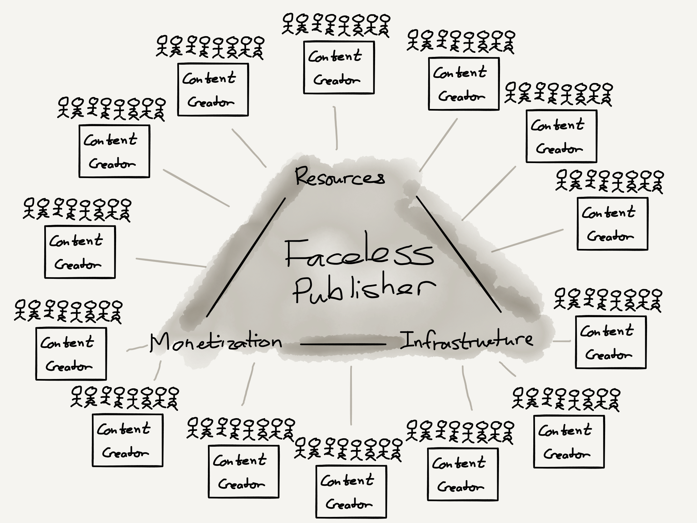

## Summary
[[BenThompson]] argues that free internet distribution split the traditional publisher into two economic directions: editorial brands and creators became more atomized, while advertising, technology, business operations, and other repeatable functions rewarded scale. The partnership between [[TheRinger]] and [[VoxMedia]] illustrates [[FacelessPublishingInfrastructure]]: creators retain their brands, audiences, ownership, and editorial independence while a largely invisible backend supplies monetization and infrastructure across many publications. The retained diagram makes that separation explicit by placing multiple audience-owning creators around one shared resource, monetization, and infrastructure layer.

## Key Claims
- Print publishers combined brand, subscription and advertising revenue, human resources, and owned distribution into a mutually reinforcing local business.
- Free digital distribution weakened that bundle: advertisers could reach individuals through Google and Facebook, readers could choose among global outlets and individual authors, and social feeds emphasized individual pieces or creators over publication brands.
- Editorial production remains labor-intensive and therefore has high variable costs, while reusable technology and consolidated advertising sales can scale across many sites.
- [[TheRinger]] gained Vox Media's technology and advertising sales without surrendering ownership or editorial independence, avoiding duplicated backend investment while joining a larger advertising package.
- [[VoxMedia]] could grow beyond owned-and-operated editorial brands by supplying scalable business functions to independently branded publications.
- [[FacelessPublishingInfrastructure]] is more than an ad network: it can also provide subscriptions, customer support, human-resources-like services, and other repeatable operating capabilities.
- Small local or specialist publications may become more viable when creator-owned editorial work is paired with scaled backend services, but the source presents this as a 2017 end-state hypothesis rather than a demonstrated industry outcome.

## Key Quotes
> "the former is becoming atomized, the latter consolidated" — on editorial and advertising moving in opposite directions.

> "much of what matters can be scaled and offered as a service" — on separating publishing services from publication brands.

## Connections
- [[BenThompson]] — author of the publishing-industry analysis.
- [[Stratechery]] — publication in which the argument appeared.
- [[BillSimmons]] — creator whose audience and brand anchor the case.
- [[TheRinger]] — independently owned publication using Vox Media's sales and technology.
- [[VoxMedia]] — scaled backend provider and advertising seller in the partnership.
- [[Medium]] — The Ringer's former host, criticized for choosing a Medium-wide subscription direction instead of the proposed service-provider model.
- [[FacelessPublishingInfrastructure]] — central model separating creator-facing brands from shared business operations.
- [[DigitalMediaMonetization]] — broader problem addressed through cross-format revenue and pooled ad sales.
- [[NicheSubscriptionPublishing]] — small paid publications are proposed as customers for shared subscription and support infrastructure.
- [[PlatformPublisherRevenue]] — Google and Facebook's advertising scale helps explain why small publishers need aggregated sales capacity.

## Contradictions
- The source's claim that publication brands no longer matter is too categorical for its own cases: The Ringer, Vox Media, and creator reputations still function as trust and demand signals. The narrower supported claim is that social distribution reduced the necessity of a single vertically integrated publisher brand.
- The article estimates that podcasts fund The Ringer's website and predicts that service-oriented publishers will back many small publications, but it provides no audited economics or later outcome evidence.
- The model reduces duplicated operating costs but does not establish how revenue, bargaining power, data, editorial risk, or dependency are divided between creators and the infrastructure provider.

## Image Notes
The sole local image was opened and retained because it is the article's architecture diagram. It shows many separate content creators, each with a surrounding audience, connected to one central faceless publisher whose shared triangle comprises resources, monetization, and infrastructure.
