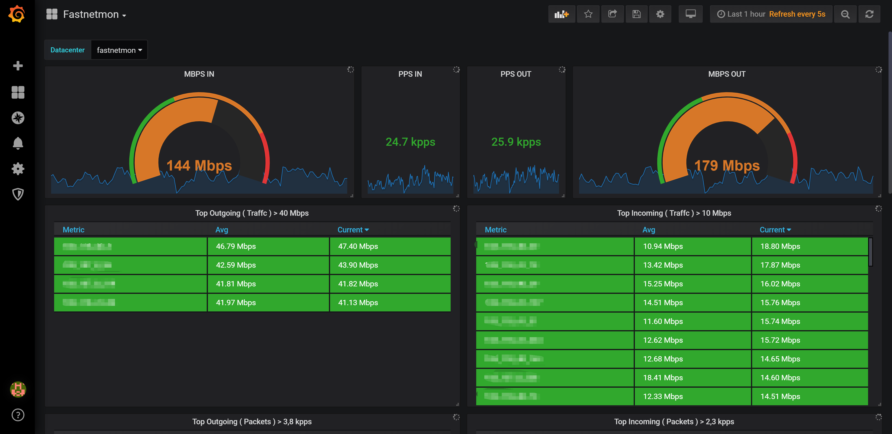

## Summary
This historical CentOS 7 walkthrough assembles [[FastNetMon]], [[InfluxDB]], and [[Grafana]] into a subnet-traffic monitoring and DDoS-warning pipeline. It demonstrates threshold detection with an `iperf` UDP load test and a notification callback, then exports FastNetMon's Graphite-formatted metrics into InfluxDB for dashboarding. The article proposes BGP announcements as an automated mitigation path but does not configure or test that path.

## Key Claims
- [[FastNetMon]] can observe configured CIDR ranges through packet capture or flow inputs, compare per-host traffic with packet-rate, bandwidth, and flow thresholds, and invoke a notification script when it bans an address.
- In the demonstrated `iperf` test, traffic to `10.1.2.137` reached about 35,552 incoming packets per second and 410 Mbps, exceeded deliberately lowered thresholds of 200 pps and 10 Mbps, appeared in FastNetMon's ban list, and produced a `/var/log/ban.log` callback entry.
- FastNetMon can emit Graphite metrics over TCP to [[InfluxDB]], whose Graphite templates map host, network, total, direction, and resource path segments into queryable measurements and tags.
- [[Grafana]] can visualize those stored metrics as separate inbound and outbound bandwidth and packet-rate trends, gauges, and ranked top-talker tables.
- Automated BGP or FlowSpec announcements are possible extensions for diverting or filtering traffic, but the supplied configuration leaves ExaBGP disabled and the walkthrough supplies no mitigation test.

## Key Quotes
> “FastNetMon 确实触发了通知的操作。” — conclusion after the simulated attack produced a ban-log entry.

> “如果正确配置，这时已经可以看到数据了。” — transition from metric export and storage to the displayed Grafana dashboard.

## Connections
- [[FastNetMon]] — detects threshold crossings, maintains the ban list, invokes callbacks, and exports traffic metrics.
- [[InfluxDB]] — receives Graphite-formatted FastNetMon metrics and stores them for querying.
- [[Grafana]] — presents network totals, direction-specific rates, trends, and top talkers.
- [[DDoSTrafficMonitoring]] — the end-to-end observe, detect, notify, visualize, and optionally mitigate workflow illustrated by the source.
- [[TimeSeriesDatabase]] — the metric store preserves changing traffic rates along a time axis.

## Contradictions
- The test demonstrates detection and notification, not actual packet blocking, traffic diversion, or attack absorption; “banned” is FastNetMon state unless the callback or routing integration enforces it.
- The prose recommends PF_RING for the walkthrough and mentions AF_PACKET for newer kernels, while the appended full configuration also enables NetFlow and leaves PF_RING disabled; these are alternative capture configurations rather than one internally consistent final deployment.
- The article's CentOS 7 commands, InfluxDB 1.7.6, Grafana 6.1.6, dashboard ID, and FastNetMon configuration syntax are historical and should not be treated as current installation instructions without version-specific verification.
