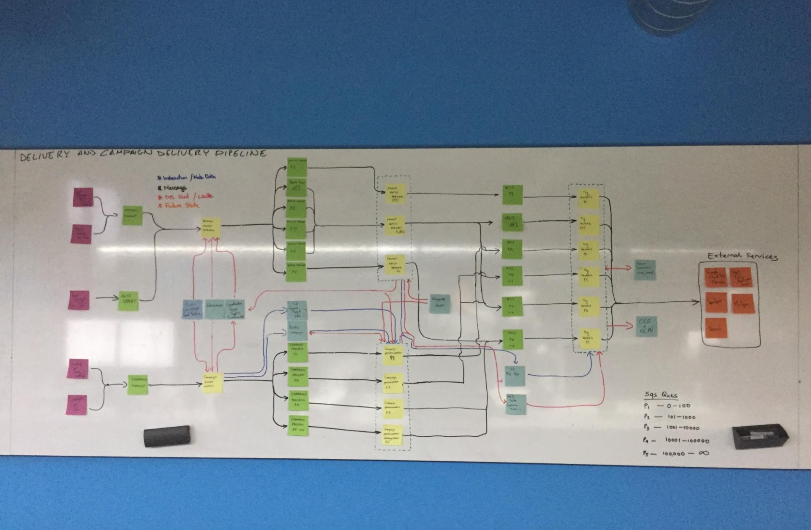

## Summary
[[HitenShah]] argues that feature count is a poor diagnosis: a broad product can be coherent when every capability delivers the same core value to a relevant segment, while even a smaller product can accumulate disconnected work when the team cannot execute its promise or builds by committee. The proposed remedy combines explicit segment strategy, empirical feature evaluation, disciplined refusal, customer-centered goals, shared product understanding, and a transparent roadmap. JIRA, HubSpot, Clearbit, Slack, and Shah's failed [[VisionWebHosting]] project serve as historical cases rather than controlled comparisons.

## Key Claims
- Feature creep is a symptom of failure to execute a product's core value, not a problem identifiable from feature quantity alone.
- Product breadth can be coherent when different capabilities serve distinct customer segments while remaining tied to one promise; JIRA's movement from issue tracking toward team plans is the main positive case.
- Teams should judge features by relevance and effectiveness for a target segment, using behavior and outcome measures such as HEART rather than counting features.
- Denying requests is part of product strategy when a requested capability conflicts with the product's conception of customer value.
- Development by committee arises when stakeholders, sales, marketing, design, and engineering pursue incentives or requests that are not aligned around customer outcomes.
- Shared goals, a common model of how the product works, explicit ownership, and roadmap transparency can reduce contradictory work and ad hoc changes.
- Product-market-fit evidence should show that users receive the promised core value; the cited Slack survey associates that value chiefly with communication and teams.

## Key Quotes
> "The myth of feature creep disguises the real problem: the inability to execute on the core value of your product." - the article's central diagnostic.

> "The number doesn’t matter. What’s important isn’t quantity, but relevance and effectiveness" - on evaluating breadth against segments and product promise.

## Connections
- [[HitenShah]] - author drawing on product cases and his own failed hosting project.
- [[ProductHabits]] - publication context for the essay.
- [[FeatureCreep]] - central concept reframed from feature quantity to strategy-and-execution failure.
- [[ProductUserSegmentation]] - different segments can justify different capabilities when they share the product's core value.
- [[ProductIdeaPrioritization]] - feature candidates need evidence of relevance, outcomes, and strategic fit.
- [[ProductMarketFit]] - customer evidence should verify delivery of the promised value.
- [[VisionWebHosting]] - Shah and Neil Patel's failed design-by-committee hosting project.
- [[HubSpot]] - robust product used to argue that complexity can fulfill rather than violate a promise.
- [[Atlassian]] - company behind the JIRA expansion case.
- [[Slack]] - survey case linking experienced value to communication and teams.
- [[Clearbit]] - broad API offering presented as coherent with a broad business-intelligence promise.
- [[CrazyEgg]] - Shah and Patel's company context before Vision Web Hosting.

## Contradictions
- [[build-a-product-that-fits-your-runway-elizabeth-yin]] describes HubSpot as starting narrowly before expanding; this source is compatible if breadth follows validated value, but it does not establish when expansion becomes premature.
- The Trello-versus-JIRA comparison associates Trello's slower-than-desired growth and acquisition with insufficient segment expansion, but it does not isolate product breadth from pricing, distribution, competition, management, or acquisition strategy.
- The article is a practitioner argument built from selected historical examples. It provides no comparative feature-use, retention, revenue, delivery-speed, or team-alignment data sufficient to prove that the proposed mechanisms caused the outcomes.
