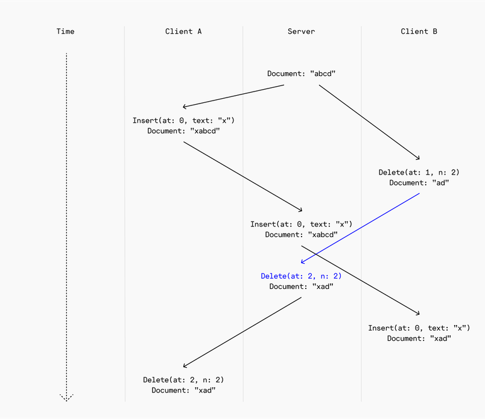
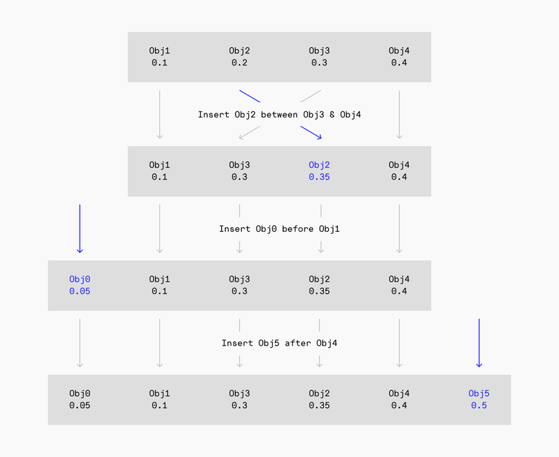

## Summary
[[Figma]] explains how its multiplayer editor keeps ordered child lists convergent when clients apply local edits immediately and may receive concurrent operations in different orders. The team rejected [[OperationalTransformation]] as unnecessarily complex for its document model and instead chose [[FractionalIndexing]], where each object's position is an arbitrary-precision fraction and insertion or movement changes one sortable value. The design accepts growing index strings and possible interleaving while using server-side reassignment to prevent identical concurrent positions.

## Key Claims
- [[RealtimeCollaborativeEditing]] requires operations that converge even when clients apply them in different orders.
- [[OperationalTransformation]] preserves the intent of concurrent positional edits by rewriting operations against one another, but its implementation burden grows with the operation set.

- [[FractionalIndexing]] turns sequence order into a sort over object positions, so inserting between neighbors uses an intermediate fraction and moving an object changes one value.

- Arbitrary-precision string fractions avoid exhausting fixed-width numeric precision after repeated insertions.
- Restricting indices to the open interval between 0 and 1 leaves room to insert before the first or after the last object.
- Figma accepted index growth and concurrent-insertion interleaving because its design-document sequences are bounded and users can repair odd visual ordering.
- The server resolves a second simultaneous insertion at an identical position by assigning it a unique position.

## Key Quotes
> "Reordering an object only involves editing a single value." - on the main operational benefit of fractional indexing.

## Connections
- [[Figma]] - first-party account of the ordering mechanism behind its multiplayer design documents.
- [[RealtimeCollaborativeEditing]] - the convergence problem that motivates the comparison.
- [[OperationalTransformation]] - rejected alternative that transforms concurrent positional operations.
- [[FractionalIndexing]] - selected ordering representation for Figma's compound-object child lists.
- [[ReplicatedLog]] - contrasting convergence model that agrees on one operation order before replicas execute it.

## Contradictions
- No direct contradiction was found. The source qualifies any assumption that all replicated editors need one globally agreed execution order: Figma instead designs these ordering operations to converge across different arrival orders, with the server resolving duplicate positions.
