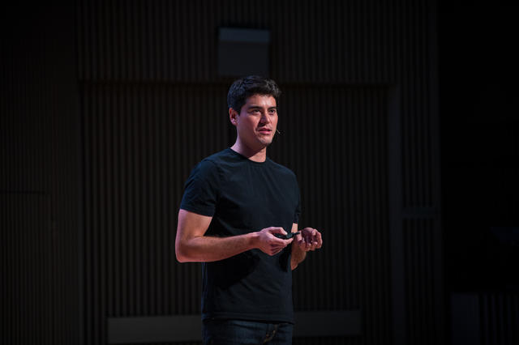

## Summary
[[FirstRoundReview]] interviews [[ToddJackson]] about defining, finding, evaluating, and closing product-manager candidates. Jackson describes [[ProductManagement]] as the work of articulating a winning product, rallying a cross-functional team, and iterating toward the right result, then turns that model into a stage-sensitive hiring rubric, structured interview prompts, a panel presentation, and a candidate-specific close. The retained photograph identifies Jackson as the featured practitioner but supplies no independent evidence for the hiring framework.

## Key Claims
- Strong product managers articulate what winning looks like, rally the team to build it, and iterate until the product works.
- Intellectual synthesis, communication, leadership, and cultural effectiveness are baseline requirements; technical, strategic, analytical, entrepreneurial, coding, mockup, and analysis skills vary in importance by company and team stage.
- Hiring teams should write the role archetype explicitly and consider evidence from varied backgrounds rather than treating one conventional resume as the only path into product management.
- A PM process can progress from mutual-fit screen to cross-functional interview loop and then a work-relevant panel presentation, with an explicit stop-and-evaluate gate before imposing the final exercise.
- Interview prompts should elicit product sense, technical understanding, conflict leadership, second-order strategic reasoning, service orientation, and genuine company motivation rather than reward polished generalities.
- Strong panel presentations reveal depth, organized thinking, communication, improvisation, and the ability to respond to hard questions in a group.
- Closing begins with frequent direct communication and becomes more effective when the company identifies the candidate's primary motivation—such as impact, autonomy, mission, learning, recognition, or user delight—and truthfully shows how the role can satisfy it.

## Key Quotes
> "Articulate what a winning product looks like." — the first of Jackson's three core PM responsibilities

> "Their job will be good communication." — on why the panel tests clarity and response under pressure

## Connections
- [[ToddJackson]] — interview subject and source of the PM hiring framework.
- [[FirstRoundReview]] — publisher translating Jackson's operating experience into hiring advice.
- [[ProductManagement]] — the role defined through outcome vision, team influence, and iteration.
- [[ProductManagerAsCEO]] — metaphor Jackson accepts for breadth while describing influence rather than formal command.
- [[ProductManagerHiring]] — stage-sensitive role design, evidence gathering, interview loop, and closing method derived from the source.
- [[HiringSystemDesign]] — broader system that contextualizes Jackson's structured but practitioner-led PM process.
- [[Twitter]] — organization where Jackson led product management and observed cross-functional confusion about the PM role.
- [[LinkedIn]] — proactive sourcing channel recommended alongside applicants and referrals.

## Contradictions
- No direct contradiction found. The source complements [[HiringSystemDesign]] through role-specific evidence and a staged process, but it does not disclose rubric scoring, interviewer calibration, decision rules, candidate burden, accessibility provisions, demographic outcomes, predictive validity, or post-hire results.
- School reputation, technical pedigree, enthusiasm, culture effectiveness, and subjective presentation quality can reproduce affinity and prestige bias unless translated into observable, job-relevant criteria and evaluated consistently.
- The article presents Jackson's practitioner judgment and anonymized successful profiles rather than a comparative study; its claims about what great PMs always possess, how disciplines differ in motivation, and which interview answers predict performance remain unvalidated.
