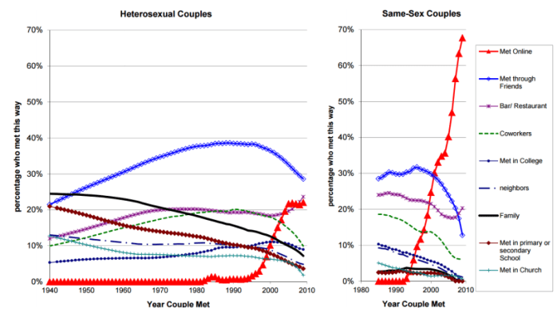

## Summary
This MIT Technology Review article presents [[JosueOrtega]] and [[PhilippHergovich]]'s model of [[OnlineDatingSocialIntegration]], in which online dating adds links between people outside one another's existing social circles and can rapidly increase interracial marriage. It connects the model to U.S. timing data and earlier research on relationship stability, but explicitly acknowledges that the historical association does not prove online dating caused either outcome. The retained chart independently supports the premise that meeting patterns changed sharply: online meeting rose from near zero to roughly one-fifth of heterosexual couples and about two-thirds of same-sex couples by the late 2000s.

## Key Claims
- Traditional partner formation usually occurred through family, friends, work, school, church, neighborhoods, and other network-embedded settings, while online dating can connect complete strangers.
- In the researchers' stylized network model, even a small number of new cross-group links produces much higher racial integration and greater modeled marriage stability.
- U.S. interracial-marriage growth accelerated after the 1995 launch of early dating websites, steepened during the 2000s, and jumped again after Tinder's 2012 arrival; these timings are consistent with, but do not establish, the model's causal hypothesis.
- Earlier research reporting lower breakup rates among couples who met online is presented as additional consistency with the model, not as a direct validation of its mechanism.
- Population-composition change alone is said to be too small to explain the observed increase in intermarriage.
- The inspected chart shows online meeting becoming especially dominant among same-sex couples, while meeting through friends and most other offline channels declined for both panels.

## Key Quotes
> "Those weak ties serve as bridges" - Ortega and Hergovich on how loose social connections link otherwise clustered groups.

> "People who meet online tend to be complete strangers" - the mechanism by which dating platforms add previously absent social links.

> "this data doesn't prove that online dating caused the rise in interracial marriages" - the article's central causal qualification.

## Connections
- [[JosueOrtega]] - coauthor of the network model summarized by the article.
- [[PhilippHergovich]] - coauthor of the network model summarized by the article.
- [[OnlineDatingSocialIntegration]] - hypothesis that digitally created absent ties can change population-level matching patterns.
- [[Homophily]] - within-group network structure that the model's cross-group links can weaken in partner selection.

## Contradictions
- The article's closing description of online dating as the "main driver" is stronger than its evidence warrants. The model is stylized, the historical comparisons are observational, and timing around Match.com or Tinder does not isolate online dating from changing attitudes, demographics, laws, platform adoption, or other social shifts.
- The marriage-strength result is model-dependent, and the cited lower breakup rate is reported from separate research without enough design detail in this article to rule out selection effects or other confounders.
- The model assumes opposite-sex marriage and randomly distributed race categories, so it does not represent the full variety of sexual orientation, gender, racial identity, partner preferences, platform design, discrimination, or relationship forms. The chart's strong same-sex trend supports changing meeting channels but does not directly test the model's interracial-marriage mechanism.

## Image Notes
- The retained two-panel chart plots the percentage of couples who met through each channel against the year they met. The heterosexual panel runs from 1940 to the late 2000s; the same-sex panel begins in the 1980s.
- Online meeting rises sharply after the mid-1990s, reaching roughly 20-23% for heterosexual couples and approximately 65-70% for same-sex couples by the final observations.
- Meeting through friends peaks near 39% for heterosexual couples before falling to about 28%, and falls from around 30% to roughly 13% for same-sex couples. Family, coworkers, school, church, college, neighborhood, and bar or restaurant series generally flatten or decline, with exact values limited by the chart's resolution.
- The graphic supplies no sample sizes, uncertainty intervals, survey wording, or methodological notes, so its visible trends should not be treated as precise causal estimates.
