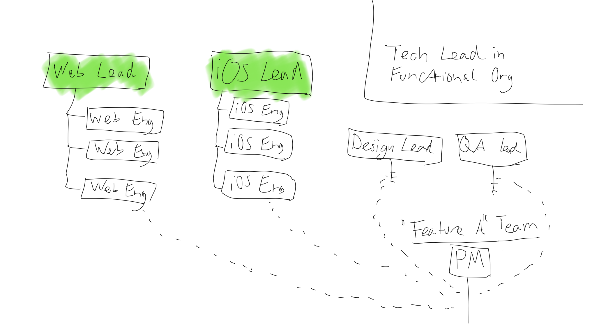
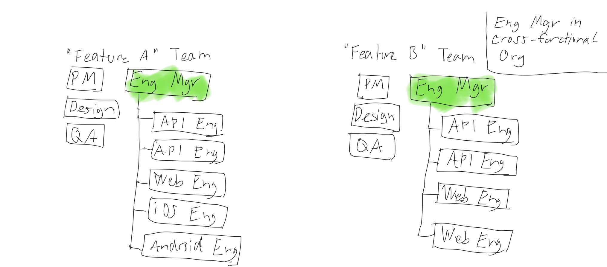
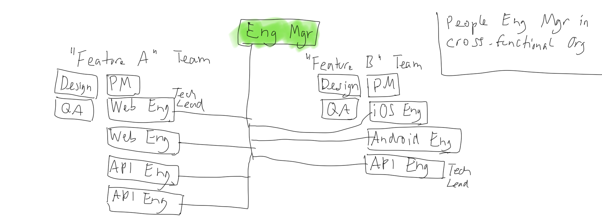

## Summary
[[BenjaminEncz]] presents three overlapping [[EngineeringManagerRoleDesign|engineering-manager role designs]] whose work changes with reporting structure, product ownership, technical breadth, and span of management. The functional tech-lead manager stays technically deep, the cross-functional product-team manager coordinates one product area across stacks, and the people manager spans products while delegating daily technical decisions to team leads. The comparison treats coding time as a consequence of role design rather than a universal requirement and makes accountability, evaluation, hiring, mentoring, and single-person dependency the central tradeoffs.

## Key Claims
- All three engineering-manager forms share recruiting, career development, and organizational-context duties, but their operating focus differs materially.
- A tech-lead engineering manager usually leads roughly three to eight engineers in one technology stack, remains involved in major technical decisions, and may spend up to about half their time coding.
- In a functional organization, stack-specific managers staff cross-functional feature work while product ownership sits elsewhere; the diagram makes the reporting and collaboration boundaries explicit.

- A product-team engineering manager usually leads roughly four to eight engineers across stacks in one product area, codes less, and coordinates architecture, staffing, knowledge sharing, and cross-functional execution.
- Cross-functional product teams improve product-area ownership but make specialist evaluation, stack-specific mentorship, experience balance, and hiring more dependent on people outside the manager's direct expertise.

- A people engineering manager may support roughly ten to fifteen engineers across stacks and products by facilitating while tech leads drive daily technical and cross-functional decisions.
- Combining technical and people leadership can create micromanagement and key-person dependency, while separating them can weaken the manager's accountability and ability to evaluate or influence performance.

## Key Quotes
> “The (software) engineering management role comes in many flavors.” — the article's premise that one title can conceal materially different jobs.

> “They are very different jobs.” — on separating people management from technical leadership.

## Connections
- [[BenjaminEncz]] - author who presents the three-role practitioner taxonomy.
- [[EngineeringManagerRoleDesign]] - compares role scope through technical depth, product ownership, decision rights, evaluation, and management span.
- [[CrossFunctionalProductTeams]] - product-team and people-manager models depend on coordination among engineering, product, design, and QA.
- [[TechnicalLeadershipRoleDesign]] - separating technical leadership from people management changes accountability and dependency risk.
- [[TeamBasedOrganizationalDesign]] - the diagrams contrast functional reporting lines with product-area team membership.

## Contradictions
- No direct contradiction was found. The article qualifies universal prescriptions about whether engineering managers should code: the answer depends on team topology, technical breadth, and delegated leadership.
