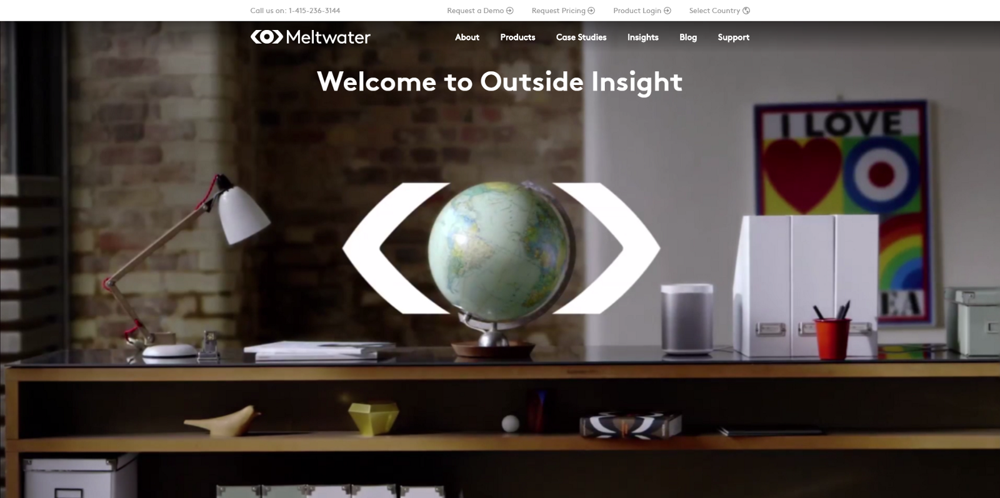
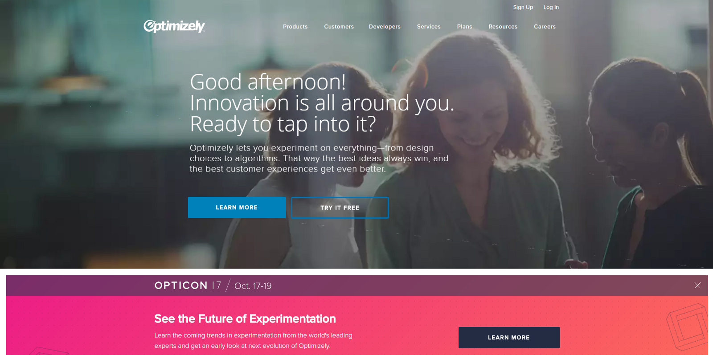

## Summary
This practitioner essay argues that a company homepage should quickly state what the company offers, who it serves, and why the offer matters instead of leading with interchangeable values, aspirations, or visual spectacle. Using [[Meltwater]], [[Optimizely]], and [[EightyFourFiftyOne|84.51°]] as historical examples, it proposes that unclear B2B copy can block self-qualification and may sometimes be designed to force prospects into sales conversations where upselling is easier. The three inspected screenshots support the broader clarity problem, although Optimizely's image also contains a concrete product explanation that qualifies the author's critique. The remote HackerNoon default title image returned HTTP 404 and could not be inspected or retained.

## Key Claims
- [[HomepageMessagingClarity]] should make the product category, customer problem, and practical value legible before broad brand language or decorative storytelling.
- Generic claims about innovation, insight, values, passion, or making life easier can apply to many companies and therefore do little to help a visitor decide whether an offer fits.
- The author argues that high-priced B2B companies may deliberately withhold product and pricing clarity to move already-interested prospects into salesperson-led upselling, but supplies no comparative evidence of intent or revenue effect.
- Startups can copy vague enterprise homepages because imitation makes unfamiliar company-building work feel legitimate, even when obscurity damages credibility.
- Clear titles such as “a one-stop shop for finding media contacts” or “the simplest website A-B testing tool” are presented as stronger defaults than slogans that cannot be tested or distinguished.
- Screenshots must be read alongside the critique: Meltwater and 84.51° foreground vague promises, while Optimizely's captured hero pairs its aspirational headline with a direct sentence about experimentation.

## Key Quotes
> "They should tell people who you are, what you do, and maybe even why they should be interested." — the essay's proposed homepage standard

> "Good afternoon! Innovation is all around you. Ready to tap into it?" — Optimizely's aspirational headline, followed in the screenshot by a more specific explanation of the product

> "We believe in making people's lives easier" — 84.51° headline criticized as too broad to identify the company's retail-data work

## Connections
- [[HomepageMessagingClarity]] — central principle that the homepage should make the offer and audience immediately legible.
- [[Meltwater]] — primary example of media-intelligence copy that the author found less clear than the underlying offer.
- [[Optimizely]] — experimentation company used as a vague-headline example, with screenshot-level counterevidence in its explanatory subhead.
- [[EightyFourFiftyOne|84.51°]] — retail-data company whose historical homepage emphasized a general human benefit over the specific dataset sought by the author.
- [[InformationHierarchy]] — product explanation must appear early enough to guide visitor interpretation and action.
- [[AppLandingPages]] — related landing-page framework for a compact value proposition and one legible visitor path.

## Contradictions
- The inspected Optimizely screenshot qualifies the prose: beneath the aspirational headline, it explicitly says the product lets users experiment on design choices and algorithms to improve customer experiences.
- The claimed link between vague copy and deliberate salesperson-led upselling is the author's inference from one Meltwater purchase and reported sales interaction, not evidence about the companies' internal intent or comparative conversion and revenue outcomes.
- The source describes historical homepage states; it does not establish the companies' current messaging, products, ownership, or go-to-market strategy.
