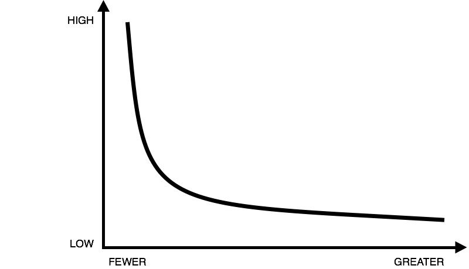

## Summary
[[HunterWalk]] argues that early-stage venture decisions should be judged by both failure risk and the scale and credibility of the outcome if a company succeeds. Because a small number of companies can dominate fund returns, identifying obvious risks does not explain whether an investment was irrational; a useful post-mortem instead asks whether failure came from foreseeable or newly emerging conditions, whether the venture-scale bull case rested on credible assumptions, and whether the investor had demonstrated judgment with that risk profile. He proposes that investors support fair reporting by discussing their original reasoning on background after failure, without betraying founders or converting analysis into blame.

## Key Claims
- Early-stage venture investing accepts a substantial probability of total loss because rare successes can return 20, 50, or more than 100 times invested capital.
- The power-law shape means the more discriminating investment question is not whether risks exist, but whether the plausible upside is large and credible enough to justify taking them.
- A good business can still be unsuitable for venture financing when its successful outcome is unlikely to reach venture scale.
- Criticism of a failed investment should distinguish predictable risks from novel changes in technology, markets, or regulation.
- A post-mortem should reconstruct the assumptions behind the venture-scale case and judge their credibility and execution difficulty at the time of investment.
- Investor-firm fit matters: a firm's record with similar risk profiles helps distinguish a considered bet from an unsupported stretch into unfamiliar territory.
- Investors can improve public learning by discussing completed-company investment reasoning with trusted reporters while protecting founder confidence and avoiding personal blame.

## Key Quotes
> “our job is to invest, not to *not* invest” — Walk on why finding a possible flaw is not, by itself, a venture-investment decision.

> “was it a reasonable risk to take, not, was there risk” — the proposed standard for evaluating a failed venture bet.

## Connections
- [[HunterWalk]] - investor-author framing venture judgment around asymmetric upside and fair retrospective analysis.
- [[VentureCapitalUpsideEvaluation]] - the source's core method for balancing failure probability against the scale and credibility of success.
- [[VentureCapitalFundStructure]] - rare outsized wins must offset the fund's many losses.
- [[VentureCapitalBlindSpots]] - upside analysis can counter risk-only rejection, while still requiring disciplined evidence rather than optimistic arithmetic.
- [[StartupFailurePatterns]] - post-mortems should separate foreseeable failure mechanisms from novel changes and hindsight reconstruction.

## Contradictions
- The essay does not contradict the wiki's risk-discipline material; it narrows the decision context. Venture investors still need loss discipline, but asymmetric portfolio returns make eliminating every risky company incompatible with the asset class.
- Walk explicitly rejects the extreme claim that any investment can be defended by sufficiently optimistic assumptions. The bull case must be plausible enough to warrant the capital and execution difficulty.
- The article is a brief practitioner argument without fund-level return data, failed-deal comparisons, investment memos, reporter perspectives, or a prospective scoring method. Its numerical return examples illustrate the model rather than establish frequencies.
- Both local images were opened. They are near-duplicate unlabeled drawings of the same power-law curve; one was retained at the supporting claim and the duplicate was omitted.
