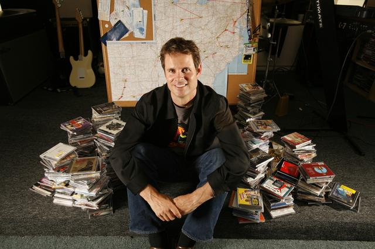

## Summary
[[TimWestergren]] recounts how [[Pandora]] moved from the B2B Savage Beast Technologies and a [[BestBuy]] kiosk project through a severe cash crisis, repeated financing rounds, leadership recasting, and an IPO. His retrospective links [[StartupFocus]], [[StartupCrisisLeadership]], [[StartupTeamBond]], and [[CEOScalingRole]]: remain inside the company's core competence, make sacrifice visible and information candid during crisis, hire for durable commitment, and redesign the founder's role when another leader complements the company's next stage. The account is a founder narrative from a First Round Capital CEO Summit rather than independently tested evidence about which practices caused Pandora's survival.

## Key Claims
- Westergren founded Savage Beast Technologies in 1999 as a B2B technology company intended to connect artists and listeners by solving music discovery rather than launching another music website.
- A seven-person team reportedly beat much larger competitors in a Best Buy kiosk test after building a prototype from IBM parts and observing strong consumer response.
- The company stayed focused on software and relied on IBM for hardware rather than entering a capital- and negotiation-heavy business outside its core competence.
- About 50 core employees reportedly worked without salary for nearly two and a half years after cash ran short; Westergren attributes their endurance to product belief, leader-first sacrifice, transparency, camaraderie, and careful hiring.
- Founder roles are stage-dependent: Westergren moved from music specialist across many executive duties and later from CEO to chief strategy officer when [[JoeKennedy]] became CEO.
- Complementary leadership can make role recasting constructive rather than treating a founder's move out of the CEO role as expulsion or failure.
- Westergren frames creating more than 700 livelihoods and a proud team as a more durable entrepreneurial reward than the IPO alone.

## Key Quotes
> "stay focused on what you’re good at" - Westergren's lesson from negotiating around the Best Buy kiosk deployment

> "They want the full story, and they deserve it." - on transparency during crisis

## Connections
- [[TimWestergren]] - Pandora founder whose retrospective supplies the article's operating lessons.
- [[Pandora]] - company that evolved from Savage Beast Technologies into a public music service.
- [[MusicGenomeProject]] - music-analysis and recommendation work that anchored Westergren's early role.
- [[JoeKennedy]] - CEO whose complementary partnership let Westergren shift to strategy.
- [[BestBuy]] - retailer that tested the team's web kiosk in a replica store beneath its headquarters.
- [[StartupFocus]] - the software-versus-hardware decision illustrates competence and ecosystem boundaries.
- [[StartupCrisisLeadership]] - product belief, leader-first sacrifice, candor, and team selection form the source's survival model.
- [[StartupTeamBond]] - camaraderie and shared commitment reportedly kept the core team together through prolonged financial distress.
- [[CEOScalingRole]] - the founder's role changed from broad direct execution to a complementary strategy role.

## Contradictions
- No direct contradiction was found. The source qualifies heroic persistence narratives because two and a half years of unpaid work and personal credit-card financing imposed severe employee and founder risk; survival does not establish that the practice was fair, repeatable, or advisable.
- The Best Buy, financing, staffing, salary-deferral, credit-card, and team-sentiment claims are Westergren's retrospective as relayed by First Round Review and are not independently corroborated in the supplied article.
