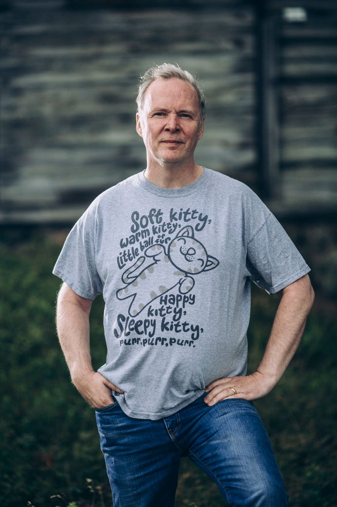

## Summary
OpenOcean profiles [[MontyWidenius]] as a programmer-founder whose long-running database work became [[MySQL]], whose public code and community supplied both a development model and a talent pipeline, and whose technical credibility let him remain a hands-on coder while [[MySQLAB]] grew. The article connects MySQL's reported commercial licensing model to [[OpenSourceCommercialization]], then traces Widenius from MySQL's sale to Sun through the [[MariaDB]] fork and the developer-focused investment firm [[OpenOcean]]. Its strongest evidence is Widenius's first-person account of his motivations and operating philosophy; its chronology, business-model description, and exceptional-talent framing require qualification.

## Key Claims
- Widenius treated programming as an absorbing lifelong craft, left university at 19, and continued spending most of his working time coding even as MySQL AB's CTO.
- MySQL grew from database precursors Widenius had developed since 1981 and was reportedly shaped by years of real customer feedback before its public 1996 release.
- The article attributes MySQL's speed, reliability, ease of learning, and rapid search across large datasets to that sustained technical and customer-driven development.
- MySQL combined public source and community contribution with paid licensing for commercial use, seeking enough revenue to hire staff and compete with closed-source vendors.
- MySQL AB used visible open-source work as hiring evidence and relied on self-directed employees, allowing Widenius to avoid a meeting-heavy management role while remaining technically active.
- After Sun's acquisition by Oracle, Widenius founded MariaDB as a more developer-oriented community fork, and he used MySQL proceeds to help found OpenOcean around developer-driven deep technology.

## Key Quotes
> "Basically, it's like reading a really really good book. Or like playing a videogame." — Widenius on becoming absorbed in programming.

> "You do the same thing that they are doing but do it better." — Widenius on earning developers' respect through demonstrated technical work.

> "I believe that open source is a better way to develop software. But you still need to earn enough money to hire staff and create a company that can compete with closed source communities." — Widenius on the commercial requirement surrounding open development.

## Connections
- [[MontyWidenius]] — central subject, MySQL cofounder, long-serving technical leader, MariaDB founder, and OpenOcean founding partner.
- [[MySQLAB]] — company formed by Widenius, David Axmark, and Allan Larsson to develop and commercialize MySQL.
- [[MySQL]] — open-source relational database whose origin, release, licensing, and technical reputation anchor the profile.
- [[MariaDB]] — community-developed MySQL fork presented as the continuation of Widenius's developer-oriented open-source commitments.
- [[OpenOcean]] — developer-focused investment firm reportedly seeded with Widenius's MySQL proceeds.
- [[OpenSourceCommercialization]] — the effort to combine public code and community contribution with revenue sufficient to sustain a competitive company.
- [[DeveloperLedTechnicalCulture]] — organizational model based on hands-on technical credibility, work-sample visibility, self-directed hiring, and low meeting load.
- [[OpenSourceProjectMaintenance]] — adjacent practice covering the documentation, governance, release, contributor, and sustainability work required after public launch.
- [[HackerStyleTechnicalCuriosity]] — broader learning posture reflected in Widenius's intensive experimentation and personal-project advice.

## Contradictions
- The article says the decision to open-source MySQL occurred in 1985, but also says MySQL AB was founded in 1995, an SQL layer was added after that lobbying, and MySQL was released in October 1996. It does not reconcile this chronology or distinguish an earlier open-source commitment from the later product decision.
- An introductory passage says Widenius released MySQL at age 33 after coding it almost entirely himself, while the detailed history gives an October 1996 release, when a person born in 1962 would have been 33 or 34 depending on birthday. The exact age and release milestone remain imprecise.
- The source describes commercial payment as an unenforced honor-system stipulation. That is a simplified first-person account rather than a legal explanation of MySQL's licensing terms, versions, enforcement, or later dual-licensing structure.
- Claims that Widenius was the best programmer at his company, that only one programmer in a thousand reaches this level, and that MySQL was the first open-source product to fund a competitive company are celebratory assertions without comparative evidence.
- The claim that hiring self-directed people let a 550-person company operate around a coding-focused CTO does not describe the rest of the management system, selection errors, employee experience, or whether the model generalizes beyond Widenius and MySQL AB.
- The portrait was retained once under a descriptive canonical filename. A 40-by-60-pixel copy and two repeated embeds of the full-size portrait were omitted as duplicates.
- The saved export displays both 2017-10-23 and the original article date Aug 29, 2017. The canonical source date follows the original article date shown in the body.
