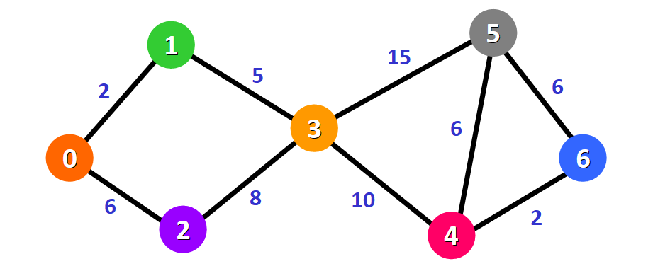
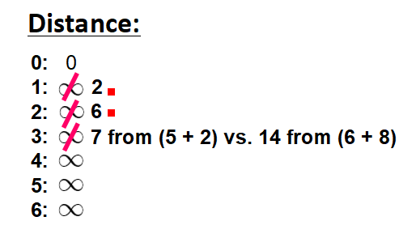
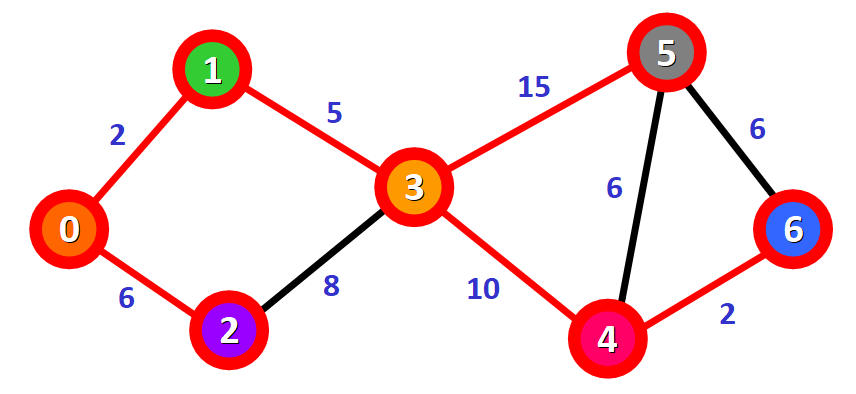

## Summary
Estefania Cassingena Navone introduces [[GraphModeling]] and explains [[DijkstrasAlgorithm]] through a seven-node weighted, undirected graph. The walkthrough initializes the source distance to zero, repeatedly settles the unvisited node with the smallest tentative distance, relaxes routes to its neighbors, and produces a shortest-path tree rooted at node 0. It also attributes the algorithm to [[EdsgerWDijkstra]] and connects the method to route finding and other network problems.

## Key Claims
- Graphs model connected entities as nodes and edges; direction controls permitted travel, while edge weights can represent distance, time, or another additive cost.
- Dijkstra's algorithm computes shortest distances from one source to every reachable node and can record predecessors to form a shortest-path tree.
- The method starts with distance 0 for the source and infinity for other nodes, then repeatedly settles the unvisited node with the smallest tentative distance.
- Relaxation keeps an existing distance unless traveling through the current node produces a smaller total.
- In the illustrated graph, nodes settle in the order 0, 1, 2, 3, 4, 6, 5; final distances for nodes 0 through 6 are 0, 2, 6, 7, 17, 22, and 19.
- Correctness depends on non-negative edge weights; a later negative edge could invalidate a distance that the greedy procedure has already treated as final.

The example's edges are 0-1 (2), 0-2 (6), 1-3 (5), 2-3 (8), 3-4 (10), 3-5 (15), 4-5 (6), 4-6 (2), and 5-6 (6). After nodes 0, 1, and 2 settle, node 3 keeps distance 7 through 0-1-3 because the alternative through 0-2-3 costs 14.

## Key Quotes
> "We only update the distance if the new path is shorter." — the article's concise statement of relaxation.

## Connections
- [[DijkstrasAlgorithm]] — the single-source shortest-path procedure explained step by step.
- [[GraphModeling]] — the node, edge, direction, and weight representation on which the procedure operates.
- [[EdsgerWDijkstra]] — computer scientist who designed the algorithm and published it in 1959.

## Contradictions
- The article says the algorithm requires positive weights; the standard boundary is non-negative weights, so zero-weight edges are valid while negative-weight edges invalidate the settled-distance argument.
