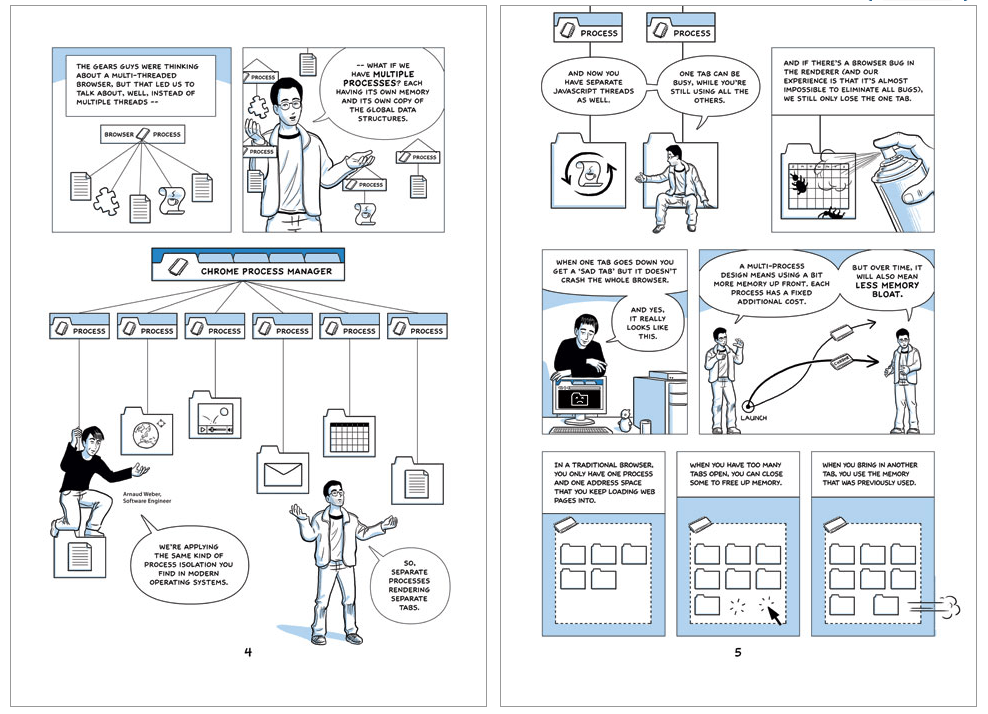
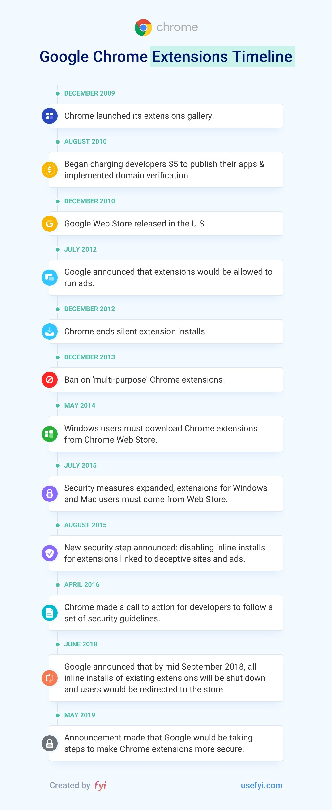
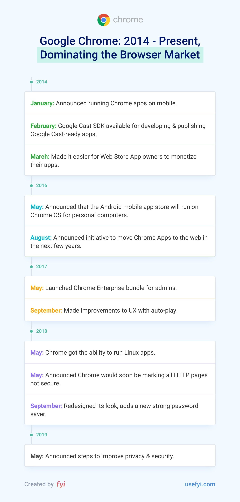

## Summary
This 2019 product-history essay attributes [[Chrome]]'s rise from a 0.3% share at its 2008 launch to almost 70% by May 2019 to a clean-slate multi-process architecture, speed, the open-source Chromium project, a developer-centered extension ecosystem, mobile and enterprise distribution, and [[Google]]'s treatment of the browser as a computing platform. It also describes the strategic reversal produced by that success: Chrome became a de facto development target, strengthened Google's influence over web standards, and attracted privacy criticism after browser and Google-service identities were linked. The account is a broad retrospective rather than a controlled causal study, and several dates and market figures require independent verification.

## Key Claims
- Chrome treated tabs and web applications as isolated processes, improving failure containment and responsiveness at the cost of additional memory overhead.
- Chromium's open-source development model and the Chrome Web Store recruited developers into an ecosystem that extended the browser's utility and created third-party businesses.
- Google compounded initial product advantages through Chrome OS, Android and iOS distribution, enterprise deployment tooling, Linux application support, and security policy changes.
- The article's cited progression runs from 0.3% market share in 2008 to 31% and first place in 2012, 55% in 2017, roughly 62% in 2018, and almost 70% in May 2019.
- Scale made Chrome a de facto implementation target for web developers and gave Google greater practical influence over standards, compatibility, and competitors using Chromium.
- The 2018 linkage between Gmail sign-in and Chrome sign-in illustrates the governance risk of integrating a dominant browser with an advertising and identity ecosystem without clear user consent.
- The broader product lesson is to solve an incumbent's core deficiencies, begin with a focused advantage, and expand over time into a platform rather than assuming inherited product conventions are fixed.

The architecture comic makes the process boundary explicit: separate renderer processes contain an individual tab crash and can return memory when a tab closes, while each process carries a fixed resource cost that can create memory bloat.

The extension timeline shows ecosystem growth paired with tightening governance: publication fees and domain verification, the end of silent and inline installs, mandatory Web Store distribution on Windows and Mac, and later security initiatives.

The later timeline combines developer monetization, Android applications on Chrome OS, enterprise administration, autoplay controls, Linux application support, HTTP security labeling, password tooling, and privacy/security commitments as parts of the platform strategy.

## Key Quotes
> "Google had gone from champion of the open web to gatekeeper of contemporary web standards in just ten years." - on the central tension created by Chrome's success.

> "Even if no data goes up [to Google's servers] it's still a huge change." - Matthew Green on the undisclosed Chrome/Gmail identity-boundary change.

## Connections
- [[Chrome]] - product whose architecture, ecosystem, distribution, and governance the article traces.
- [[BrowserPlatformStrategy]] - the article's central pattern of turning a browser into an application, developer, distribution, and enterprise platform.
- [[WebCentralization]] - Chrome's scale concentrated implementation attention and standards influence in one Google-controlled product.
- [[Google]] - owner whose search, advertising, identity, mobile, cloud, and developer interests shaped Chrome's expansion.
- [[Microsoft]] - incumbent displaced when Internet Explorer stagnated and later adopter of Chromium for Edge.
- [[Firefox]] - early competitor, engineering input, and later independent counterweight to Chrome monoculture.
- [[Mozilla]] - open-web organization that criticized Microsoft's move to Chromium as increasing Google's infrastructure power.
- [[BrendanEich]] - browser-industry critic quoted calling Chrome spyware while leading Chromium-based Brave.

## Contradictions
- No direct contradiction with existing wiki claims was found; the source extends [[browse-against-the-machine-the-official-unofficial-firefox-blog-medium]] from a 2017 campaign critique into a longer product history.
- The article internally places Windows 7 on the market in 2008 even though it was released in 2009, and an embedded timeline labels the July 2009 Chrome OS announcement as a launch. These errors weaken confidence in uncross-checked chronology.
- Market-share estimates vary by provider, device scope, and date, so the cited figures are historical source claims rather than current or directly comparable measurements.
