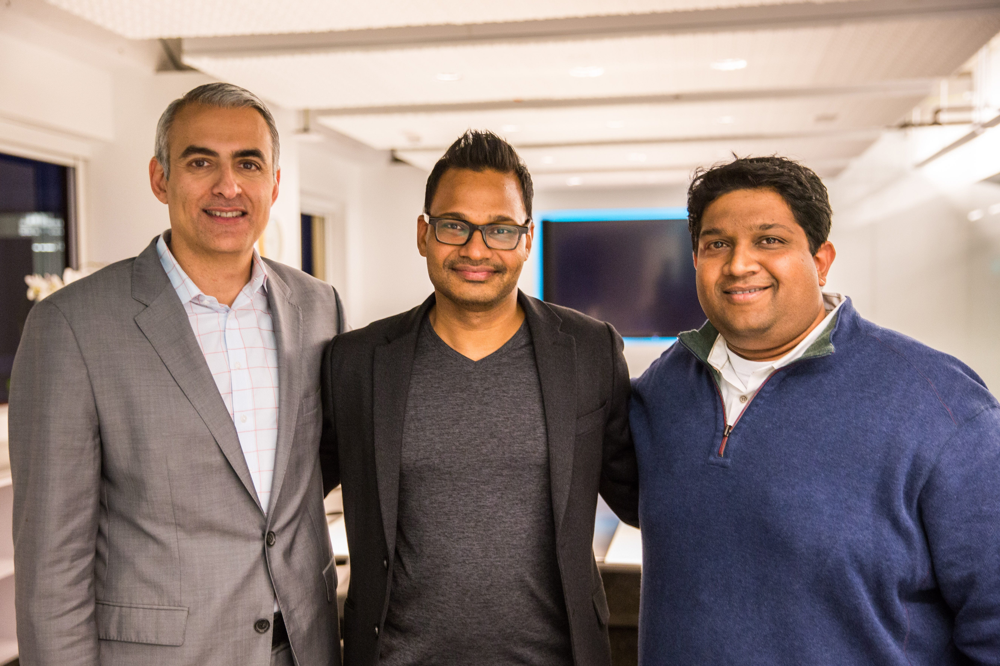

## Summary
[[AsheemChandna]] recounts [[GreylockPartners]]' role in backing [[JyotiBansal]] and [[AppDynamics]] from its 2008 Series A through the company's decision to accept [[Cisco]]'s acquisition proposal immediately before its planned January 2017 IPO. The investor retrospective emphasizes founder conviction, the early engineering team, enterprise customer adoption, leadership succession to [[DavidWadhwani]], subscription and expansion metrics, and Cisco's stated opportunity to combine application and infrastructure analytics.

## Key Claims
- A confidential introduction from [[RajeevMotwani]] connected Chandna with Bansal, who had begun developing an application-monitoring company initially called Singularity Technologies.
- Greylock and [[LightspeedVenturePartners]] co-led AppDynamics' Series A after Chandna's first extended product and market discussion with Bansal.
- [[BhaskarSunkara]] was the first hire and helped Bansal assemble the initial engineering team; about a dozen engineers produced the first product before the company began onboarding enterprise customers.
- The source names Netflix, Priceline, Williams Sonoma, Electronic Arts, and TiVo as early customers and says AppDynamics later grew to more than a thousand enterprise customers.
- A board-led executive search recruited Wadhwani as CEO in September 2015, with Bansal moving to chairman, to prepare the company for larger-scale operation and a future public-company role.
- The company reported disciplined subscription metrics and a [[SaaSLandAndExpand]] pattern: customers had expanded to an average of five times their initial purchase, while its top 25 customers averaged fourteen times.
- Cisco, already described as a significant AppDynamics customer, proposed a merger during the IPO roadshow; AppDynamics accepted because the board believed Cisco's reach and resources could accelerate the mission.

## Key Quotes
> "Enter Cisco." - Chandna's transition from the oversubscribed IPO account to the acquisition proposal.

> "combine application analytics and infrastructure analytics" - the source's stated product rationale for the Cisco merger.

## Connections
- [[AsheemChandna]] - Greylock investor and author of the retrospective.
- [[AppDynamics]] - company whose founding, scaling, leadership transition, IPO process, and acquisition anchor the account.
- [[JyotiBansal]] - founder who developed the original application-monitoring vision and later became chairman.
- [[BhaskarSunkara]] - first hire and early engineering leader, described as product head and CTO at publication.
- [[DavidWadhwani]] - executive recruited as CEO to scale the company and prepare it for public markets.
- [[GreylockPartners]] - Series A co-lead, early office host, board participant, and publisher context.
- [[Cisco]] - customer and proposed acquirer immediately before AppDynamics' planned IPO.
- [[ExecutiveHiring]] - the four-month CEO search and courtship illustrate succession hiring for a new company stage.
- [[StartupScaling]] - the company progressed from a dozen engineers to a geographically distributed enterprise-software organization.
- [[SaaSLandAndExpand]] - reported account-expansion multiples served as evidence of subscription growth quality.
- [[FounderExitTradeoff]] - the board chose an acquisition despite a viable path to an independent public company.

## Contradictions
- No direct contradiction identified. The source adds a successful executive-succession case to the wiki's hiring and scaling material, but it does not establish that the same transition model generalizes to other startups.
- The account is a celebratory investor retrospective published around the transaction. It supplies no audited financial statements, acquisition price, independent customer evidence, losing strategic alternatives, integration outcomes, or perspectives from Cisco, employees, and customers; its expansion, Gartner, IPO-demand, and merger-rationale claims therefore remain attributed.
