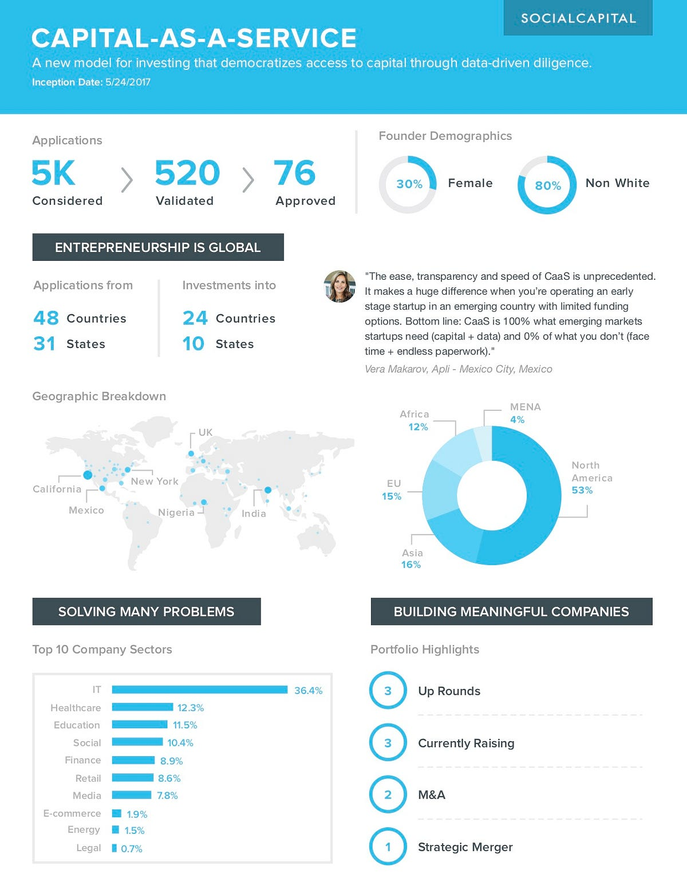

## Summary
This [[SocialCapital]] retrospective presents [[CapitalAsAService]] as an online, data-driven alternative to relationship- and geography-dependent early-stage fundraising. Founders submitted transaction data to an automated diligence engine intended to assess [[ProductMarketFit]] within hours, compare businesses across categories, and return model-based feedback. Its first-year infographic reports broad application reach and portfolio diversity, but the source does not disclose model design, validation, rejection outcomes, investment amounts, realized returns, or evidence that automation achieved its claimed consistency and freedom from bias.

## Key Claims
- Falling public-cloud costs and standardized operational data can lower both the cost of starting companies and the cost of evaluating them across geographies.
- CaaS was designed to complement human judgment with data science by evaluating how businesses turn prospects into engaged customers rather than relying primarily on pitches, intuition, travel, or personal access.
- The online workflow let founders self-select into diligence, submit transaction data, and receive funding decisions within hours, making the program continuously accessible across six continents.
- The first-year infographic reports roughly 5,000 applications considered, 520 validated, and 76 approved after the program's May 24, 2017 inception.
- Reported applicants came from 48 countries and 31 U.S. states; investments reached 24 countries and 10 states. The displayed portfolio geography was 53% North America, 16% Asia, 15% Europe, 12% Africa, and 4% Middle East and North Africa.
- The infographic reports that 30% of founders were women and 80% were non-white. Its sector breakdown was led by IT at 36.4%, followed by healthcare at 12.3%, education at 11.5%, social at 10.4%, finance at 8.9%, retail at 8.6%, and media at 7.8%, with smaller e-commerce, energy, and legal shares.
- The first-year portfolio snapshot reports three up rounds, three companies then raising, two M&A outcomes, and one strategic merger; the prose also says the fund had already exited the J-curve and that later investors treated its diligence as accreditation.

## Key Quotes
> "We could complement human judgement with data science." - on the intended division of labor between software and investors.

> "Without so much as a plane ticket or a coffee chat" - on removing geographic and relationship-dependent steps from diligence.

## Connections
- [[CapitalAsAService]] - Social Capital's online capital-allocation and automated-diligence product.
- [[SocialCapital]] - firm that launched and reported the first year of CaaS.
- [[ProductMarketFit]] - central business quality the transaction-data workflow claimed to evaluate.
- [[UserGrowthAccounting]] - an earlier Social Capital example of decomposing operating data beneath topline growth.
- [[VentureCapitalBlindSpots]] - related concern about intuition, network, consensus, and customer-perspective errors in venture decisions.
- [[DataDrivenOperations]] - CaaS applies operational measurement to investment selection and founder feedback.
- [[EnterpriseCloudMigration]] - public-cloud standardization is presented as the infrastructure that makes comparable operating data more accessible.

## Contradictions
- The source's claim that software can replace human bias and limitations with precision and reach is an aspiration, not a demonstrated result. Transaction data can reflect selection, measurement, survivorship, historical, and category bias, and model-based screening can scale those biases.
- Application, validation, approval, demographic, geographic, and sector counts describe reach and throughput rather than decision quality. The source supplies no denominator for eligible founders, comparison with conventional sourcing, false-positive or false-negative analysis, follow-up duration, realized return data, or independent audit.
- The article says the fund was already out of the J-curve and cites up rounds and M&A activity, but it gives no valuation, cash-flow, ownership, write-off, or realized-return figures. Those observations cannot establish superior investment performance one year after launch.
- The thesis assumes operational and transaction data are sufficiently available and comparable. Pre-revenue, enterprise, regulated, hardware, research-intensive, seasonal, privacy-sensitive, and unusually structured businesses may not fit the same diligence interface.
