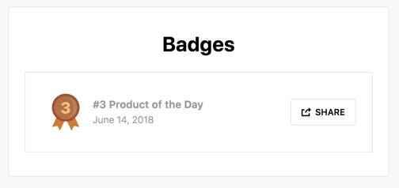
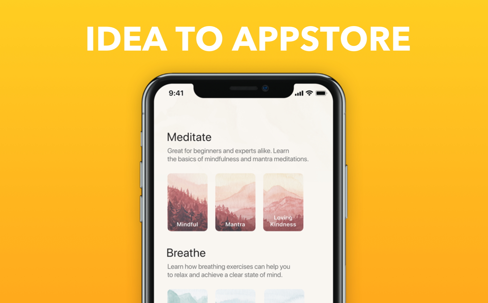

## Summary
[[JonathanCourtney]] describes how [[AJSmart]] remotely redesigned [[Oak]] with founder [[KevinRose]], expanding a one-screen brief into a four-week, full-app design project. The team adapted [[DesignSprint]] exercises for distributed work, reached client alignment during the first week, spent two more weeks producing screens, and handed the design to a developer; the released app was later featured in the App Store and placed third on Product Hunt.

## Key Claims
- A remote sprint needs unusually explicit notes, more alignment check-ins, stronger inspiration-sharing, and a shared collaboration surface because participants cannot rely on co-located explanation.
- AJ&Smart used an 80-minute kickoff as an expert interview, captured “How Might We” notes in RealtimeBoard, and then defined the goal, sprint questions, and product map with the client.
- Pinterest references and Kevin Rose's cross-industry examples made subjective visual preferences discussable before detailed design began.
- Hand-drawn concepts, client voting, narrated feedback, and several animated prototype variants progressively reduced design-direction uncertainty before full screen production.
- The team used Figma for screen design, exported to Marvel for prototyping, and replaced vector art with Sarah Kilcoyne's watercolors.
- The original meditation-select brief expanded into a total redesign, a move the author explicitly says requires an experienced, sufficiently resourced team and is not normally recommended.
- The account documents client alignment and launch reception but does not describe representative-user testing, outcome metrics, retention, or causal evidence that the sprint produced the reception.

## Key Quotes
> “Be extra-specific when making notes” — on making remote artifacts understandable without their author present.

> “Double-down on alignment check-ins” — on reducing misunderstanding in distributed sprint work.

## Connections
- [[JonathanCourtney]] — author and AJ&Smart practitioner recounting the project.
- [[AJSmart]] — Berlin consultancy that ran the remote redesign.
- [[KevinRose]] — Oak founder and remote client who supplied expert input, inspiration, votes, and prototype feedback.
- [[Oak]] — meditation and breathing app redesigned in the case study.
- [[JakeKnapp]] — practitioner credited for the Design Sprint process AJ&Smart adapted.
- [[DesignSprint]] — underlying goal, question, mapping, lightning-demo, concept, voting, and prototyping structure.
- [[RemoteDesignSprint]] — distributed adaptation emphasizing explicit artifacts, shared tools, and repeated alignment.
- [[Figma]] — screen-design tool used before prototypes were exported to Marvel.

## Contradictions
- Qualifies [[DesignSprint]] as a canonical five-day prototype-and-user-test cycle: this case used sprint exercises inside a four-week design engagement and reports client feedback rather than representative-user testing.
- The project expanded from one selection screen to a full redesign even though the author warns that such scope growth is normally inadvisable without unusual experience and capacity.
