## Summary
[[TwilioSegment]]'s founders reconstruct the company's first year, from six failed product iterations and a 400-line open-source library through a high-response [[HackerNews]] launch, seven-day hosted product build, continuous customer feedback, content experiments, and a cash-constrained bridge round. The retained launch screenshots and complete 2013 seed deck show how the company translated qualitative demand into product activation metrics, a data-portability value proposition, and an early platform thesis. The 2019 retrospective then contrasts abandoned monetization ideas with the customer-funded integration platform that supported a $175 million Series D.

## Key Claims
- After 18 months of failed ideas, the four-person team exposed one narrow internal tool: Analytics.js normalized eight analytics destinations behind one API, and its Show HN launch produced explicit workplace demand and hundreds of beta signups.

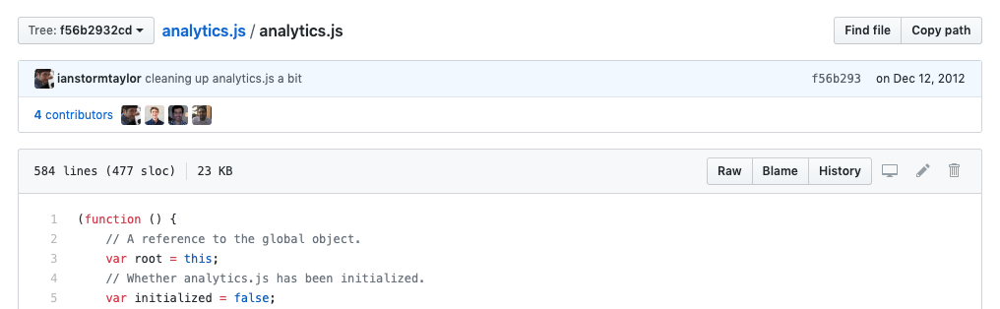

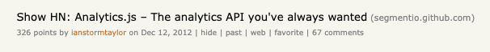

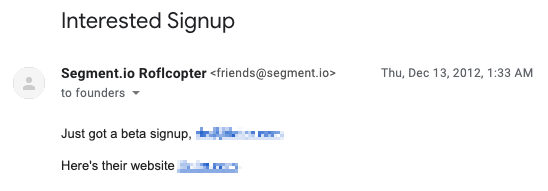

- The team converted that signal into a minimal hosted product in seven days, initially serving custom Analytics.js builds through a CDN and displaying Node API events without yet proxying destination traffic through its servers.

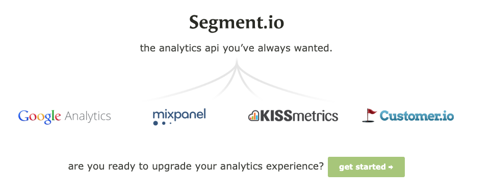

- Always-on live chat made requests observable while users were attempting real integrations; during the first four months the team added six client libraries, 23 server-side integrations, two mobile libraries, and native iOS and Android support.

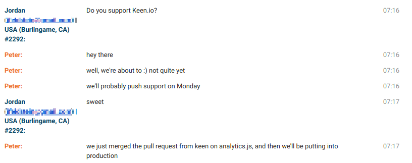

- Analytics Academy initially attracted launch interest without sustained sharing. Direct reader criticism pushed the team from generic category content toward specific comparisons, use cases, and techniques that readers could apply immediately.

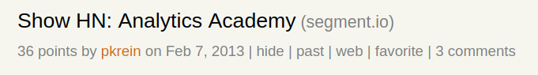

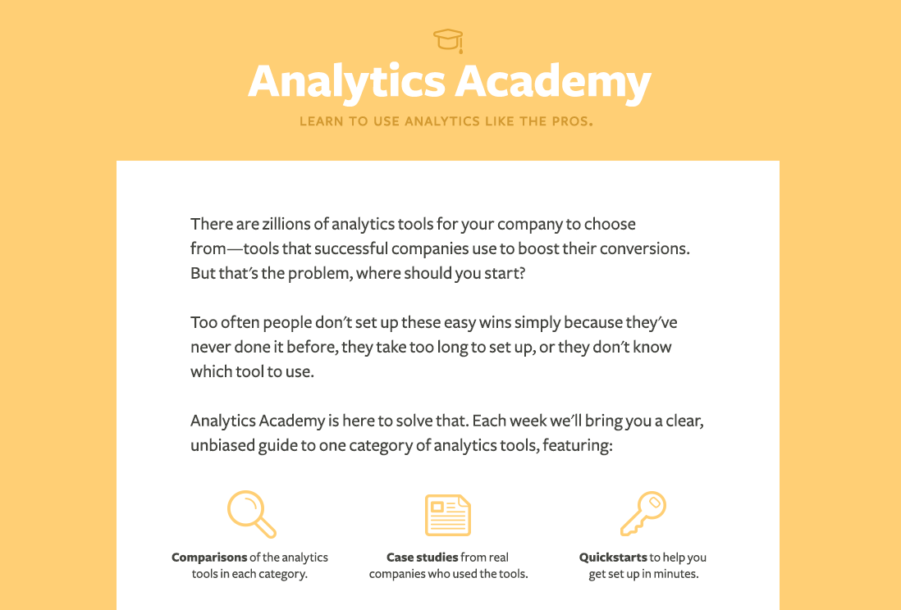

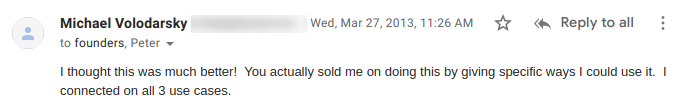

- With roughly three months of runway and no revenue, the 2013 seed deck emphasized product clarity, weekly growth in projects sending data, funnel activation, testimonials, enterprise interest, portability, possible monetization, and a larger customer-data-platform vision.

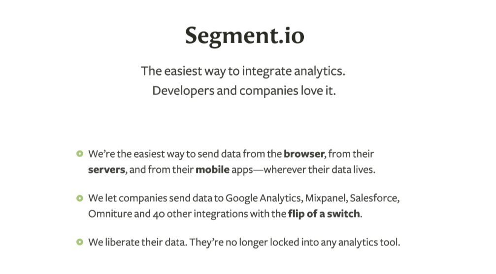

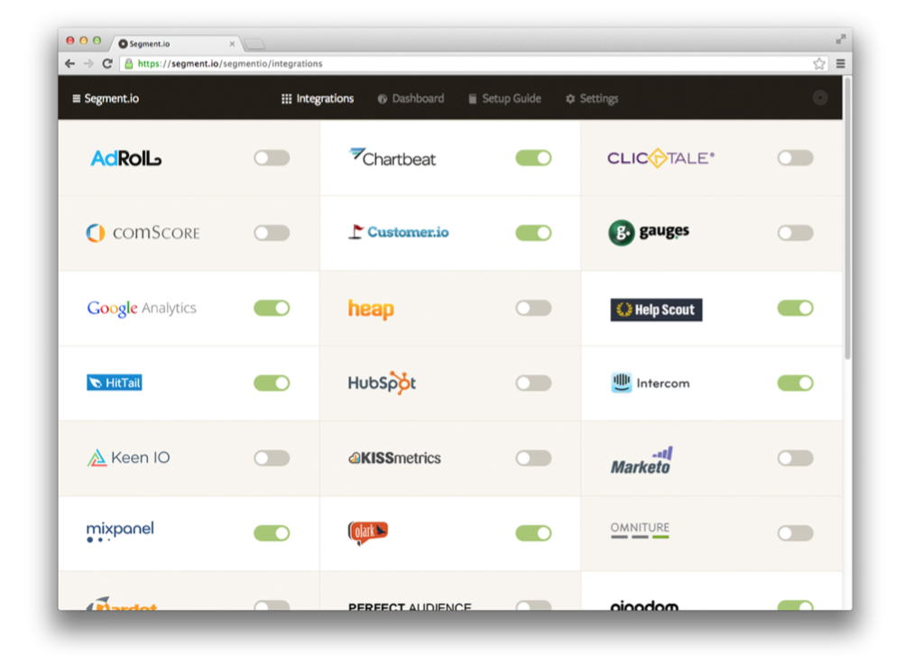

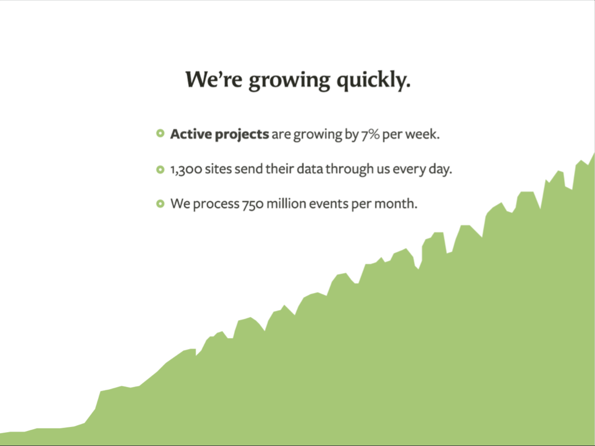

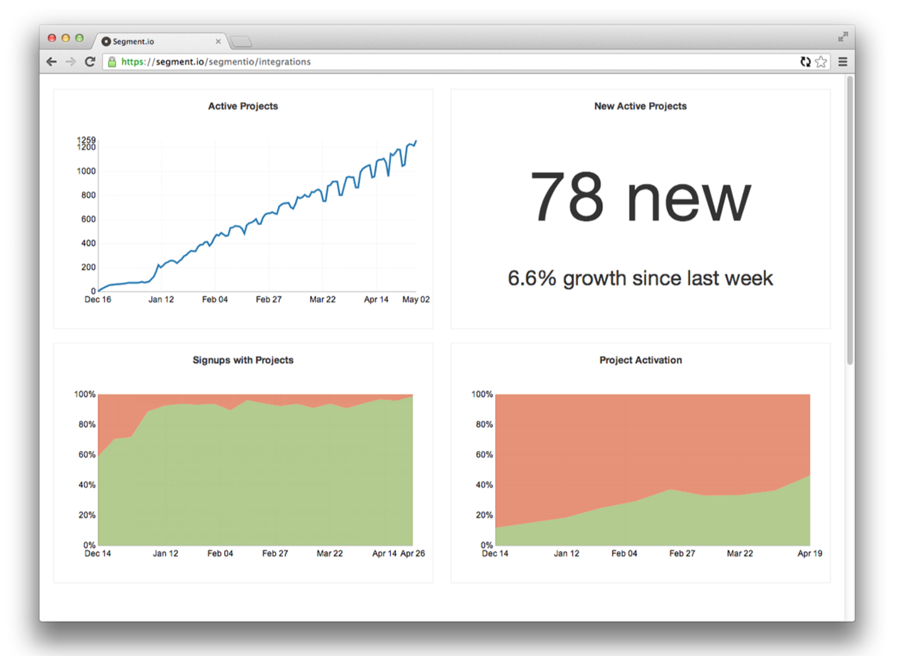

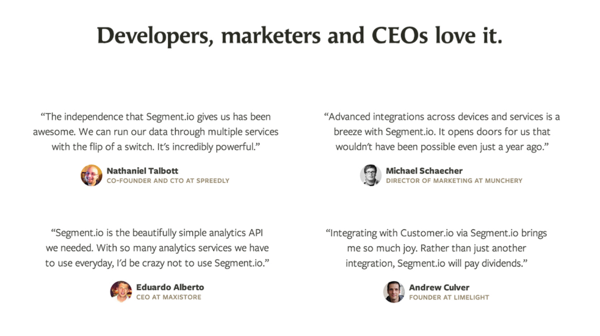

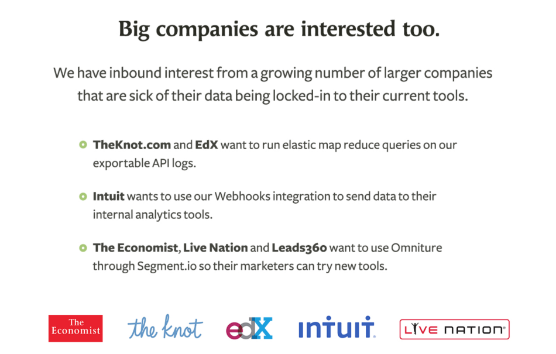

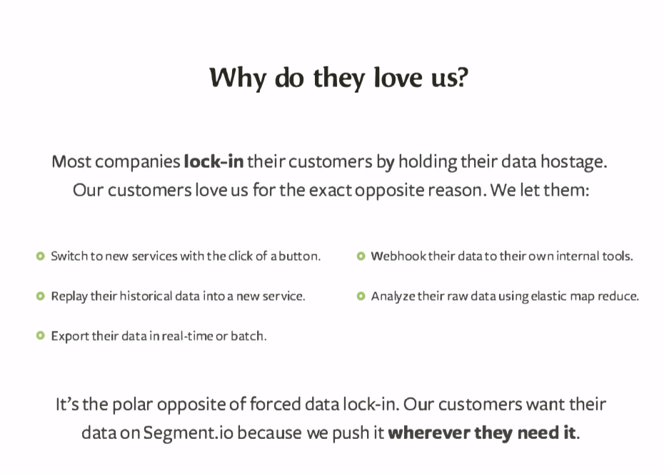

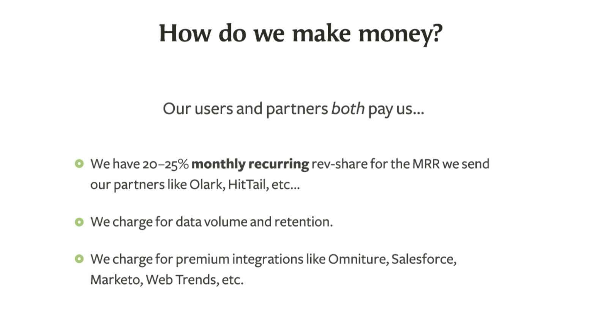

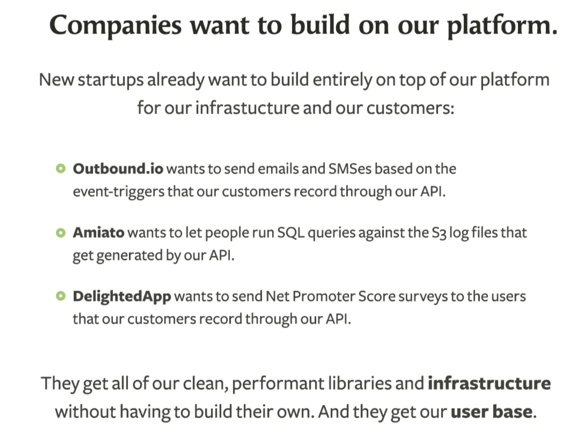

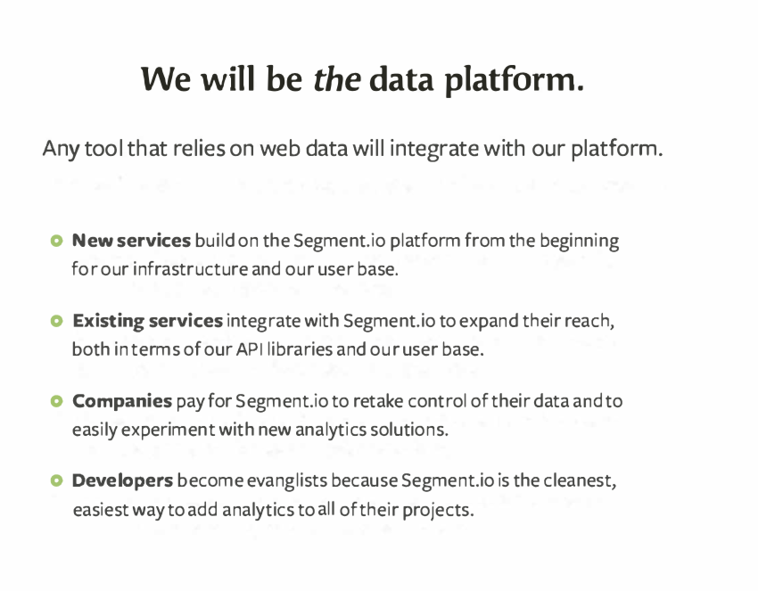

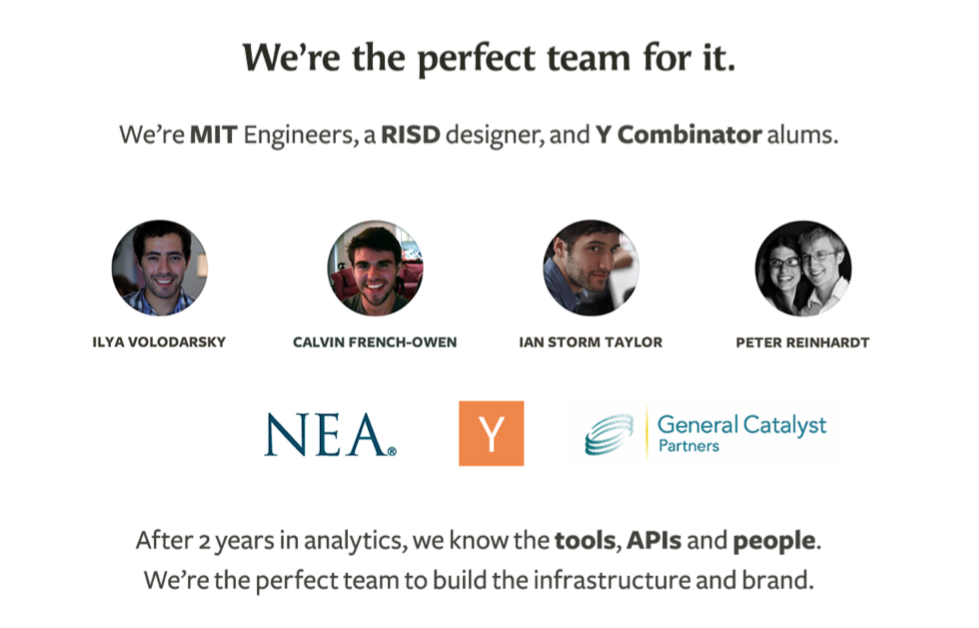

- [[PeterReinhardt]] led the bridge-round outreach; three of dozens of contacted investors replied, and the company ultimately closed $2 million at a $10.5 million post-money valuation, extending runway through its first $1 million in annual recurring revenue.

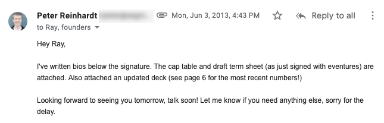

- The company later rejected partner revenue sharing because it created advisory conflicts and stopped charging for premium integrations because broader connection use increased customer value; customer revenue became the business-model center.
- By the 2019 account, Segment reported more than 250 integrations, over 100,000 messages per second, 20 billion warehouse rows synced daily, 350-plus employees, and a $175 million Series D, while retaining product launches, open source, and public feedback as operating habits.

## Key Quotes
> "professional engineers were saying ‘we need this at work.’" - the qualitative signal the founders distinguished from launch-day attention.

> "specific and actionable" - the content standard adopted after weak early Analytics Academy lessons.

> "a year ago, these six prospects expressed interest. Today, five of the six names on here have become customers." - the later distinction between early intent and actual adoption.

## Connections
- [[TwilioSegment]] - company and customer-data platform whose first-year product, feedback, funding, and platform evolution anchor the retrospective.
- [[HackerNews]] - launch venue that supplied attention, technical response, and unusually strong workplace-demand signals.
- [[PeterReinhardt]] - cofounder who led the bridge-round outreach and sent the closing email shown in the source.
- [[EarlyStartupDemandValidation]] - staged progression from public interest to signups, use, activation, payment, and repeatable customer value.
- [[ProductMarketFit]] - the team treated intense requests and adoption as early pull while continuing to test business viability and monetization.
- [[CustomerLedProductDevelopment]] - live chat and reader criticism turned concrete user problems into product and content changes.
- [[StartupFundingRound]] - the bridge round bought time for a pre-revenue company to reach recurring-revenue milestones.
- [[ContentLedAcquisition]] - product announcements and Analytics Academy were the team's principal owned distribution channels.

## Contradictions
- The case qualifies broad skepticism about Hacker News as a demand-validation channel: this launch produced explicit workplace requests and hundreds of signups, but it still does not show that ordinary HN attention predicts a durable market.
- The seed deck itself distinguishes interest from adoption. None of the six named large prospects used Segment at the time, although five reportedly became customers by the next year's Series A process.
- The deck's partner revenue sharing and premium-integration fees were hypotheses, not durable strategy. Segment later rejected both because one compromised neutral advice and the other discouraged the integration breadth that created product value.
- All growth, scale, fundraising, customer, and retrospective-causality claims are company-authored and selected after a successful Series D; the source provides no independent audit, failed-company comparison, or way to separate execution from market timing, network, capital, and luck.
- Several later platform and infrastructure figures are 2019 snapshots rather than current product facts.
