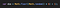
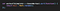

## Summary
[[RyanHanna]] recounts using [[Codecademy]]'s Code Year as an entry point to web programming, then consolidating that learning by building [[Sworkit]] around his own need for flexible workouts. The app moved from an HTML, CSS, JavaScript, and jQuery website wrapped with PhoneGap through Lifehacker exposure, paid distribution, full-time operation, and acquisition by [[Nexercise]]. The story supports learning through personally useful construction and staged [[SideProjectIncubation]], while its 25-million-download, profitability, award, and workout totals remain founder-reported 2017 outcomes rather than independent measures of retention or typical learner success.

## Key Claims
- A beginner can use a guided learning environment as a starting layer, then strengthen transfer by applying the material to an independently chosen problem.
- Hanna adapted a randomization pattern from a Code Year virtual-dice exercise when building Sworkit's randomized workout logic.
- Sworkit's first version was a web application built with HTML, CSS, JavaScript, and jQuery, then packaged as a native app with Adobe PhoneGap.
- The product began with Hanna's own constraint: he wanted workouts that fit the time, space, equipment, and fitness level available.
- A direct pitch to Lifehacker produced coverage and thousands of downloads, after which Hanna released a paid version and moved from systems engineering to mobile consulting and eventually full-time Sworkit work.
- Nexercise acquired and merged with Sworkit, and Hanna joined as vice president of product and engineering.
- By the article's publication, Hanna reports 25 million downloads, more than 50 million completed workouts, profitability, and an American College of Sports Medicine ranking as the leading fitness app.

## Key Quotes
> "I didn’t want to build something for the sake of building it — I wanted to create something that I would use, too." — Hanna on choosing the first project

> "Keep it simple at the beginning, work with your users and find out what they want, and funnel out from there." — Hanna's advice to new developers

## Connections
- [[RyanHanna]] — first-person narrator whose learning, career change, product work, and acquisition path anchor the article.
- [[Sworkit]] — workout application that grew from Hanna's learning project into the acquired product described here.
- [[Nexercise]] — fitness-app company that acquired and merged with Sworkit and employed Hanna as a product and engineering executive.
- [[Codecademy]] — Code Year supplied Hanna's entry point to web programming and the exercise pattern he says he adapted.
- [[ProgrammerMindset]] — the case illustrates movement from guided exercises to independent problem choice, implementation, debugging, and user iteration.
- [[ActiveLearning]] — building and modifying a personally useful application turned course exposure into applied practice.
- [[SideProjectIncubation]] — Sworkit progressed through spare-time work, public release, paid distribution, a full-time transition, and acquisition.
- [[ReleaseFocusedSideProjects]] — early release and external coverage created real user feedback and commercial evidence.
- [[CustomerLedProductDevelopment]] — Hanna advises starting simply and learning what users want after release.

## Contradictions
- The account qualifies the broadest criticism in [[why-you-shouldnt-learn-to-code-with-codeacademy]] by documenting one beginner who transferred Code Year material into an independent product. It does not overturn that source's narrower claim that guided lessons alone are insufficient: Hanna built outside the course, solved a personal problem, researched obstacles, shipped, and iterated with users.
- The article was published by Codecademy and is a selected founder success story. It provides no comparison group, learner base rate, acquisition terms, active-user or retention figures, audited profitability, or independent verification of its award and usage totals.
- The two code screenshots were opened and retained because they are the article's direct visual comparison between the lesson and product implementation, but the supplied files are only 60 pixels wide. Their exact code cannot be transcribed reliably, so the source note uses only the surrounding prose's claim that the functions were similar.
