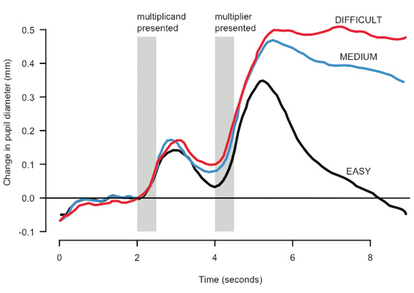
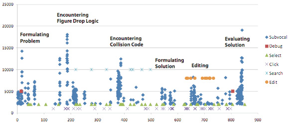

## Summary
[[ChrisParnin]] presents programmer interruption as a measurable context-recovery problem rather than a vague complaint about distraction. The supplied excerpt reports observational programming-session and survey results, describes developers' improvised recovery cues, and uses pupil-diameter and electromyogram evidence to argue that interruption is most disruptive during high cognitive load.

## Key Claims
- Office-task research cited by the article estimates that interrupted tasks take twice as long, contain twice as many errors, and occur in a setting where 57 percent of tasks are interrupted.
- An analysis of 10,000 programming sessions from 86 Eclipse and Visual Studio users, paired with a survey of 414 programmers, found a 10-15 minute delay before code editing resumed after interruption.
- After interruption during a method edit, programmers resumed work in under one minute in only 10 percent of observed cases, and a programmer was likely to receive only one uninterrupted two-hour session in a day.
- Developers commonly navigated through several locations to reconstruct context, sometimes left intentional compile errors as forced reminders, and treated source diffs as a cumbersome last resort.
- The article argues that interruption is most damaging at peak memory load; its pupil-response chart shows greater and more sustained dilation as arithmetic difficulty increases.
- The programming-task EMG chart aligns bursts of subvocal activity with phases such as formulating the problem, encountering figure-drop and collision logic, editing, and evaluating the solution, but its unlabeled vertical axis limits quantitative interpretation.

The pupil chart plots change in diameter in millimetres against time in seconds. All three series rise after the multiplicand and multiplier appear, but the easy series peaks lower and falls below baseline while the medium and difficult series remain elevated, supporting the article's use of pupil response as a cognitive-load indicator.

The programming timeline separates phases from problem formulation through solution evaluation. Subvocal readings cluster in several high-activity bursts, while search and edit actions occupy different intervals; because the vertical measure is not named and the figure is descriptive, it does not by itself establish a threshold for safe interruption.

## Key Quotes
> "A programmer takes 10-15 minutes to start editing code" — reported resumption delay after an interruption.

> "Programmers insert intentional compile errors" — an improvised reminder used to preserve unfinished intent.

## Connections
- [[ChrisParnin]] — author credited by the original publication and researcher presenting the programmer-interruption findings.
- [[ProgrammerInterruptionRecovery]] — synthesis of the reported costs, cognitive-load timing, and context-reconstruction behaviors.
- [[AttentionManagement]] — interruptions spend limited cognitive capacity and impose a recovery cost beyond their clock duration.
- [[CommunicationMultitasking]] — related evidence that switching away from demanding work creates a return-to-task burden.
- [[PersonalProductivity]] — protected work blocks and external reminders can reduce avoidable recovery effort.

## Contradictions
- The supplied Markdown is incomplete: it ends immediately after Figure 2, so this note does not claim to cover the original article's later recommendations, memory taxonomy, or references.
- The local files for Figures 1 and 2 were missing. Exact-name copies were recovered from the original Game Developer publication page, opened, inspected, and retained; the lead `.jpg` reference was actually an HTML copy of a generic news page and was omitted.
- The article summarizes findings without giving enough methods, distributions, comparison groups, or uncertainty to turn its headline figures into universal programmer benchmarks.
- Time until the next edit is an imperfect proxy for regained productivity: navigation and reading may be legitimate recovery work, and the excerpt does not separate interruption cost from task complexity, interruption type, or voluntary switching.
- The pupil and EMG figures support variation in workload signals, but neither figure proves that a specific physiological level predicts interruption harm in everyday software work.
