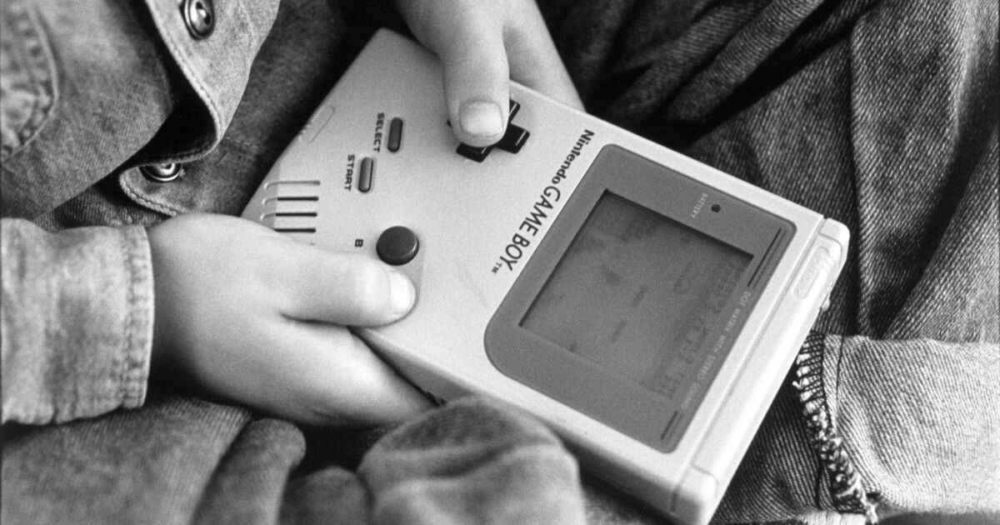

## Summary
The Los Angeles Times uses the [[GameBoy]]'s thirtieth anniversary to argue that affordability, portability, battery practicality, and a familiar home-console style of play mattered more than leading-edge specifications in making the handheld successful. It then traces the device's [[HardwareAfterlives]] through restoration and visual customization, [[Chiptune]] performance, and deliberately low-resolution photography. These practices turn technical limits into expressive materials, although the article is a celebratory feature built from selected enthusiasts rather than a comparative history of the handheld market.

## Key Claims
- [[Nintendo]] released the original [[GameBoy]] in Japan on April 21, 1989, and its lower price, battery practicality, and genuine portability helped it beat technically stronger rivals.
- [[GunpeiYokoi]]'s [[LateralThinkingWithWitheredTechnology]] favored recombining mature, inexpensive technology into accessible products rather than maximizing raw specifications.
- By the 2001 Game Boy Advance release, Nintendo had reportedly sold 110 million Game Boy units worldwide, making it the best-selling game system at that point.
- Replacement shells, paint, backlights, buttons, and audio modifications let owners repair, personalize, and extend the original hardware.
- Little Sound DJ and Nanoloop cartridges turn the Game Boy into a portable music generator, while further modifications can integrate synthesis and MIDI-controlled performance.
- The Game Boy Camera and Printer support 128-by-112-pixel monochrome photography whose visible limitations can become part of its social and artistic appeal.

## Key Quotes
> "It really was a true portable console." - Kelsey Lewin on the practical advantage of price and battery life.

> "I feel like there’s an art to it." - Maxwell Scheller on unmodified Game Boy Camera photography.

## Connections
- [[GameBoy]] - the handheld platform whose commercial and cultural afterlives organize the article.
- [[Nintendo]] - manufacturer whose product strategy is linked to mature technology and practical accessibility.
- [[GunpeiYokoi]] - inventor associated with the guiding product philosophy.
- [[LateralThinkingWithWitheredTechnology]] - design philosophy used to explain how practical tradeoffs beat superior specifications.
- [[HardwareAfterlives]] - repair, customization, musical reuse, and photography keep the device active beyond its intended lifecycle.
- [[Chiptune]] - musical practice that treats the Game Boy's sound hardware as an instrument rather than only a game component.
- [[ConstraintShapedInterfaceDesign]] - related pattern in which an old technical limitation becomes a durable aesthetic or interaction convention.

## Contradictions
- No direct contradiction with the existing wiki was found.
- The 110-million-unit figure and “best-selling game system” label are historical claims reported by the article and may depend on whether Game Boy family models are aggregated; the source does not provide a primary sales table.
- The article connects the Game Boy to modern mobile gaming and says Yokoi's philosophy still guides Nintendo, but it does not isolate those causal claims from brand, software catalog, distribution, licensing, or other market forces.
