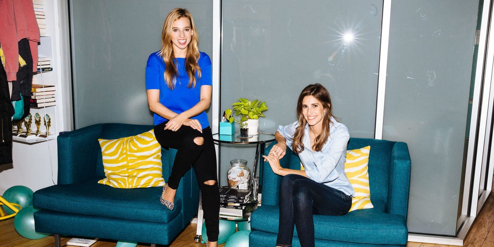

## Summary
In a 2015 joint interview, [[DanielleWeisberg]] and [[CarlyZakin]] describe leaving NBC News to found [[TheSkimm]] around a specific audience routine: busy professional women wanted current-events context but did not follow television, Twitter, or headline sites continuously. They chose morning email, seeded it through their personal and professional networks, repeatedly asked readers for five referrals, and converted early attention into venture-backed hiring after roughly eighteen months of apartment-based work. The account is useful as a founder origin and early-distribution narrative, but its subscriber, fundraising, and company-growth claims are retrospective and not independently verified here.

## Key Claims
- Weisberg and Zakin grounded theSkimm in an observed information gap among busy professional women who knew their own fields but lacked time and context for broader current events.
- Email was a routine-based product choice: the founders expected their audience to check messages from friends and family immediately after silencing a morning phone alarm.
- The founders quit with about two months of combined savings, no formal market study, no partners, and little equipment beyond their writing skill, laptops, and phones.
- Their relationship developed gradually from a study-abroad acquaintance into friendship, roommates, and then business partners rather than beginning as an immediate startup pairing.
- The first launch drew a reported few thousand signups from broad personal outreach, a request that each recipient recruit five friends, repeated reader referral asks, and an unsolicited Today show mention by [[HodaKotb]].
- Six months of continuous work produced a health and operating-limit crisis; venture funding in late 2013 enabled hiring from January 2014 and growth to a reported 16 employees by the interview.
- The product vision was broader than one newsletter: recreate the institutional role of morning television around the target audience's routines and future formats.

## Key Quotes
> "We wanted to create a news source for our friends, something that fit into their routine" - Weisberg on connecting product format to audience behavior.

> "We did not jump into starting a business together overnight." - Weisberg on the relationship history preceding the company.

## Connections
- [[TheSkimm]] - company whose audience problem, email format, launch, fundraising, and early operating history the founders recount.
- [[DanielleWeisberg]] - co-founder describing her newsroom path, the audience gap, product choice, personal risk, and early workload.
- [[CarlyZakin]] - co-founder describing her newsroom path, the initial product resources, referral launch, and longer-term product vision.
- [[CoFounderFit]] - the pair's progression from acquaintance to friends, roommates, and partners supplied relationship evidence before founding.
- [[FounderInstinct]] - their decision combined direct audience familiarity with a strong intuition, but almost no formal market research.
- [[StartupDistributionStrategy]] - morning email, personal-network seeding, explicit referral asks, and earned media formed the initial channel mix.

## Contradictions
- The interview does not directly contradict the current wiki synthesis. It qualifies founder-instinct narratives by showing that the founders' “gut feeling” still came from newsroom experience and repeated observation of friends, while leaving open whether those signals generalized beyond their immediate network.
- The reported first-day signups, ongoing growth, rejection rate, financing, and headcount are founder recollections in a success-profile interview. No subscriber cohorts, retention, engagement, acquisition cost, fundraising documents, or independent company records are supplied.
- A prominent Today show endorsement arrived within two weeks, so the article cannot isolate the effect of referrals, email-routine fit, founder networks, celebrity exposure, or broader press on early growth.
- The retained lead photograph shows Weisberg and Zakin together in an apartment setting, supporting the story's working context but not its subscriber, fundraising, or product-performance claims.
