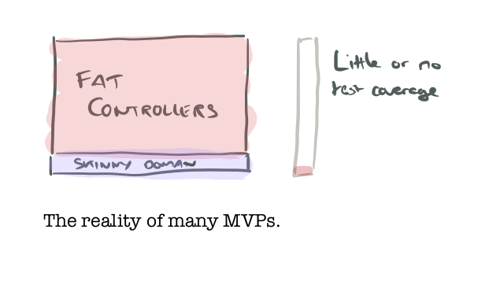
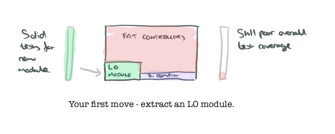
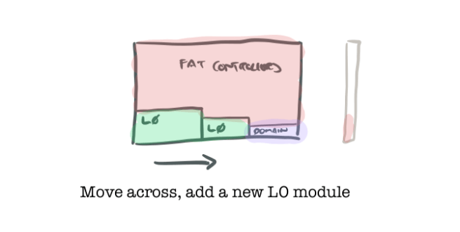
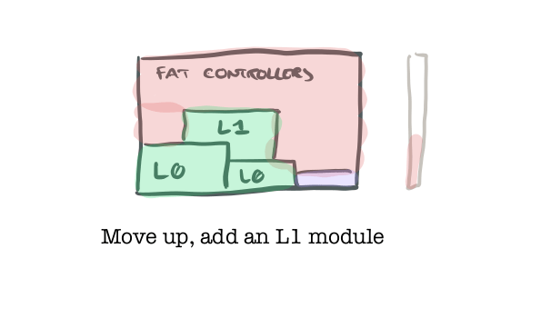
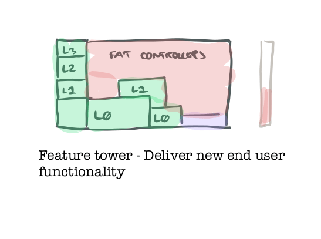

## Summary
[[AdrianColyer]] argues that a rapidly built [[MinimumViableProduct]] needs a different engineering strategy once real users and credible market pull make continued investment likely. His rescue plan establishes continuous integration, staging, and production promotion first, then replaces fat transaction-script controllers incrementally with tested modules built from lower-level abstractions upward. [[IncrementalMVPModernization]] preserves feature momentum through narrow “feature towers,” but requires every addition to improve the codebase's tested structure rather than enlarge its untested surface.

## Key Claims
- Prototype-style code can be a rational response to product uncertainty, but growing usage changes the cost of weak structure, duplicated logic, direct infrastructure calls, manual testing, and uncertain changes.
- A minimum safety baseline is continuous integration, automatic deployment of passing builds to a production-like staging environment, and controlled promotion from staging to production.
- Teams can modernize without a full rewrite by extracting one low-level module with robust tests, moving existing code onto it, and repeating across or upward through a uses hierarchy.

- Tests for higher-level modules should replace lower modules at their public boundary rather than restub their internal HTTP or infrastructure behavior, because that leakage couples tests to implementation details.
- Modernization can proceed horizontally by adding another low-level module, vertically by building a higher-level module once its dependencies are tested, or as a thin bottom-to-top feature slice.

- New customer-visible work should leave the overall codebase healthier instead of extending untested transaction scripts.

- The target architecture is provisional: teams should sketch domain models, information-hiding modules, and dependency levels, then revise them as implementation and requirements reveal mistakes.
- The same incremental logic can inform microservice extraction or a strangler migration, but distributed systems add design costs and Colyer prefers bottom-up restructuring for MVP-style projects.

## Key Quotes
> “What you do next can have a big impact on the long-term success of the project.” — on the transition after an MVP attracts real users

> “You just found a tiny bit of solid ground that you can build upon!” — on the first tested low-level module

> “whenever you add some functionality, you’re improving the overall health of the codebase” — the article's golden rule for continued feature work

## Connections
- [[AdrianColyer]] — author connecting classic modular-design guidance to a practical post-MVP rescue plan.
- [[MinimumViableProduct]] — the starting artifact may be intentionally rough while the team is testing whether the product deserves continued investment.
- [[IncrementalMVPModernization]] — the article's bottom-up, test-backed transition from prototype structure to a maintainable product codebase.
- [[ContinuousDelivery]] — CI, automatic staging deployment, and controlled production promotion establish the first safety loop.
- [[InternalSoftwareQuality]] — tested modules and clearer boundaries make future changes safer and faster.
- [[ModularMonolith]] — the proposed internal module hierarchy improves a monolith without requiring immediate service extraction.
- [[ChangeSafety]] — staging, tests, and bounded refactoring reduce uncertainty around production changes.

## Contradictions
- The article qualifies MVP sources that permit disposable or weakly structured prototypes: that tradeoff may be reasonable during validation, but it becomes increasingly dangerous once real usage makes continued operation and change likely.
- The bottom-up preference does not establish that a full rewrite, top-down restructuring, strangler pattern, or microservice extraction is always inferior. Team size, system boundaries, operational capacity, risk, and the condition of the existing code can change the appropriate migration strategy.
- The evidence is one practitioner's generalized plan and personal preference, not a comparative study. It provides no measured delivery, defect, migration-time, onboarding, or business outcomes, and its expected controller style and hierarchy do not describe every MVP codebase.
- The appended discussion surfaces a real resource constraint: engineering time spent on internal restructuring competes with feature work. The feature-tower pattern is the proposed reconciliation, but the source does not quantify the right allocation or prove that every increment can satisfy both goals.
