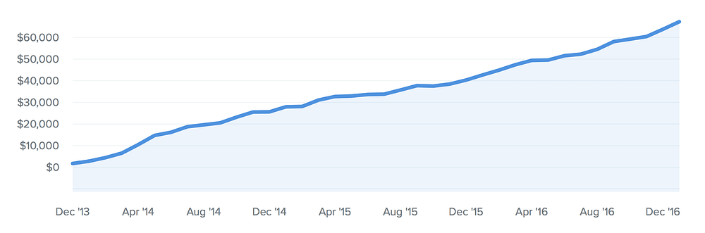

## Summary
This first-person [[Baremetrics]] essay describes how two funding rounds, fast hiring, optimistic revenue assumptions, and pursuit of hockey-stick growth left the company with less than two months of runway in June 2016. After team-wide pay cuts, a ten-day break, and a return to profitability, the author rejects the idea that every startup should race toward maximum growth or an exit. He argues that founders should define success through sustainable economics, desired income and lifestyle, employee experience, or customer happiness rather than inherit Silicon Valley's default objective.

## Key Claims
- Baremetrics raised $800,000 across two rounds, hired and spent quickly, and budgeted as though steady month-over-month revenue would soon become hockey-stick growth.
- The author says this pressure was self-prescribed rather than demanded by investors, making internalized startup norms—not funding alone—the immediate cause in his account.
- With less than two months of runway, the team took a 15% pay cut and the author took 30%; the essay reports that salaries were later restored and the company became profitable.
- A ten-day break created enough distance for the author to recognize that urgency was driving rapid launches and immediate shifts to the next idea rather than sustained learning.
- Treating startup work as an all-consuming race can produce founder burnout, narrow judgment, and decisions made inside an occupational bubble.
- [[FounderSuccessDefinition]] can center sustainable income, a long-lived independent business, family travel, a well-paid and satisfied team, customer happiness, or no sale at all.

The retained chart supports the essay's distinction between steady growth and a sudden breakout: the plotted series rises from roughly $1,000 in December 2013 to about $67,000 by December 2016, with pauses but no visible hockey-stick discontinuity. The image does not label the metric beyond dollars, and the source provides no underlying data, so those values are approximate visual readings rather than audited results.

## Key Quotes
> "But there is no race." - on rejecting an imaginary startup finish line.

> "creating your own definition of success" - on replacing inherited startup goals.

## Connections
- [[Baremetrics]] - company whose runway crisis and recovery anchor the argument.
- [[FounderSuccessDefinition]] - central proposal that founders choose the outcomes their company should serve.
- [[VentureBackedGrowthPressure]] - qualified by the author's insistence that investors did not demand the growth-at-all-costs behavior.
- [[BurnoutPrevention]] - distance from work is presented as a way to restore perspective and avoid all-consuming founder obsession.
- [[StartupRunway]] - the company changed course when cash fell below two months.
- [[StartupCulture]] - Silicon Valley stories and formulas supplied the race metaphor the author had internalized.

## Contradictions
- The account challenges claims that venture pressure always arrives as direct investor coercion: outside capital expanded the capacity to spend, but the author identifies his own optimism and imitation of startup norms as the proximate pressure.
- The recovery, profitability, salary restoration, revenue trajectory, and million-dollar forecast are first-party claims without financial statements, margin detail, retention data, or later outcome evidence.
- The essay rejects obsessive work as unnecessary and harmful, but it does not compare founder workloads or establish which operating changes, beyond pay cuts and reduced spending, produced the reported recovery.
- The startup-race illustration was opened and omitted as decorative; the revenue chart was retained because it adds the time series used to distinguish steady growth from a hockey stick.
