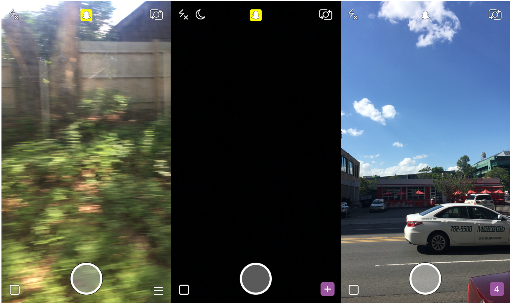

## Summary
[[BenBasche]] argues that [[Snapchat]] was not merely a desktop-derived service redesigned for phones but an [[AuthenticallyMobile]] social product whose camera, network, capture device, consumption device, vertical media, and ephemerality formed one system. He contrasts its low-stakes, present-oriented exchange with the persistent, presentation-heavy feeds of [[Facebook]] and [[Instagram]], proposing “jumping into” a friend’s experience as Snapchat’s organizing idea. The essay is a 2016 product-strategy interpretation: its adoption, sharing, engagement, and competitive claims are historical and largely secondary rather than causal evidence.

The retained composite shows Snapchat opening directly into three different camera states—motion blur, darkness, and an everyday street—supporting the article’s claim that collection begins with whatever is happening now rather than with a polished feed.

## Key Claims
- [[AuthenticallyMobile]] products do not simply adapt desktop interactions to a smaller screen; their value depends on capabilities such as always-carried connectivity, cameras, sensors, location, and a unified capture-and-consumption device.
- Snapchat’s camera-first default emphasizes collection and immediate expression, while Facebook and Instagram’s feed model emphasizes presentation and consumption of persistent artifacts.
- Persistent profiles and mixed audiences can increase self-presentation pressure and contribute to [[ContextCollapse]], although the essay does not establish that Snapchat caused reported declines in original sharing elsewhere.
- Ephemeral photographs can orient communication toward the present rather than toward an archive, lowering the perceived cost of sharing mundane or temporary selves without eliminating performance or voyeurism.
- “Jumping into their experience” describes a reciprocal interaction in which vertical photos, videos, doodles, stickers, and filters help people share moments because capture and consumption occur on the same device.
- Snapchat’s ambiguous purpose and gesture-heavy interface may make it harder to explain, but the author argues that ambiguity—not interface mechanics alone—was also part of its breadth as a social environment.
- The essay frames Facebook as a broad “phonebook” and Snapchat as a more active interpersonal “phone,” then speculates that the latter could extend its authentically mobile position into post-phone products.

## Key Quotes
> “Jumping into their experience” — [[EvanSpiegel]]’s description of Stories, used as the essay’s closest unified account of Snapchat.

> “Without this impermanence, Snapchat would feel like surveillance.” — Basche’s interpretation of ephemerality as a condition of intimate presence.

## Connections
- [[BenBasche]] - author of the historical product-strategy interpretation.
- [[Snapchat]] - camera-first social product at the center of the argument.
- [[AuthenticallyMobile]] - distinction between phone-adapted services and experiences dependent on mobile capabilities.
- [[EvanSpiegel]] - supplies the “camera company” position and experience-jumping account.
- [[Facebook]] - feed and directory incumbent contrasted with Snapchat’s interpersonal immediacy.
- [[Instagram]] - presentation-centered visual feed contrasted with Snapchat’s collection-centered camera.
- [[ContextCollapse]] - mixed audiences and persistent identity can raise the social cost of personal posting.
- [[HereAndNowMedia]] - related account of ephemerality, immediacy, and shared presence.
- [[ProductContextAlignment]] - Snapchat’s unusual interface is interpreted through its product purpose and social norms rather than generic discoverability rules alone.

## Contradictions
- The essay attributes Facebook and Instagram sharing weakness partly to Snapchat, persistent identity, and archival pressure, but offers no controlled behavior, cohort, or migration data capable of separating competition from ranking, audience growth, changing norms, or other causes.
- It cites reported Facebook, Instagram, revenue, rank, photo-sharing, and engagement figures without the underlying datasets and explicitly doubts the reported 40% Instagram interaction decline.
- Ephemerality can reduce persistence pressure but does not guarantee authenticity, intimacy, privacy, safety, or freedom from screenshots, platform retention, surveillance, performance, and harassment.
- The forecast that Snapchat’s “phone” role would carry it beyond mobile is speculative and should not be treated as evidence of later product or market outcomes.
- All five local image references were opened. A 1732×1028 camera-state composite was retained; its 1200×712 duplicate and 60×36 thumbnail were omitted. A filtered selfie was decorative and omitted. The “authentically mobile” comparison table is materially placed, but its archived copy is only 60×27 pixels and remained unreadable after lossless enlargement; the original publication preserved the credit and surrounding interpretation but not legible cells, so no visual detail from the table was used as evidence.
