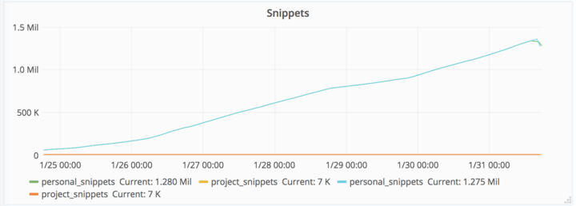
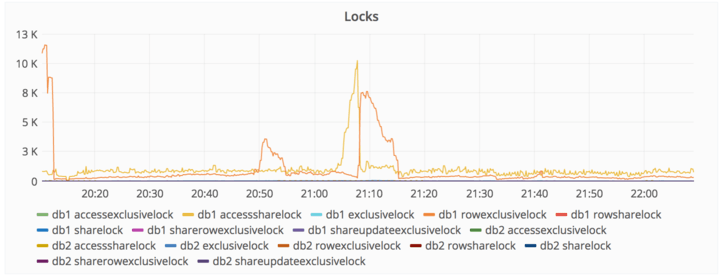
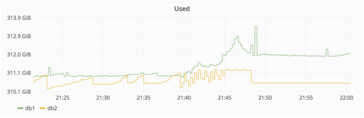
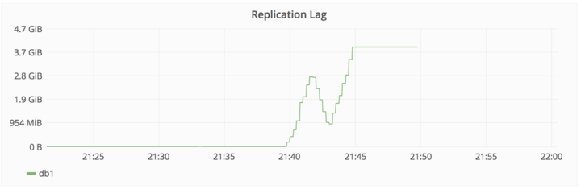
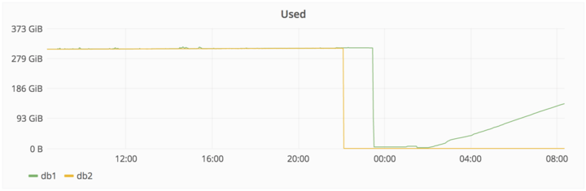

## Summary
[[GitLab]] reports how abusive write traffic, stalled [[PostgreSQL]] replication, fragile recovery procedures, and an operator command run on the wrong host culminated in deletion of the primary database and six hours of lost GitLab.com application data. The incident is a concrete [[SystemReliability]] and [[BackupAndRecovery]] failure: five nominal backup or replication techniques were unavailable, unreliable, unconfigured, or unsuitable, so recovery depended on a fortuitous six-hour-old staging snapshot. Git repositories, wikis, and self-hosted installations were not affected.

## Key Claims
- Spammers drove personal snippet count to about 1.28 million and contributed to a write lockup before replication fell roughly 4 GiB behind.
- During the replication repair, an engineer removed the PostgreSQL data directory on the primary host instead of the secondary; only about 4.5 GiB of roughly 300 GiB remained when deletion stopped.
- Nominal redundancy did not equal recoverability: scheduled dumps were tiny or absent, the S3 bucket was empty, Azure snapshots excluded database servers, and the replication procedure was fragile and poorly documented.
- Recovery used a manually created staging snapshot from about six hours earlier, producing permanent loss of database-backed changes between 17:20 and 23:25 UTC.
- The charts corroborate the incident sequence: rapidly rising snippets, lock spikes, database divergence and replication lag, followed by deletion and gradual restoration of the primary.

## Key Quotes
> "Losing production data is unacceptable" — GitLab's assessment of the incident.

> "out of five backup/replication techniques deployed none are working reliably" — the live incident account's recovery diagnosis.

## Connections
- [[GitLab]] — company operating GitLab.com and publishing the live incident account.
- [[PostgreSQL]] — database whose replication, configuration, deletion, and restoration dominate the incident.
- [[SystemReliability]] — the failure crossed load control, replication, operational procedure, human factors, and recovery readiness.
- [[BackupAndRecovery]] — multiple nominal safeguards failed to provide a tested recoverable copy at the required point in time.
- [[ServiceObservability]] — snippet growth, lock counts, disk use, and replication lag exposed parts of the failure sequence.
- [[ChangeSafety]] — destructive host-level work lacked sufficient target verification and blast-radius controls.

## Contradictions
- No direct contradiction found. The incident strengthens the wiki's existing position that backup existence and replication claims are insufficient without verified, practiced restoration.
- This was a live incident account rather than the later full postmortem, so causal detail and remediation commitments remained provisional at publication time.
