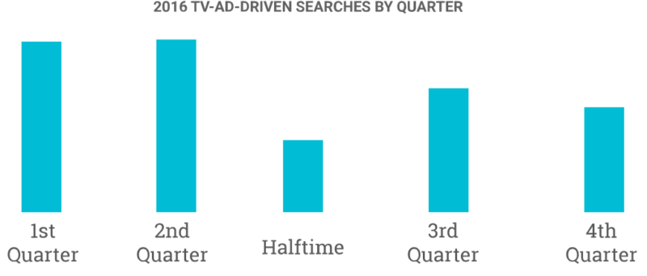
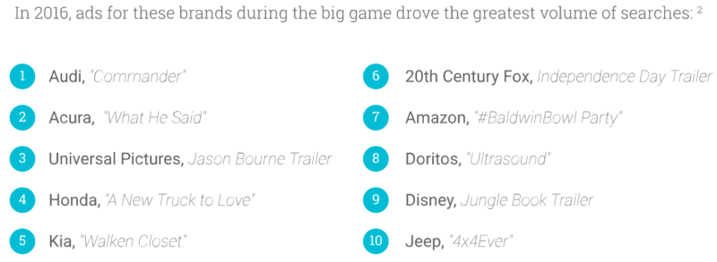

## Summary
[[GinnyMarvin]] reports [[Google]]'s analysis of searches attributed to television advertisements during the 2016 Super Bowl. Google said those ads generated more than 7.5 million incremental Google and [[YouTube]] searches, 40% more lift than in the prior year's game, with smartphones accounting for 82% of the response. The source shows search as an immediate cross-media behavior, but its Google-supplied aggregate figures do not disclose the attribution method, baseline, absolute brand volumes, uncertainty, or later business outcomes.

## Key Claims
- Smartphones accounted for 82% of searches that Google attributed to Super Bowl television ads, up 12 percentage points from the reported 70% share in 2015; desktop or laptop devices accounted for 11% and tablets for 7%.
- Google reported more than 7.5 million incremental ad-driven searches during the Broncos-Panthers game, a 40% larger lift than the previous year's advertisers received.
- Search response was strongest in the first two quarters, with the inspected chart showing the second quarter slightly above the first; halftime was the low point, and both second-half quarters trailed the first-half quarters.

- The 2016 first-half concentration resembled the prior year's close game but contrasted with the 2014 blowout, when ad-content searches reportedly rose in the second half as the Seahawks beat the Broncos 43-8.
- Audi's "Commander" ad generated the largest reported brand-search volume, followed by Acura and Universal Pictures' *Jason Bourne* trailer; four of the top five were automotive brands.

- The inspected top-ten graphic continues with 20th Century Fox, Amazon, Doritos, Disney, and Jeep, but provides ranks rather than absolute search counts or lift values.
- Google Trends reportedly showed Denver leading Carolina in pre-game search interest, Carolina leading during most of the game, and Denver retaking the lead after winning.

## Key Quotes
> "82 percent of TV ad-driven searches during the Super Bowl happened on smartphones." - on the device mix of immediate search response.

> "the ads drove more than 7.5 million incremental searches" - Google's reported aggregate lift during the game.

## Connections
- [[GinnyMarvin]] - Search Engine Land author reporting Google's released analysis.
- [[Google]] - source of the device, incremental-search, timing, brand-ranking, and Trends data.
- [[YouTube]] - included with Google Search in the reported ad-related search activity.
- [[CrossMediaSearchResponse]] - television exposure generated immediate search behavior, predominantly on smartphones.
- [[MarketingAttribution]] - the report uses an incremental-search baseline to assign response to television advertisements without publishing the method.
- [[BrandAdvertising]] - Super Bowl placements sought broad attention whose immediate brand-search response varied by advertiser.

## Contradictions
- The source reports precise shares and lift but does not explain Google's attribution window, counterfactual baseline, query classification, deduplication, sampling, or whether searches represented unique people; “incremental” should therefore be treated as Google's reported estimate rather than an independently reproducible causal result.
- Search volume measures attention or curiosity, not ad recall, sentiment, purchase intent, sales, customer value, or profit, and the ranked brand graphic supplies no absolute values.
- The article and charts are a 2016 event snapshot. They do not establish that the device mix, game dynamics, brand ranking, or effect size generalizes to later events or other television campaigns.

## Image Notes
All four unique remote images were recovered from the publisher's current asset path and opened. The generic Google-device photograph and Super Bowl 50 illustration were omitted as decorative, as were three repeated copies. The quarter chart and top-ten brand ranking were retained once each because they add relative timing and complete ranking evidence not fully repeated in the prose.
