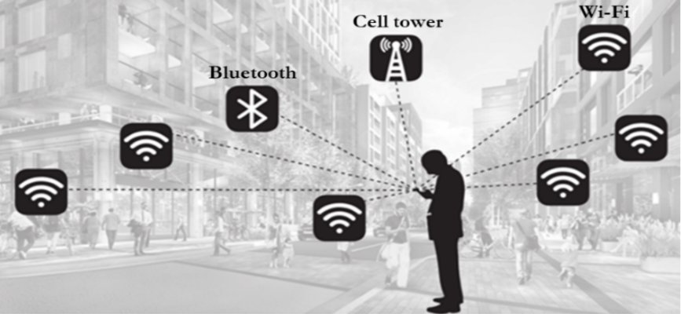
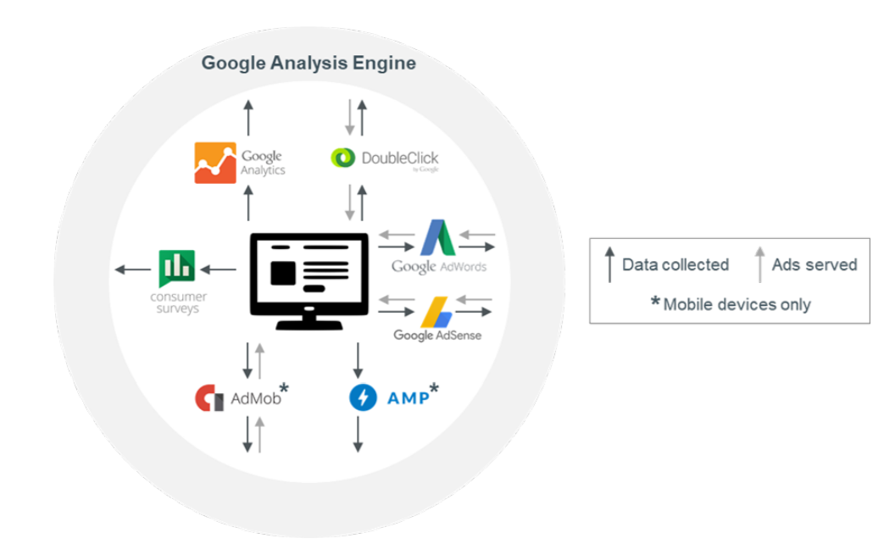

## Summary
Digital Content Next summarizes Douglas C. Schmidt's 2018 research on the breadth of [[Google]]'s passive and active data collection across [[Android]], [[Chrome]], advertising products, and third-party sites. Its stationary-device experiments report much more background communication from Android/Chrome than from iOS/Safari, while its identity analysis argues that advertising identifiers and DoubleClick cookies can be associated with a signed-in Google identity. The article is an advocacy-oriented summary of the underlying paper, so its historical measurements do not establish current product behavior.

## Key Claims
- A stationary Android phone with Chrome active in the background reportedly sent location information to Google 340 times in 24 hours, averaging 14 communications per hour; location made up 35% of the observed samples.
- In the cited experiments, idle Android/Chrome generated nearly 50 times as many hourly Google data requests as idle iOS/Safari, while Android contacted Google nearly 10 times as often as an Apple device contacted Apple.
- The comparison attributes much of the difference to [[Android]] and [[Chrome]] as data-collection surfaces, but it does not isolate every hardware, software, configuration, account, or network difference between the tested devices.
- Advertising IDs and DoubleClick cookie IDs, although presented as pseudonymous identifiers, could be joined to a real Google account when device identifiers or signed-in Google applications appeared in the same data environment.
- Significant collection occurred while users were not directly interacting with Google products, making background platform behavior part of the privacy boundary rather than only explicit search or application use.

## Key Quotes
> "A major part of Google's data collection occurs while a user is not directly engaged with any of its products." - the article's passive-collection conclusion.

> "Google has the ability to associate anonymous data collected through passive means with the personal information of the user." - the article's identity-linkage claim.

## Connections
- [[Google]] - company whose cross-product data collection and identifier linkage the research examines.
- [[Android]] - mobile platform producing the largest background-communication volume in the cited experiments.
- [[Chrome]] - browser identified as a critical collection surface, especially when active in the background on Android.
- [[IdentityResolution]] - advertising IDs and DoubleClick cookies can bridge pseudonymous activity to a Google account.
- [[LocationDataPrivacy]] - background location transmission illustrates how movement data can be collected without active interaction.
- [[Adtech]] - Google Analytics, DoubleClick, AdWords, AdSense, AdMob, and AMP appear as collection, analysis, or ad-delivery components in the retained diagram.

## Contradictions
- The source's high Android/Chrome request volume qualifies any account of privacy as only a user-controlled settings problem: it argues that platform defaults and background services can collect data without immediate interaction.
- The article summarizes experiments and claims from a supported research paper but does not reproduce the full protocol, sample size, raw traffic, or later replication. Its 2018 measurements should not be treated as current behavior or as proof that every communication contained a distinct location observation.
- Comparisons among Android/Chrome, iOS/Safari, Google, and Apple are configuration-sensitive and do not by themselves establish equivalent request semantics, necessity, retention, or downstream use.

## Image Notes
Both unique local images were opened and retained. The first source image appeared twice and was deduplicated; it illustrates Wi-Fi, Bluetooth, and cell-tower location surfaces. The second diagram contributes system relationships not fully stated in the prose by showing Google Analytics, DoubleClick, AdWords, AdSense, AdMob, AMP, and consumer surveys exchanging collected data or served ads with a shared Google analysis environment.
