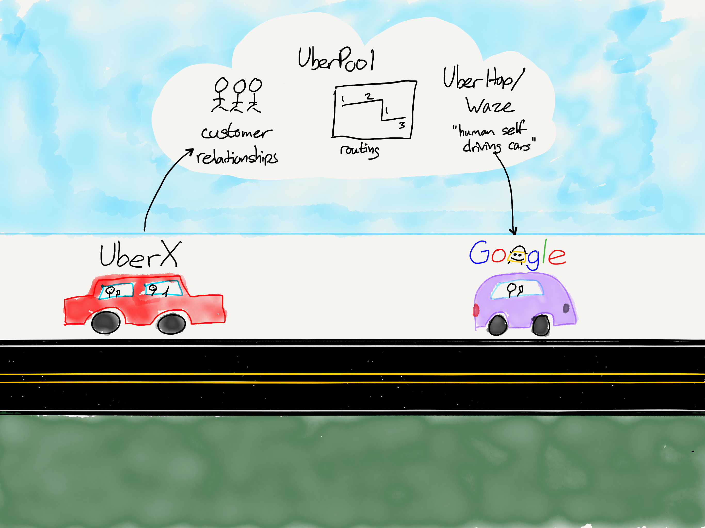

## Summary
[[BenThompson]] argues in [[Stratechery]] that autonomous vehicles would not turn ride-hailing into a simple contest over self-driving technology. His [[TransportationAsAService]] model separates drivers, cars, mapping, routing, and riders, then argues that autonomy removes the driver-side network effect while making fleet capital, detailed maps, dispatch optimization, customer habit, and government approval more important. The retained diagram reinforces the transitional argument by showing UberX contributing customer relationships, UberPool contributing routing, and UberHop/Waze contributing human-driven shared rides toward an eventual Google autonomous service.

## Key Claims
- [[TransportationAsAService]] consists of five interdependent components: drivers, cars, mapping, routing, and riders; winning any one component does not automatically produce a complete service.
- UberX's advantage came from a two-sided rider-driver marketplace whose liquidity improved matching, but autonomous fleets would remove drivers as scarce marketplace participants and weaken that source of winner-take-all power.
- UberPool made routing a strategic capability because pooled trips require repeated real-world heuristics for matching several riders, pickup points, destinations, and vehicle capacity while maintaining acceptable service.
- Waze-style commuting and UberCommute are transitional "human self-driving cars": the driver and vehicle are already traveling and largely sunk costs, so their economics can approach an autonomous shared ride before robotic fleets exist.
- Full autonomy changes the cost stack rather than eliminating it: vehicles become capital-intensive, maps need much greater detail, routing remains complex, and deployment depends on manufacturing scale and government approval.
- Google was framed as stronger in self-driving technology and mapping, while [[Uber]] was framed as stronger in routing, ride-service business models, and customer habit; the contest therefore depended on combining complementary capabilities.
- Thompson favored Uber's 2016 position because existential urgency, a routing head start, gradual fleet rollout, Google's possible reluctance to fund capital-intensive deployment, and incumbent customer attachment gave Uber time to become good enough.

## Key Quotes
> "I see five components that really matter" - Thompson introducing drivers, cars, mapping, routing, and riders as the TaaS stack.

> "it’s only half of the equation" - on self-driving vehicle technology without the backend that dispatches and utilizes the fleet.

## Connections
- [[TransportationAsAService]] - five-component framework and staged transition from UberX through pooling and commuting to autonomous fleets.
- [[Uber]] - ride-hailing incumbent whose routing, marketplace liquidity, customer habit, and existential incentive form the article's main competitive case.
- [[Google]] - mapping and autonomy leader whose Waze experiment is interpreted as a route toward operational ride-sharing knowledge.
- [[BenThompson]] - author applying platform, capability, capital, and market-structure reasoning to transportation.
- [[Stratechery]] - publication context for the 2016 analysis.
- [[MarketplaceColdStart]] - Uber's installed rider-driver liquidity enabled pooled-trip experimentation that a new entrant could not immediately reproduce.
- [[AutonomousVehicleDataNetworkEffects]] - adjacent fleet-learning concept; this source emphasizes maps, routing, and deployment scale rather than safety-data volume alone.
- [[SubsidizedUnitEconomics]] - qualifies the claim that customer attachment and service leadership establish durable economic advantage.

## Contradictions
- The article is a 2016 forecast and does not establish which company later achieved technical, regulatory, or economic leadership in autonomous ride-hailing.
- Its confidence in Uber is qualified by the wiki's [[SubsidizedUnitEconomics]] evidence: routing skill and customer habit do not by themselves prove profitable fleet economics.
- Treating drivers as nonexistent in the autonomous end state abstracts away remote assistance, maintenance, charging, cleaning, repositioning, safety operations, and other labor not analyzed in the source.

## Image Notes
The sole effective local image was opened and retained because it adds an architecture-and-transition view not fully repeated in the prose. It places UberX customer relationships and UberPool routing in a shared cloud, links UberHop/Waze "human self-driving cars" toward Google, and visually separates the present human-driven vehicle layer from the service capabilities above it.
