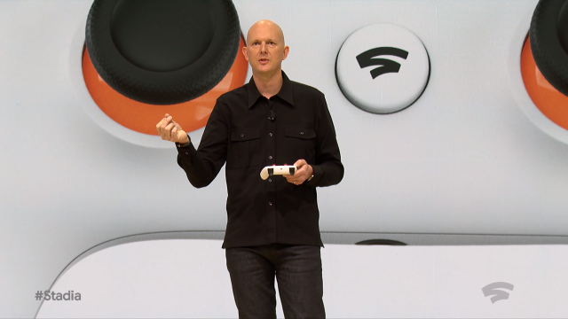

## Summary
Ars Technica's [[RonAmadeo]] argues that [[Google]]'s unusually dense 2019 sequence of product, feature, and service shutdowns damaged more than the affected offerings: it weakened the confidence consumers, enterprise customers, developers, and hardware partners need before investing in a platform. The article uses the then-new [[GoogleStadia]] announcement to show the spillover, as mainstream launch coverage asked whether Google would sustain the service long enough for users and developers to commit. The argument establishes a historically situated reputation mechanism rather than measuring brand sentiment or proving that every shutdown was avoidable.

The application strip visually groups five products implicated in Google's shutdown reputation: Hangouts, Google+, Google Play Music, Inbox, and Allo.

## Key Claims
- In the first 91 days of 2019, the article counted an official Google product, feature, or service shutdown about every nine days, with additional wind-downs already announced.
- [[ProductLifecycleTrust]] matters because adopting a platform can require stored data, purchased hardware, social coordination, workflow change, application development, or multi-year manufacturing commitments that are costly to reverse.
- Consumers risk lost data, stranded devices, and repeated migration; enterprise buyers value predictable partners; developers need stable APIs and policies; and hardware manufacturers need services to survive development and support cycles.
- Paid access does not remove platform risk: the article cites disruptive Google Maps API price increases, inconsistent Google Play enforcement, and limited human recourse as reasons developers may hesitate to invest.
- Repeated shutdowns create portfolio-wide spillover because a new team inherits the parent company's reputation even when it did not make earlier closure decisions.
- [[GoogleStadia]] launch coverage made that spillover visible: journalists and prospective users asked about long-term commitment alongside feasibility and product appeal.
- Large investment and cross-company participation are weak commitment signals on their own because Google+ had also received substantial company-wide backing before closure.

The launch image places [[PhilHarrison]] in front of an enlarged Stadia controller while presenting the service whose credibility the article argues was burdened by Google's earlier shutdowns.

## Key Quotes
> "These groups need to feel the platform they invest in today will be there tomorrow" - on the common trust requirement across platform constituencies.

> "I understand the concern." - Phil Harrison acknowledging the shutdown question during a Stadia interview.

## Connections
- [[Google]] - company whose shutdown cadence and portfolio-wide reputation the article critiques.
- [[GoogleStadia]] - launch case in which questions about service longevity accompanied questions about technical feasibility and appeal.
- [[ProductLifecycleTrust]] - broader confidence that a product or dependent service will remain available long enough to justify adoption costs.
- [[DeveloperPlatformTrust]] - developer-specific confidence weakened by unstable APIs, pricing, enforcement, and support.
- [[PlatformDistributionDependence]] - adjacent risk faced when a business or product depends on another company's controlled surface.
- [[RonAmadeo]] - Ars Technica author making the brand-damage argument.
- [[PhilHarrison]] - Stadia executive who acknowledged the concern and cited the project's investment and cross-company scope.

## Contradictions
- No direct contradiction with existing wiki claims was found. The source broadens [[DeveloperPlatformTrust]] beyond APIs and distribution to consumers, enterprises, and hardware partners making product-lifecycle commitments.
- The article is an April 2019 opinion analysis built from a selected shutdown list and press examples, not a longitudinal brand study; it does not measure customer switching, developer investment, enterprise purchasing, partner behavior, or the relative merit of maintaining each product.
- Shutdowns with migration paths, feature removals, business exits, and complete product closures impose different costs, so the article's average treats unlike events as one reputation signal.
- Its Stadia discussion concerns launch-time expectations and cannot establish later product performance, customer behavior, or closure outcomes.
- The supplied Markdown appears to omit the beginning of one developer paragraph before “months building an app,” so no claim depends on reconstructing the missing text.

## Image Notes
All six local image occurrences were resolved and opened. Two files are near-duplicate decorative renderings of a damaged Google wordmark and were omitted. The discontinued-app strip and the Phil Harrison Stadia photograph were each embedded twice; one canonical copy of each was retained at its semantic position and the duplicate occurrences were omitted.
