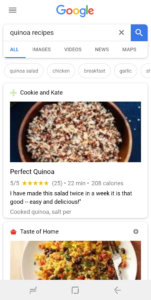

## Summary
[[CaseyWinters]] argues that mobile users' preference for immediate answers and options is moving [[Google]] from referring searchers to websites toward becoming the discovery interface itself. For inventory aggregators, this changes [[PlatformDistributionDependence]]: internal-search and doorway-page policies constrain indexable category pages while Google's build, buy, or partner strategy can absorb the aggregation layer. Winters recommends distributing individual listings into Google's discovery surfaces and building direct audience loyalty, but the article is a 2018 strategic forecast rather than measured evidence that the pattern applies uniformly.

## Key Claims
- Organic search lasted unusually long as an acquisition channel because user demand for answers aligned with Google's product and advertising economics.
- Mobile time, bandwidth, and app competition favor immediate answers or option cards over repeated navigation through ten external links.
- Google increasingly acts as the aggregator for category searches, reducing the value of third-party inventory and internal-search pages that once ranked for popular queries.

- Google can enter verticals by building a product, buying a data supplier, or partnering with fragmented suppliers that adopt its markup.
- Aggregators exposed to this shift should optimize individual listings for platform discovery while developing loyal, direct demand with meaningful switching costs.
- Refusing to participate is unstable when a competitor can supply inventory to Google, although differentiated aggregators may still create more value than Google's generic result surface.

## Key Quotes
> “Users want an answer, and they want it immediately.” — on the mobile search experience.

> “give us your content, and we’ll aggregate it” — Winters's interpretation of the strategic bargain offered to aggregators.

## Connections
- [[CaseyWinters]] — author connecting SEO experience at Apartments.com, Grubhub, and Pinterest to a platform-strategy forecast.
- [[SearchPlatformDisintermediation]] — the source's central mechanism: a referral platform internalizes answers, options, and transactions.
- [[PlatformDistributionDependence]] — search-dependent aggregators lose leverage when ranking rules and result formats change.
- [[AggregationTheory]] — Google's direct relationship with search demand lets it move into the aggregation layer above suppliers.
- [[AggregatorMonopolyPower]] — the article raises a source-scoped concern that a demand-controlling platform can privilege its own discovery surface.
- [[SEOConsultantSelection]] — provides complementary platform-authored guidance on doorway pages and organic-search governance.
- [[Grubhub]] — example of an aggregator whose query-category pages may lose value as Google internalizes discovery.
- [[Yelp]] — local-search incumbent used to illustrate the limits of opting out when Google can build a competing surface.

## Contradictions
- The appended reader comment qualifies the article's recommendation to prefer individual listings: an aggregator's own result page can add comparison value and may convert better than a single listing, making acceptance of search penalties economically rational for a time.
- The article infers that Chrome browsing data helps Google identify doorway-like pages but supplies no direct evidence for that implementation claim.
- The build-buy-partner cases and AMP recommendation describe a 2018 platform state. They do not establish that every vertical followed the forecast, that AMP remained necessary, or that participation was always better than resistance.
