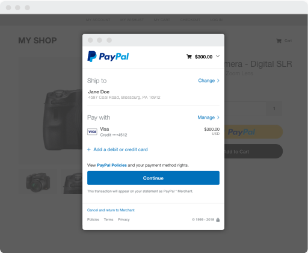

## Summary
[[PayPal]] describes its progression from atomic [[RESTAPI]] endpoints, through a little-used Bulk REST mechanism, to [[GraphQL]] for Checkout applications. The account argues that atomic REST imposed costly client-server round trips, while server-side orchestration accumulated unused fields and client coupling; Bulk REST returned composition control to clients but exposed too much underlying API structure. In a six-week mobile-SDK project, three developers reportedly used a discoverable GraphQL schema to build UI and API work in parallel, after which PayPal expanded GraphQL adoption to more than 30 applications or teams. The case supports client-selected response shape and schema discoverability as performance and productivity mechanisms, but supplies no controlled before-and-after latency, conversion, server-cost, or maintenance measurements.

## Key Claims
- Atomic REST endpoints fit domain boundaries but can force latency-sensitive web and mobile clients to make several network round trips; PayPal reports at least 700 ms of network time per Checkout round trip at the 99th percentile, excluding server processing.
- Server-defined orchestration endpoints reduce round trips but tend to couple the client to a growing response that over-fetches fields as features and experiments accumulate.
- PayPal's Bulk REST request format let clients combine atomic operations and declare dependencies, but developers rarely used it because they needed detailed knowledge of the underlying APIs and could select resources rather than individual fields.
- [[GraphQL]] lets clients choose response fields and combine related data in one operation, including requesting data alongside a mutation.
- A schema can serve as a discoverable contract: the mobile team reportedly inspected available fields and iterated on UI before the backing API was ready, without extensive PayPal-specific knowledge.
- The source attributes better application speed, developer productivity, API evolution, and client flexibility to GraphQL, and reports adoption by more than 30 PayPal applications or teams after one year.
- Field-level usage visibility can inform deprecation decisions more precisely than endpoint-level REST usage, although the article does not describe PayPal's telemetry or governance implementation.

## Key Quotes
> "Clients determine the size and shape of data, not servers." - the principle PayPal valued in both Bulk REST and GraphQL.

> "We went all-in on GraphQL." - the team's conclusion after the mobile-SDK project.

## Connections
- [[PayPal]] - company and Checkout product context for the reported migration and adoption.
- [[GraphQL]] - selected as the client-shaped, schema-discoverable interface after the mobile-SDK project.
- [[RESTAPI]] - starting architecture whose atomicity, orchestration, and Bulk REST variants expose different composition tradeoffs.
- [[DeveloperExperience]] - schema inspection and reduced internal API discovery are presented as productivity mechanisms.
- [[HTTP]] - network round trips are the main client-side latency cost discussed by the source.
- [[WebPerformanceOptimization]] - fewer sequential application-data requests are intended to shorten Checkout rendering time.

## Contradictions
- No direct contradiction was found. The source strengthens the existing claim that GraphQL can reduce over-fetching and client round trips, while its lack of backend-work measurements preserves [[GraphQL]]'s qualification that one network request does not guarantee lower total cost or simpler operations.

## Image Notes
All 12 distinct local image files referenced by the 13 embeds were opened. The full-resolution Checkout modal and mobile Checkout interface were retained because they establish the user-facing product and funding-choice context. Two tiny copies of those interfaces and two GraphQL logos were omitted as duplicate or decorative. Six 60-pixel-wide code, API-flow, and development-workflow thumbnails were too low-resolution to interpret reliably; their surrounding prose and captions repeat the available claims, so they were omitted and no image-derived detail was asserted from them.
