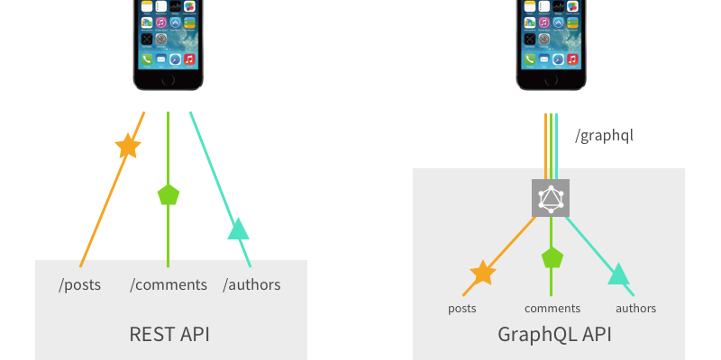

## Summary
This Apollo GraphQL article argues that [[GraphQL]] and [[RESTAPI]] share the same basic HTTP request-response and server-function foundations, while differing in how they describe, fetch, and assemble resources. REST commonly couples a server-defined response shape to an HTTP route, whereas GraphQL separates schema types from query entry points, lets clients select fields and traverse relationships, and composes a requested response through multiple resolvers. The retained diagram makes the routing contrast explicit: three REST paths become one `/graphql` entry point that dispatches through a schema to posts, comments, and authors.

## Key Claims
- [[GraphQL]] and [[RESTAPI]] both expose identifiable resources over [[HTTP]] and can return JSON, but they bind resource identity, retrieval, and response shape differently.
- REST commonly makes a route and HTTP method the entry point and leaves the server responsible for the response shape; GraphQL defines typed schema relationships and lets the client select the fields it needs.
- A GraphQL schema describes a graph of types and relationships, while a REST API is commonly presented as a linear list of routes even when documentation systems make those routes machine-readable.
- GraphQL queries and mutations distinguish reads from writes inside the operation document rather than relying only on different HTTP methods.
- REST route handlers and GraphQL resolvers both call server-side functions, but one GraphQL operation can invoke multiple nested resolvers and assemble their results into the query's shape.
- GraphQL can reduce over-fetching and client round trips for related data, at the cost of weaker direct use of ordinary HTTP response caching and a then-less-mature tooling ecosystem.

## Key Quotes
> "GraphQL and REST are not so different after all" - the article's framing before comparing their resource, interface, and execution models.

> "Almost like a multiplexed REST." - the article's shorthand for resolving several nested fields in one GraphQL request.

## Connections
- [[GraphQL]] - central query language, schema, and resolver model being explained.
- [[RESTAPI]] - comparison model built from resource URLs, HTTP methods, route handlers, and server-shaped responses.
- [[HTTP]] - shared transport and semantics layer, including the caching advantage the article attributes to REST-style resource requests.
- [[ApolloGraphQL]] - publication and tooling context for the article and its caching examples.
- [[APIErrorHandling]] - adjacent API-contract concern that the comparison explicitly leaves largely outside its scope.
- [[CapabilityOrientedIntegration]] - both emphasize separating useful consumer-facing access from underlying implementation mechanics, though at different architectural levels.

## Contradictions
- No direct contradiction was found. The source qualifies rather than overturns the wiki's REST material: REST's HTTP semantics remain valuable, while GraphQL moves field selection and relationship traversal into a typed query layer.

## Image Notes
All four effective local embeds were opened. The 800×400 REST-versus-GraphQL routing diagram was retained because it visually establishes separate REST routes versus one schema-mediated GraphQL request. A 60×30 thumbnail was omitted as a duplicate of that diagram, and two occurrences of the same 60×42 Apollo promotional graphic were omitted as decorative; the empty image marker contained no asset.
