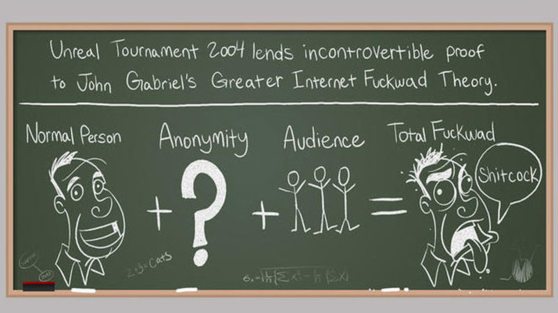
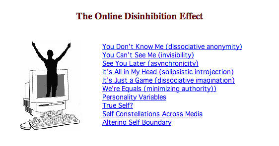
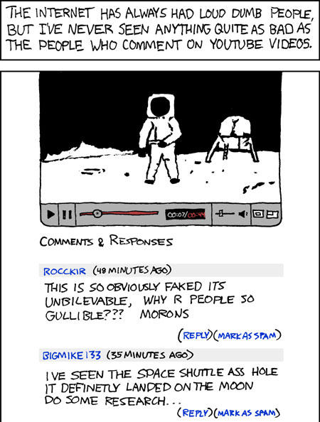
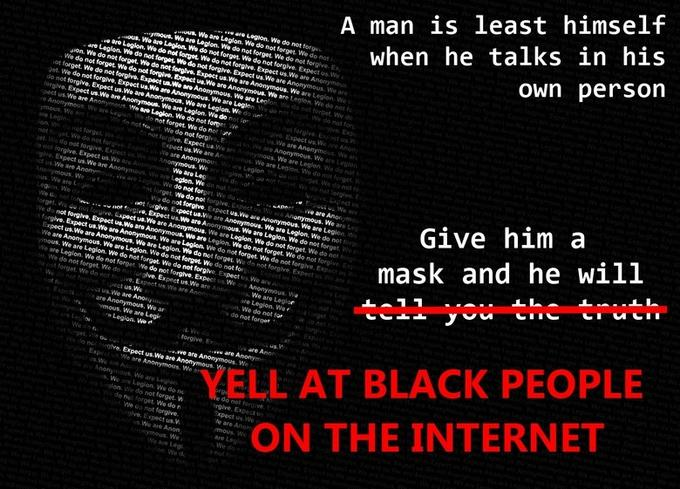
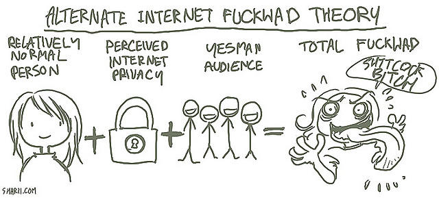

## Summary
Know Your Meme traces the [[GreaterInternetFuckwadTheory]] from a 2004 [[PennyArcade]] comic into a widely reused explanation for abusive online behavior: an otherwise ordinary person may behave antisocially when anonymity is combined with an audience. It connects that folk theory to [[JohnSuler]]'s more differentiated [[OnlineDisinhibitionEffect]], earlier observations about unaccountable CB-radio speech, and later examples from YouTube, 4chan, gaming, and online-commenting debates. The article documents the theory's cultural spread rather than proving that anonymity alone causes abuse.

## Key Claims
- Penny Arcade introduced the memorable equation “Normal Person + Anonymity + Audience = Total Fuckwad” in its March 19, 2004 comic “Green Blackboards (And Other Anomalies),” using *Unreal Tournament 2004* as the immediate context.
- Similar observations predate the webcomic: the article cites a 1978 *New Yorker* profile describing racist and sexually explicit CB-radio speech under reduced accountability.
- Suler's 2004 online-disinhibition framework separates benign disclosure from toxic behavior and identifies several interacting mechanisms rather than anonymity alone.

- The theory spread through Urban Dictionary, Reddit, webcomics, forums, gaming commentary, humor sites, trope catalogs, and arguments about anonymous commenting.
- The xkcd example makes the audience dynamic concrete by depicting hostile, poorly reasoned YouTube comments attached to a public video.

- Later remixes linked online anonymity to racist speech and proposed variants in which merely perceived privacy and a validating audience can produce the same outcome.

## Key Quotes
> “Normal Person + Anonymity + Audience = Total Fuckwad” - the original comic's equation.

> “don't be a dick.” - Wheaton's Law, presented as a normative response to poor online conduct.

## Connections
- [[GreaterInternetFuckwadTheory]] - the article documents the equation's origin, meaning, and circulation as an internet-culture shorthand.
- [[OnlineDisinhibitionEffect]] - Suler's framework supplies a more granular psychological account of loosened online restraint.
- [[JohnSuler]] - psychologist whose 2004 article distinguished benign and toxic disinhibition and listed multiple contributing mechanisms.
- [[PennyArcade]] - webcomic that originated the named theory and its chalkboard equation.
- [[PsychologicalSafety]] - benign disinhibition can enable vulnerable disclosure, while safety should not be confused with freedom from accountability for abuse.

## Contradictions
- The source does not directly contradict an existing wiki page. It does qualify any single-cause account of online abuse: the retained Suler image names anonymity, invisibility, asynchronicity, solipsistic introjection, dissociative imagination, minimized authority, personality variables, and self-boundary changes.
- The “alternate theory” image adds perceived privacy and a validating audience, but it is a cultural remix rather than empirical evidence.
- The article is a secondary meme-history entry built from selected anecdotes, links, and examples; it does not measure prevalence, isolate causality, compare identified and anonymous settings, or establish that anonymous participation is generally harmful.

## Image Notes
All nine local image files referenced by the source were opened; two were duplicate renditions of the original Penny Arcade equation. Five unique evidence-bearing images were retained at their semantic positions. The lead duplicate, a satirical bell-curve graphic, and the Wheaton's Law cartoon were omitted because their relevant content was duplicated in the prose or stronger retained material. The remote GIF references all point to the same URL whose filename identifies it as a blank placeholder; that host could not be resolved during ingest, but each remote reference was paired with a cached local original that was opened and assessed.
