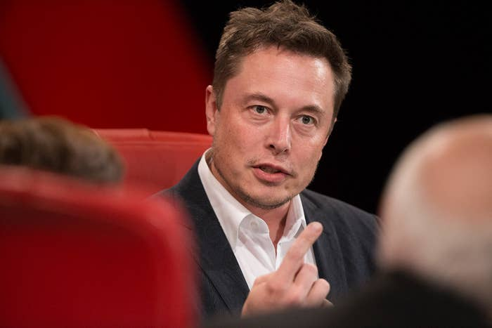

## Summary
[[NitashaTiku]] reports from [[CodeConference]], arguing that its exceptional access to technology leaders also creates a clubby environment in which prestige, friendship, hospitality, and dependence on future access can soften scrutiny. The article contrasts the Mars and off-world visions of [[ElonMusk]] and [[JeffBezos]] with immediate disputes involving platform power, inequality, diversity, regulation, media dependence, and [[PeterThiel]]'s financing of litigation against Gawker. It treats the event as a case in which [[AccessJournalism]], [[TechnologyElitePower]], and [[EscapistTechnofuturism]] reinforce one another.

## Key Claims
- [[CodeConference]] concentrated founders, executives, investors, and technology reporters in an exclusive setting that produced valuable access but also a shared social environment resistant to aggressive challenge.
- [[AccessJournalism]] can operate as diffuse soft power: reporters who become socially or professionally close to influential subjects may learn more while saying less to preserve access.
- Musk and Bezos received extended room for speculative claims about Mars, simulation, AI, and off-world industry while urgent questions about antitrust, discrimination, platform governance, press freedom, and political responsibility received less attention.
- [[EscapistTechnofuturism]] turns distant technological futures into a clean slate where current institutional and social conflicts appear solvable through exit, relocation, or new infrastructure rather than present accountability.
- [[TechnologyElitePower]] combines wealth, company control, investment networks, platforms, litigation, and agenda-setting while receiving less scrutiny than the scale of that influence warrants.
- Limited speaker diversity and DeRay Mckesson's criticism show that who enters elite decision-making rooms affects which problems, assumptions, and constituencies become visible.
- Musk's warning that despotism follows concentrated AI control also applies, in the article's framing, to the human owners and operators of powerful technology systems.

## Key Quotes
> "The closer you get, the argument goes, the more you know and the less you say in order to keep that access." - Tiku on the tradeoff between proximity and scrutiny.

> "Or the people controlling the computer" - Musk on where AI despotism could reside.

## Connections
- [[NitashaTiku]] - BuzzFeed News reporter and author interpreting the conference from inside its media-access system.
- [[CodeConference]] - exclusive executive-and-media gathering used as the article's central case.
- [[KaraSwisher]] - conference co-founder and interviewer whose aggressive reputation is contrasted with the event's protected elite environment.
- [[SiliconValley]] - ecosystem whose concentrated wealth, networks, companies, and chroniclers form the article's subject.
- [[ElonMusk]] - featured speaker whose visionary authority, space plans, AI warnings, and limited political answer anchor the critique.
- [[JeffBezos]] - speaker whose off-world industrial vision parallels Musk's Mars rhetoric.
- [[PeterThiel]] - Facebook director and financier of litigation against Gawker, used as an example of discreet private power over media.
- [[AccessJournalism]] - mechanism by which proximity and future-access incentives can weaken adversarial coverage.
- [[TechnologyElitePower]] - concentration of economic, platform, legal, and agenda-setting influence among technology leaders.
- [[EscapistTechnofuturism]] - distant future visions that can displace attention from current governance and distribution conflicts.

## Contradictions
- The article directly qualifies [[SiliconValley]] accounts centered on mobility, opportunity, and exit by showing that the same ecosystem can concentrate access and power, reproduce exclusion, and make its own leaders difficult to scrutinize.
- It does not show that every interview was deferential or that access always weakens journalism; the critique is an on-site reported interpretation of one elite 2016 conference, written by a journalist who disclosed prior employment by Gawker Media.
- The retained image is contextual rather than independent evidence: it shows Musk speaking in Code Conference's red-chair setting. A near-duplicate tighter crop was omitted.
