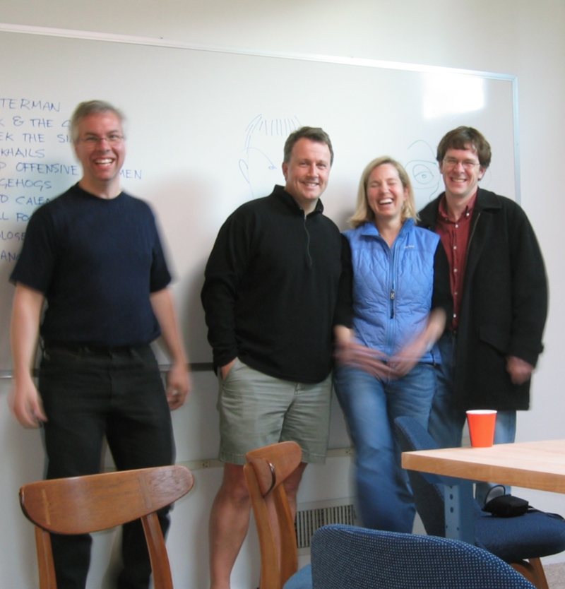
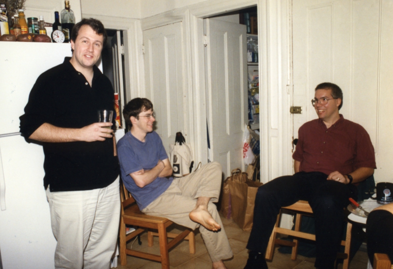
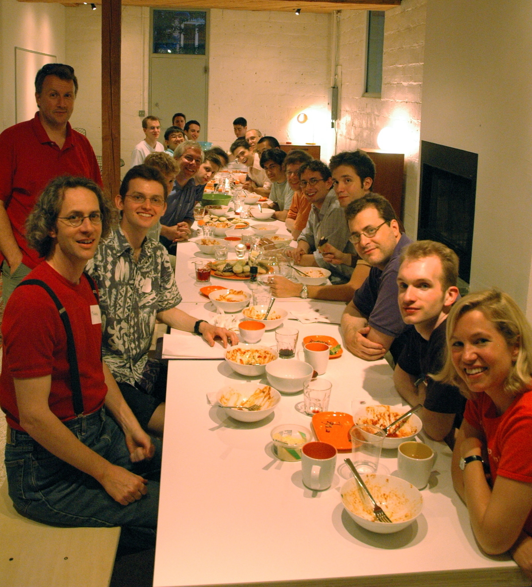
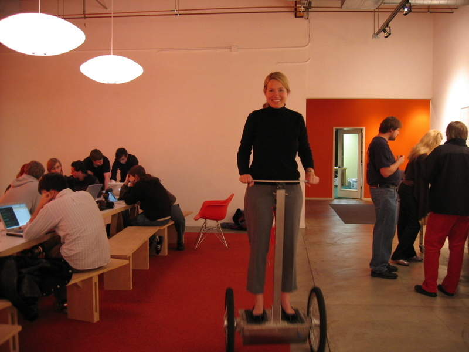
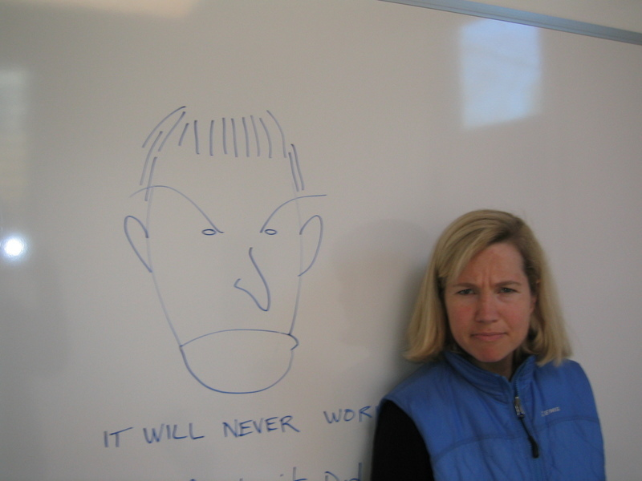

## Summary
[[JessicaLivingston]] uses her life and the founding of [[YCombinator]] to argue that founders need not imitate a standard entrepreneurial type. Her social perception, operational discipline, event experience, empathy, candor, and independence complemented her technical cofounders and shaped YC's batch program, selection judgment, and alumni culture. The broader principle is [[PersonStrategyFit]]: identify a distinctive combination of interests and abilities, then build a venture whose needs make that combination useful rather than reshaping oneself to fit a conventional role.

## Key Claims
- Livingston says unconventional independence was modeled by her grandmother, while a difficult transition from high achievement to mediocrity at Phillips Academy weakened the idea that early credentials reliably predict founder potential.

- YC arose from Livingston and [[PaulGraham]] repeatedly discussing broken early-stage funding, then recruiting Graham's Viaweb cofounders to combine technical selection and advice with Livingston's operations and social judgment.

- YC's small-check, batch-based model let inexperienced investors learn across eight startups while giving founders peers, shared dinners, speakers, legal templates, and a first Demo Day.

- Livingston's "social radar" evaluated earnestness, determination, flexibility, and cofounder relationships at a stage when growth metrics and market estimates were unavailable; she also used selection to establish an intentionally low-ego alumni culture.
- Her operational and emotional work—legal setup, incorporation guidance, event production, logistics, listening, and cofounder counseling—was core investment infrastructure rather than peripheral support.

- Complementary cofounders need shared values and clear deference to one another's expertise, not identical abilities; Livingston presents her partnership with Graham as an example.
- The strongest founder opportunities may grow from unusual personal experience and natural strengths, while user demand, small experiments, resilience to rejection, and boldness remain external tests of whether the resulting venture works.

## Key Quotes
> "We had to judge the founders not by what they were, but what they could turn into." - Livingston on evaluating very early founders without mature business metrics.

> "What unique combination of abilities and interests do you have?" - the self-assessment behind growing a venture around a founder's distinctive fit.

> "You are a jigsaw puzzle piece of a certain shape." - the closing metaphor for building a new opportunity around one's strengths instead of conforming to an existing mold.

## Connections
- [[JessicaLivingston]] - author and YC cofounder whose personal history supplies the central case.
- [[YCombinator]] - startup accelerator whose batch model, operations, selection, and culture the source explains from a cofounder's perspective.
- [[PaulGraham]] - complementary cofounder and spouse who shared Livingston's moral priorities while contributing technical and idea-expansion strengths.
- [[PersonStrategyFit]] - general principle that a sustainable strategy should match the person expected to carry it out.
- [[CoFounderFit]] - Livingston's partnership example combines complementary skills, shared values, divided responsibility, and deference to expertise.
- [[StartupCulture]] - YC's early selection choices and family-like support are presented as foundations for its alumni culture.
- [[StartupHypothesisTesting]] - YC itself began with a hypothesis about easier early-stage funding and expanded after a small first batch worked.
- [[DoingThingsThatDoNotScale]] - incorporation help, dinners, legal templates, logistics, and founder counseling were high-touch parts of the initial model.

## Contradictions
- Livingston calls YC the first accelerator, but the term was applied retrospectively and earlier incubators existed; the source's stronger claim is that YC pioneered the particular batch-based model that many later accelerators copied.
- The essay argues that unusual founder qualities can become decisive advantages, but its retrospective success case cannot show that personal fit, authenticity, or persistence is sufficient without demand, execution, capital, timing, and luck.
- Its family metaphor describes care and founder support, while [[StartupCulture]] records that family language can also conceal weak accountability or exclusion; the operative evidence is YC's actual selection, events, advice, and founder-support practices.
