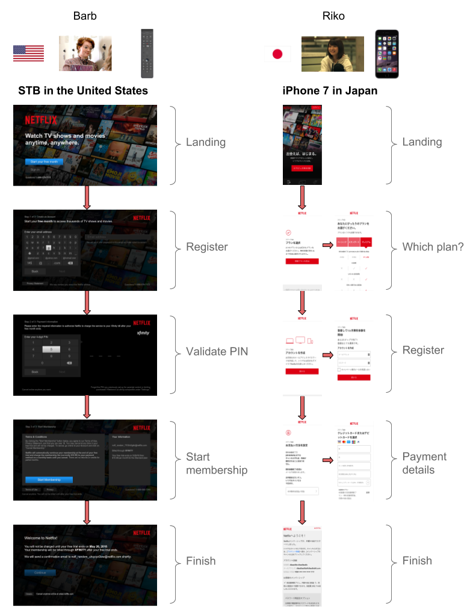

## Summary
Netflix describes [[GrowthEngineering]] as the product-and-platform discipline that converts existing demand into membership by improving signup and login across devices, countries, partners, and payment methods. The article joins constant experimentation with a stateless JSON-over-HTTP protocol, a server-side state machine, central event collection, and fault-tolerant service orchestration so lightweight clients can present locally appropriate flows without duplicating business logic. Its strongest reusable claim is that growth work at global scale is both a [[ConversionRateOptimization]] problem and a [[MicroservicePlatformEngineering]] problem.

## Key Claims
- The signup funnel has four broad stages: landing, plan selection, registration, and payment, but device input, market, partner integration, and local payment options can change the practical sequence and interaction cost.
- Netflix says it continuously A/B tests the funnel against conversion, retention, revenue, and user-experience goals rather than assuming one global signup design.
- Partner-integrated television signup can reduce remote-control entry and combine account creation with billing, while browsers can exploit autofill and local payment methods.
- Growth Engineering supplies lightweight clients with a small stateless JSON-over-HTTP protocol whose fields and actions describe what each interface should render and submit.
- An orchestration service validates requests, hydrates context, invokes a state machine, coordinates downstream calls, and composes the next JSON response.
- The service path assumes failures and uses latency- and fault-tolerance mechanisms such as Hystrix so signup can remain resilient when dependencies degrade.
- Central ownership of the protocol and funnel events gives the team one instrumentation point for monitoring signup business metrics and choosing further experiments.

## Key Quotes
> “We experiment constantly.” — on using A/B tests to learn how visitors navigate signup.

> “We assume requests will fail” — on designing orchestration for latency and fault tolerance.

## Connections
- [[Netflix]] — company and product context for the global signup platform.
- [[GrowthEngineering]] — discipline joining customer acquisition goals, experimentation, instrumentation, and enabling architecture.
- [[ConversionRateOptimization]] — signup changes are evaluated against conversion and downstream business metrics.
- [[ProductFlowFriction]] — remote-control input, repeated form entry, and unsupported local payments can consume user intent.
- [[MicroservicePlatformEngineering]] — shared protocols, orchestration, and fault-tolerance controls let heterogeneous clients use common business logic.
- [[SystemReliability]] — the signup path assumes dependency failure and uses resilient request orchestration.

The article's registration walkthrough makes the request boundary explicit: a client requests a page, the orchestration layer validates and enriches context, the state machine chooses the next mode, and the service returns fields and permitted actions. Submitting the account details repeats that cycle and advances the flow to partner PIN validation.

## Contradictions
- No direct contradiction found. The source strengthens the wiki's funnel-friction and conversion material by showing why some apparent UI changes depend on partner, payment, protocol, instrumentation, and reliability work underneath.
- Its experimentation claims remain company-authored and mostly qualitative: no individual test design, effect size, sample, retention result, revenue result, or reliability measurement is supplied.
