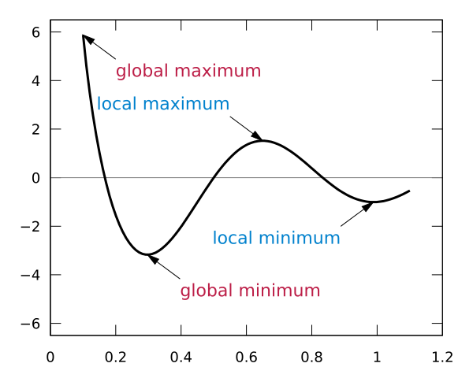

## Summary
This essay argues that sustainable growth comes from increasing the value customers perceive rather than forcing a headline metric upward. It defines [[ValueHacking]] as segmenting a market by different value functions, testing how each group derives value, and changing the offering or audience when conventional [[GrowthHacking]] reaches a local optimum. [[Gojek]], [[Valve]], WeChat, and McDonald's serve as illustrative adjacency cases, but the article supplies no comparative evidence that the proposed method caused their outcomes.

## Key Claims
- A North Star metric should represent customer value, but teams can increase it artificially without improving the product's ability to create that value.
- An activation or “a-ha” milestone is a lagging indicator of discovered value, not a guarantee that users will keep choosing the product over alternatives.
- [[GrowthHacking]] generally assumes [[ProductMarketFit]] and optimizes an existing value proposition, audience, and growth function.
- Repeated growth experiments can reach a local maximum where further optimization of the same proposition produces little improvement.

- [[ValueHacking]] means identifying customer segments with distinct value functions and testing new combinations of audience, use case, capability, and offering.
- Adjacent use cases can open a different optimization surface: the essay points to McCafé, [[Valve]]'s move from games toward Steam, [[WeChat]]'s expansion beyond messaging, and [[Gojek]]'s expansion beyond ride-hailing.
- Segment-specific experiments and impact metrics are more informative than optimizing only for aggregate user-base growth.

## Key Quotes
> “If you build value, growth will come.” - the essay's central causal claim.

> “optimizing for each and every kind of value functions available in your market” - the author's definition of value hacking.

## Connections
- [[ValueHacking]] - central framework for moving from metric optimization toward segment-specific customer value.
- [[GrowthHacking]] - the optimization practice the essay retains after product-market fit but qualifies when it becomes metric-first.
- [[ProductMarketFit]] - initial market validation that makes later growth experiments meaningful.
- [[ProductUserSegmentation]] - method for identifying groups with similar usage patterns and value perceptions.
- [[ProductMetricLadder]] - related discipline for connecting operational metrics to customer and business outcomes.
- [[Gojek]] - author's employer and principal self-reported example of adjacent-market expansion.
- [[Valve]] - example of following changing player value from games toward an online PC platform.
- [[WeChat]] - example of extending a messaging network into payments and social media.

## Contradictions
- No direct contradiction with existing wiki content. The essay strengthens existing qualifications on [[GrowthHacking]] by separating metric movement from customer value and durable retention.
- The company examples are brief retrospective illustrations rather than causal evaluations. The Gojek passage is also promotional and reports valuation and growth without unit economics, retention, segment-level experiment results, or independent verification.
