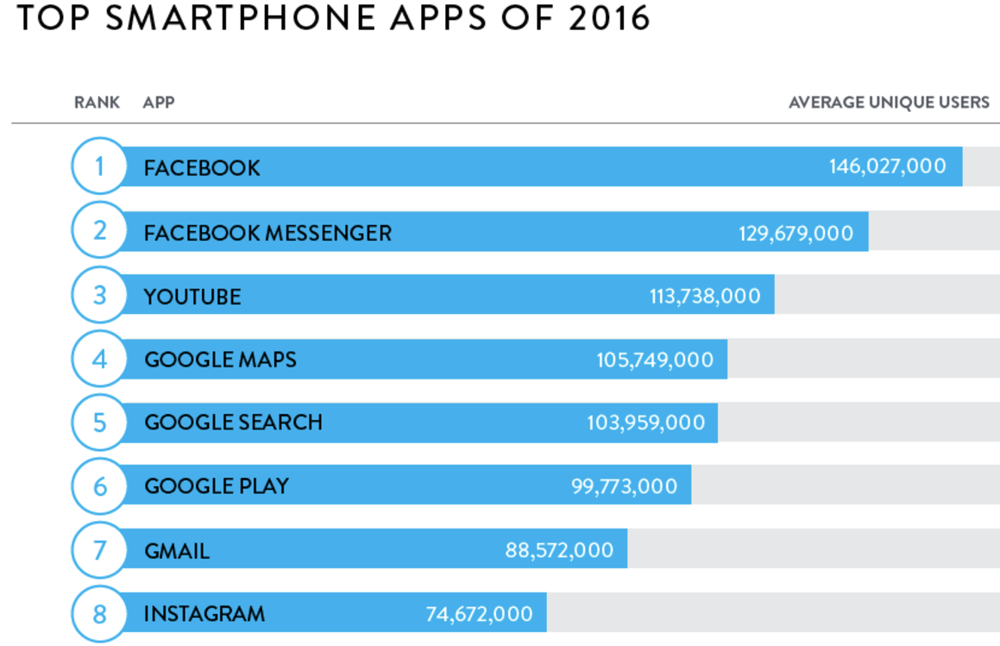
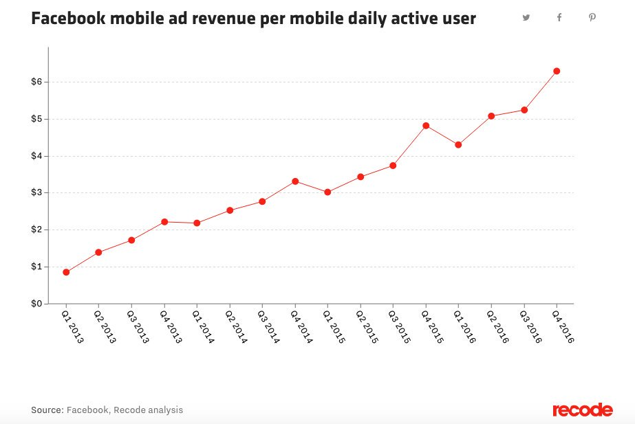
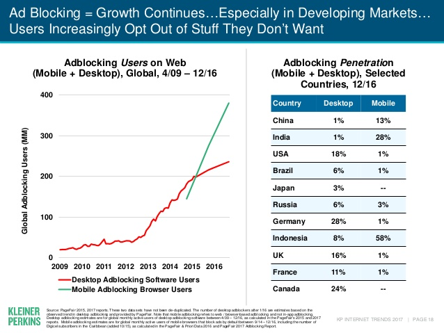
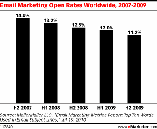
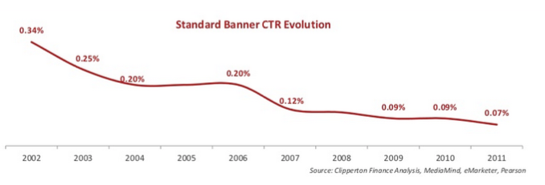
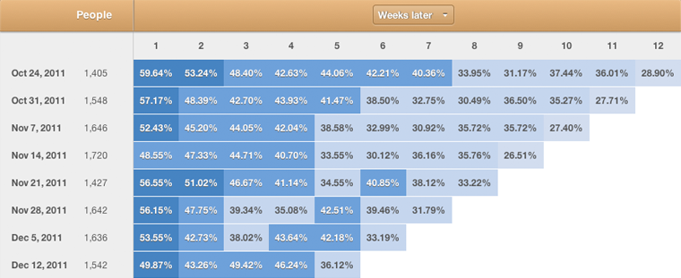

## Summary
[[AndrewChen]] argues that late-cycle mobile and software markets make new-product growth harder because app distribution is concentrated, paid inventory is contested, users ignore familiar acquisition tactics, analytics and sales tools have diffused, incumbents respond faster, and attention has shifted from unoccupied time to established products. The seven retained visuals support the historical mechanism with 2007-2016 examples: Facebook and Google ownership of the leading smartphone apps, rising Facebook mobile ad revenue per daily user, growing ad blocking, declining email-open and banner-click rates, turnkey cohort analytics, and portfolio-wide adoption of Stories interfaces. His proposed response is to deepen monetization, differentiation, personalization, and problem value so products can afford acquisition and resist rapid imitation, but the essay does not test whether those moves caused durable growth.

## Key Claims
- Mobile discovery had consolidated around app-store curation and a small set of dominant apps; the Nielsen chart shown in the source ranks eight 2016 smartphone apps, all owned by [[Facebook]] or [[Google]].

- Paid acquisition becomes harder when more advertisers bid for finite attention. Facebook's mobile advertising revenue per mobile daily active user rose from under $1 in Q1 2013 to above $6 in Q4 2016, although revenue per user is not itself a direct ad-price measure.

- User adaptation erodes established channels. The cited 2017 Internet Trends slide shows global mobile ad-blocking users rising to roughly 380 million by late 2016, with selected-country mobile penetration reaching 58% in Indonesia and 28% in India.

- The essay generalizes Chen's “law of declining click-throughs” beyond banner ads: the retained historical charts show worldwide email marketing open rates falling from 14% in H2 2007 to 11.2% in H2 2009 and standard banner CTR falling from 0.34% in 2002 to 0.07% in 2011.

- Widely available analytics and sales tooling raises the competitive baseline: capabilities such as cohort retention analysis and automated outbound become accessible to many teams, helping each diagnose funnels and bid more aggressively for acquisition.

- Large incumbents can respond rapidly by copying a successful interaction across products. The source points to Facebook's rollout of Stories-like surfaces in Messenger, Instagram, WhatsApp, and Facebook as its central consumer example.

- Mature attention markets become closer to zero-sum: a new app must displace time already spent in strong incumbent products rather than merely fill boredom or unused smartphone time.
- The suggested strategic responses are stronger monetization, paid referral and advertising capacity, data-driven personalization, deeper differentiation, and harder technical or customer problems that create real economic value.

## Key Quotes
> "competing with boredom is easier than competing with Facebook + Google" - on the shift from greenfield attention to incumbent displacement.

> "It gets much, much harder to grow new products" - on the claimed consequence of a maturing technology cycle.

## Connections
- [[AndrewChen]] - author presenting a late-cycle diagnosis of startup growth constraints.
- [[GrowthChannelSaturation]] - combines channel crowding, declining response, tool diffusion, incumbent speed, and attention scarcity into one growth constraint.
- [[ConsumerStartupCompetition]] - mobile consolidation and incumbent attention ownership reinforce the competitive stack faced by new consumer products.
- [[MobilePlatformDiscovery]] - app stores, rankings, editorial promotion, and incumbent portfolios shape which mobile products users encounter.
- [[CustomerAcquisitionCost]] - advertiser competition and finite inventory can make paid growth progressively more expensive.
- [[AdBlocking]] - user-side avoidance reduces reachable advertising inventory and illustrates adaptation to familiar acquisition methods.
- [[ProductImitationStrategy]] - Facebook's Stories rollout shows how incumbents can use speed and existing distribution to answer a challenger.
- [[DifferentiationStrategy]] - one proposed response is to solve harder problems and make the product less substitutable.

## Contradictions
- No direct contradiction with existing wiki content. The source reinforces [[consumer-startups-are-dead-long-live-consumer-startups]], which later describes the same mobile-platform shift as a move from creating new leaders to reinforcing established ones.
- The evidence is a 2017 practitioner synthesis assembled from selected historical charts and company examples. Facebook revenue per mobile DAU does not isolate auction prices or advertiser competition, leading-app ownership does not measure all discovery, and falling aggregate response rates do not show that every campaign or channel decayed.
- The suggested responses are hypotheses rather than evaluated remedies: deeper monetization can worsen incentives, personalization can create privacy costs, paid referrals can also saturate, and harder technology does not guarantee demand or defensibility.
- The local source's eight post-header image references reused three identical files containing an unrelated HTML page. The original article showed that one position duplicated the title card and supplied seven distinct evidence-bearing visuals; those seven originals were recovered and inspected, while the decorative title card was omitted.
