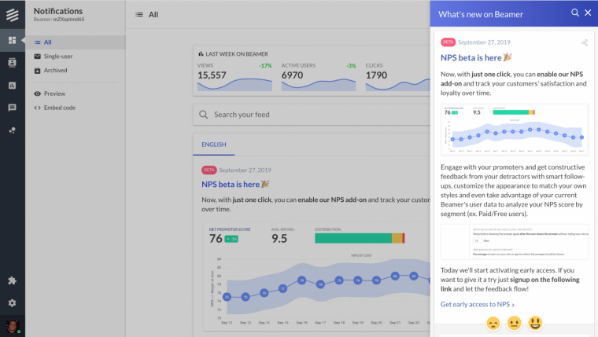
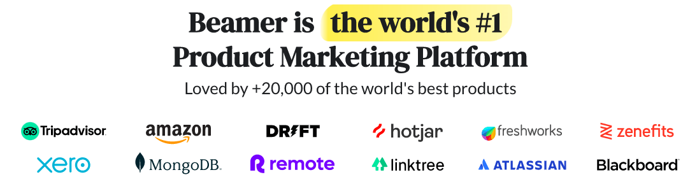

## Summary
[[MarianoRodriguezColombelli]] recounts how [[Hibox]] nearly exhausted its cash while pursuing a broad collaboration market, then spun an internal release-notification tool into [[Beamer]], a focused SaaS product for product teams. The founder-reported case connects niche selection, rapid iteration, direct customer feedback, product-embedded visibility, automation, and a small remote team with early profitability and growth toward $1 million in annual recurring revenue. It is a retrospective success narrative rather than audited evidence, and the page combines figures from different moments: the prose says more than 5,000 companies used Beamer while an embedded marketing banner claims more than 20,000 products.

## Key Claims
- Hibox's attempt to serve non-technical small businesses broadly left it under-focused against [[Slack]], contributing to slow growth, downsizing, branch closures, salary cuts, and layoffs.
- A minimal internal notification feed produced reported open rates up to five times those of live-chat messages and more than ten times those of comparable email campaigns, revealing demand for a dedicated release-communication product.
- Requests from customers and founder peers led the team to name the tool Beamer and publish a beta landing page in less than a day; Product Hunt feedback and first paid customers then supported a semi-pivot from Hibox.
- A later AppSumo launch brought 3,000 one-time paying customers in one week, while support conversations with SaaS founders and product teams sharpened the buyer persona and expanded the product from a changelog into a product-marketing and feedback tool.
- The source reports profitability within six months of official launch, adoption by prominent SaaS companies, an NPS of 78, and average revenue growth of 20% month over month over the preceding year without paid advertising.
- Five full-time and one part-time distributed workers reportedly supported more than one billion monthly requests, nearly 200 million unique viewers, and more than 10 million reactions by relying on PaaS infrastructure and automating billing, churn recovery, onboarding, and other non-core work.
- Organic growth remained a concentration risk: roughly half of leads reportedly came from referrals and word of mouth and half from content and SEO, leaving Beamer exposed to customer advocacy and search-platform changes.

## Key Quotes
> "we were targeting a very specific issue that required a very specific solution" - on resisting the assumption that live-chat tools made Beamer unnecessary.

> "Stay lean" - the final recommendation against using headcount or advertising to compensate for weak market fit.

## Connections
- [[MarianoRodriguezColombelli]] - co-founder and author narrating the Hibox-to-Beamer transition.
- [[SpencerCoon]] - co-founder who built Hibox and made the Beamer semi-pivot with Rodriguez Colombelli.
- [[Beamer]] - focused changelog, release-notes, product-marketing, and feedback product at the center of the case.
- [[Hibox]] - broad collaboration SaaS whose focus and cash-flow problems created the pivot context.
- [[ProductMarketFit]] - customer pull, rapid payment, profitability, adoption, and retention-adjacent metrics are presented as fit evidence.
- [[BootstrappedSaaS]] - Beamer is presented as a lean, profitable SaaS still weighing whether venture capital would improve or weaken its operating model.
- [[SmallTeamLeverage]] - automation, managed infrastructure, and distributed support let a compact team report large usage volume.
- [[StartupDistributionStrategy]] - word of mouth, product visibility, content, and SEO produced growth while creating channel-concentration risk.
- [[Slack]] - focused collaboration competitor contrasted with Hibox's broad target market.
- [[Drift]] - live-chat company whose use of Beamer is presented as validation of the specialist product.
- [[Intercom]] - customer-communication company whose use of Beamer is presented as similar validation.

## Contradictions
- The article's prose says Beamer was used by more than 5,000 companies, while the retained banner says it was loved by more than 20,000 products. These figures may reflect different update dates or different units, but the source does not reconcile them.
- The Product Hunt, AppSumo, profitability, customer, NPS, traffic, reaction, and growth figures are self-reported without cohorts, churn, ARR history, acquisition cost, margin, infrastructure cost, or independent verification.
- The source treats organic growth as both validation and vulnerability: referrals, network exposure, content, and SEO supported growth without paid ads, but the founders lacked control over customers' recommendations and search visibility.
- The account supports a strong fit narrative but does not establish [[MichaelSeibel]]'s stricter condition of demand overwhelming the team's capacity, nor does it show whether one-time AppSumo buyers converted into durable recurring revenue.
- Seven local images were opened. The two evidence-bearing product and customer banners were retained; a founder photograph, drowning illustration, neon-sign photograph, Barcelona photograph, and mountain photograph were omitted because they add no material evidence beyond the prose.
