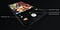
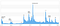
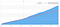

## Summary
[[BenSandofsky]] reviews the first year of [[Halide]], the paid iPhone camera app he built with [[SebastiaanDeWith]], as a sequence of product, support, distribution, and business-model experiments. The team reports that a focused advanced-photography position, repeated substantial releases, an iPhone X redesign, support-driven fixes, useful educational content, and improved App Store featuring turned a large launch spike into higher slow-day revenue and more than 100,000 monthly active users. The account also exposes a structural tension in one-time-purchase software: conspicuous features create sales spikes, while maintenance is necessary for product quality but harder to fund and market. It is a celebratory first-party retrospective with self-reported metrics, incomplete chart labels, and no audited revenue, acquisition, retention, or counterfactual evidence.

## Key Claims
- Halide launched after ten months of nights-and-weekends work with a narrow promise: tactile, professional, deliberate iPhone photography rather than a mass-market selfie camera.
- Launch coverage reportedly produced more than 350 million App Store impressions and a peak of number three in Top Paid Apps, but launch ultimately represented only 27% of first-year profit.
- Support and user requests shaped releases 1.1 through 1.8, including higher reported stability, older-device support, volume-button capture, faster capture, RAW-file workarounds, depth tools, a timer, Apple Watch support, and accessibility improvements.
- Major updates with clear messages produced larger sales spikes than maintenance releases, yet each major update also raised the reported slow-day revenue baseline; by year end, slow days produced about four times August 2017 revenue.
- The iOS 11 App Store redesign reportedly increased sales by 50%, showing that platform merchandising and category structure can materially change an indie app's demand.
- Social advertising did not work for Halide in the team's experiments, while useful, product-adjacent articles about iPhone RAW photography became its most successful promotional material.
- Raising the upfront price from $2.99 to $5.99 reportedly reduced unit demand without materially changing profit; the team preferred the higher price as a long-term funding choice and a filter for product-fit expectations.
- Halide rejected editing scope in favor of a Darkroom integration and implemented portrait mode as an advanced depth-data tool, using its deliberate-photography promise to decide how—not merely whether—to add requested features.

The iPhone X example shows the redesigned camera controls concentrated near the lower corners, using the taller screen while keeping frequent actions within thumb reach.

The comparison makes the RAW compatibility failure concrete: unsupported apps could show a visibly degraded preview without warning, which users reasonably experienced as a Halide quality problem.

The AR viewer illustrates version 1.7's advanced-photographer approach to portrait mode by exposing depth structure for inspection rather than only applying a guided blur effect.

The full-year chart visibly supports the claimed blockbuster pattern: launch dwarfed ordinary daily sales, so the article analyzes later months separately.

The post-launch chart shows a low baseline interrupted by several event-linked spikes, including an especially large late-December peak; its archived labels are too small for independent numerical extraction.

The cumulative curve shows a pronounced plateau during the team's maintenance-heavy period followed by renewed growth, matching the text's account without revealing absolute profit.

The area chart shows the sales baseline rising after the marked iOS 11 App Store transition, but its tiny archive copy does not permit an independent measurement of the reported 50% increase.

The trend rises in stages rather than returning fully to the earlier baseline, visually supporting the team's claim that major releases had lasting as well as spiky sales effects.

The side-by-side product image summarizes the team's “episodic Halide 2” argument: accumulated incremental releases produced a substantially different app without withholding changes for one paid upgrade.

## Key Quotes
> "when enough people run into a problem, it doesn’t matter who’s at fault. It’s ultimately your problem." — on prioritizing a workaround for unsupported RAW previews.

> "Stay focused. Think long term. Keep shipping." — the team's conclusion from the first sales plateau and later recovery.

## Connections
- [[Halide]] - the paid iPhone camera app whose first-year product and business development is reviewed.
- [[BenSandofsky]] - author and Halide co-creator reporting the team's decisions and results.
- [[SebastiaanDeWith]] - Halide co-creator responsible for design work and educational photography content discussed in the source.
- [[AppStore]] - launch, chart ranking, editorial structure, and the iOS 11 redesign materially shaped reported sales.
- [[IterativeProductShipping]] - versions 1.1 through 1.8 accumulated into what the team calls an episodically delivered Halide 2.
- [[ProductivityAppSubscriptions]] - a useful contrast: Halide retained one-time pricing while acknowledging that release-tied revenue makes maintenance economically harder to prioritize.

## Contradictions
- The source says subscriptions would make maintenance easier to fund but explicitly rejects moving Halide to one, qualifying arguments that continuously maintained professional apps must adopt recurring pricing.
- The article attributes sales changes to updates, App Store design, press, useful content, seasonality, and new-device adoption without controlled attribution; the charts show timing but cannot isolate causes.
- Reported impressions, stability, users, revenue lifts, profit share, and advertising results are first-party figures without raw data, definitions, acquisition costs, refunds, taxes, platform fees, retention cohorts, or independent audit.
- Several retained charts are only 60 pixels wide in the local archive. Their broad shapes are interpretable and their claims are repeated in prose, but small labels and exact plotted values cannot be independently recovered.
