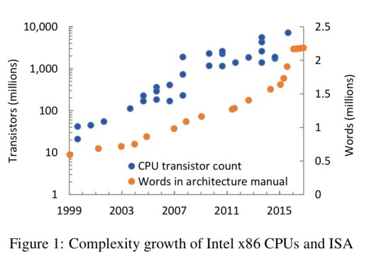
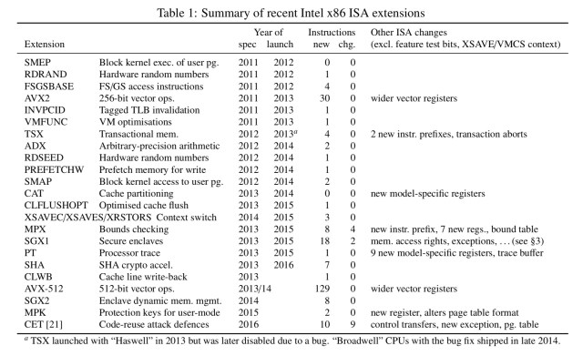

## Summary
The Morning Paper summarizes [[AndrewBaumann]]'s 2017 argument that recent Intel x86 extensions are becoming software-like in scale and interaction complexity while retaining slow hardware deployment and the burden of exact compatibility. The paper uses SGX and CET to show that security features can modify established instruction semantics, interact unexpectedly with prior mechanisms, and expand the obligations of processors, virtual machines, compilers, debuggers, and other implementers.

Its proposed direction is to reconsider the [[HardwareSoftwareBoundary]]: if some architectural features are implemented in microcode, a stable instruction set may be better understood as a translation layer whose capabilities could sometimes be decoupled from new physical processors. The article presents this as a speculative alternative rather than a worked deployment, performance, licensing, or revenue model.

## Key Claims
- The x86 architecture grew from 96 instructions in the 386 manual into a platform with rapidly proliferating extensions, many of which add system-level behavior rather than merely accelerating existing user-mode computation.
- Manual word count is used as a rough complexity proxy: the supplied chart shows a particularly steep rise around 2015–2016 alongside continued transistor growth.

- Recent extensions impose combinatorial costs because they change existing semantics and interact with earlier features; the table records not only new instructions but changes to registers, control transfers, exception behavior, and memory-management state.

- SGX illustrates both specification and interaction risk: the article reports roughly 200 pages for 26 instructions and cites page-fault observation as a side channel capable of leaking cryptographic secrets despite SGX's enclave threat model.
- CET adds shadow-stack and indirect-branch protections against code-reuse attacks, but doing so changes nine already complex control-transfer instructions and their variants.
- Exact x86 behavior must be reproduced by many independent implementations, so each extension expands the compatibility and verification surface beyond Intel's processor hardware.
- Hardware release and fleet adoption make feature deployment slow: the article uses SGX's 2013 specification and 2015 first CPUs to argue that widespread availability can take about a decade or more.
- If architectural features can be supplied through microcode, the ISA may be treated as a translation layer rather than a fixed hardware–software boundary, potentially allowing slower fallback implementations on installed processors.

## Key Quotes
> “It’s no longer the boundary between hardware and software, but rather just another translation layer in the stack.” — quoted conclusion of Baumann's paper.

## Connections
- [[AndrewBaumann]] - Microsoft Research author of the HotOS 2017 paper summarized by the article.
- [[Intel]] - designer of the x86 extensions, manuals, and processors examined in the paper.
- [[ISAExtensionComplexity]] - central problem of interacting architectural features and expanding implementation obligations.
- [[HardwareSoftwareBoundary]] - boundary Baumann argues is blurred by microcoded architectural behavior.
- [[APIBackwardCompatibility]] - software-interface analogue to x86's promise of preserving behavior across versions and implementations.
- [[EssentialAndAccidentalComplexity]] - related distinction for asking whether architectural complexity is inherent to the capability or introduced by its chosen interface and deployment mechanism.

## Contradictions
- No direct contradiction with existing wiki claims was found; the source extends compatibility and complexity concerns from software interfaces and stacks into processor architecture.
- The article is a 2017 secondary summary of a position paper, and its claim that feature releases are a deliberate CPU-upgrade strategy is an interpretation rather than evidence from Intel decision-makers.
- Architecture-manual word count is an imperfect proxy: documentation can grow because behavior is explained more fully, not only because the design itself becomes more complex.
- The SGX leakage figures and other technical details are relayed from cited work rather than independently evaluated here, while the proposed microcode path leaves performance, safety, update, licensing, and business-model questions open.
- The short reader comments appended after the article are unattributed reactions and are not treated as support for the paper's claims.
