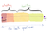
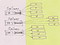
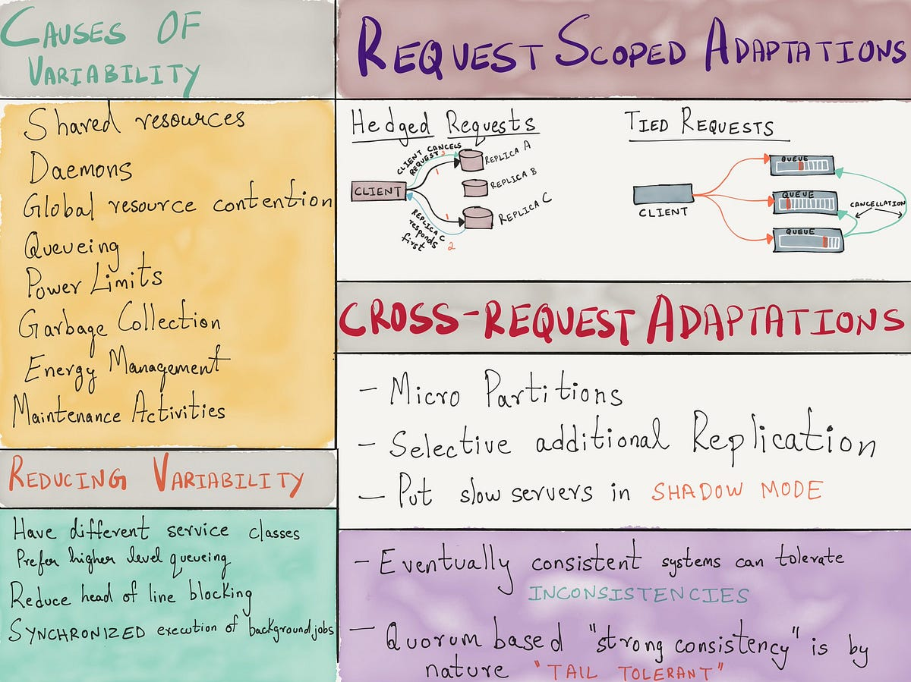

## Summary
The article argues that service health is a quality-of-service spectrum rather than a binary alive/dead state. Coarse liveness checks remain appropriate for deciding when an orchestrator should restart a process, but load balancers need application-level signals about latency, queueing, concurrency, and ability to complete real work so they can shed load and propagate backpressure before overload becomes a cascading failure.

The [[Imgix]] case makes the control loop concrete: [[Spillway]] used per-request metadata, worker-local capacity judgments, bounded retries, three queue types, rejection, and client backoff to adapt routing under unpredictable image-processing workloads. The source presents this as a historical practitioner design, not a controlled comparison or a universal algorithm.

## Key Claims
- [[ServiceHealthChecks]] should measure whether a service can complete representative work at an acceptable quality, not merely whether its process or port responds.
- Orchestrators and load balancers need different health semantics: liveness can stay binary for restart decisions, while routing needs a graded, workload-sensitive view.
- Unbounded concurrency and queueing can turn a responsive process into a slow or unusable one, so overload protection must begin before total failure.

- [[AdaptiveBackpressure]] requires a feedback loop in which services communicate current capacity or refusal decisions to upstream routers and callers.
- Static rate limits and circuit-breaker thresholds can be brittle when workload shape and service capacity vary at runtime.
- [[Spillway]] combined worker-local admission decisions, three dispatch attempts, bounded LIFO/FIFO/priority queues, rejection, and retry backoff to contain overload.

- Backpressure must travel through the call chain; otherwise excess work simply accumulates in another component's queue.

- Tail-latency variability can be addressed with request-scoped techniques such as hedged or tied requests and cross-request techniques such as partitioning or selective replication, but these methods have different cost and consistency tradeoffs.

## Key Quotes
> “The ‘health’ of a process is a spectrum.” — on replacing a binary routing model with quality-of-service signals.

> “Without timely and sufficient backpressure, services can quickly descend into the quicksands of failure.” — the article's conclusion about overload propagation.

## Connections
- [[ServiceHealthChecks]] - health signals should match the control decision they drive.
- [[AdaptiveBackpressure]] - dynamic capacity feedback lets upstream components reduce or redirect work before collapse.
- [[DependencyDegradation]] - partial failure should reduce capability without unnecessarily taking down the whole service.
- [[NetworkLoadBalancing]] - routing should incorporate application-level ability to complete work, not only reachability.
- [[Kubernetes]] - readiness and liveness probes illustrate separate routing and restart decisions.
- [[HAProxy]] - agent checks allow a backend to advertise dynamic weight, connection limits, and administrative state.
- [[Envoy]] - example service-mesh data plane that uses health information when routing.
- [[Imgix]] - company context for the adaptive image-processing case.
- [[Spillway]] - internal request broker and reverse proxy in the case study.
- [[Prometheus]] - monitored and alerted on broker queue depth.

## Contradictions
- The source does not reject simple liveness checks; it limits them to process-recovery decisions and argues against reusing them as sufficient evidence for load balancing.
- Live traffic can reveal real service behavior, but a purely traffic-derived signal may react only after users experience degradation; the article therefore favors explicit service-to-upstream feedback as well.
- The Spillway design is a historical first-person account without comparative latency, loss, throughput, or recovery measurements, and its three-attempt and queue-policy choices should not be generalized without workload evidence.
- Four retained diagrams are only 60 pixels wide in the archive. Their broad roles are visible and supported by the surrounding prose, but unreadable labels and exact chart values were not inferred.
