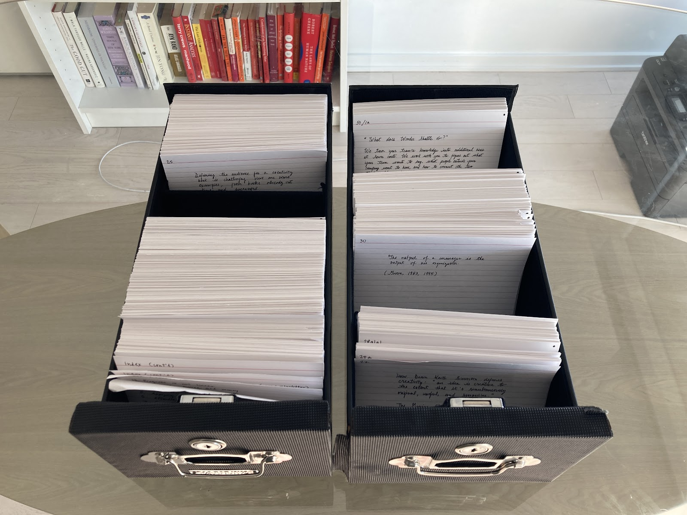
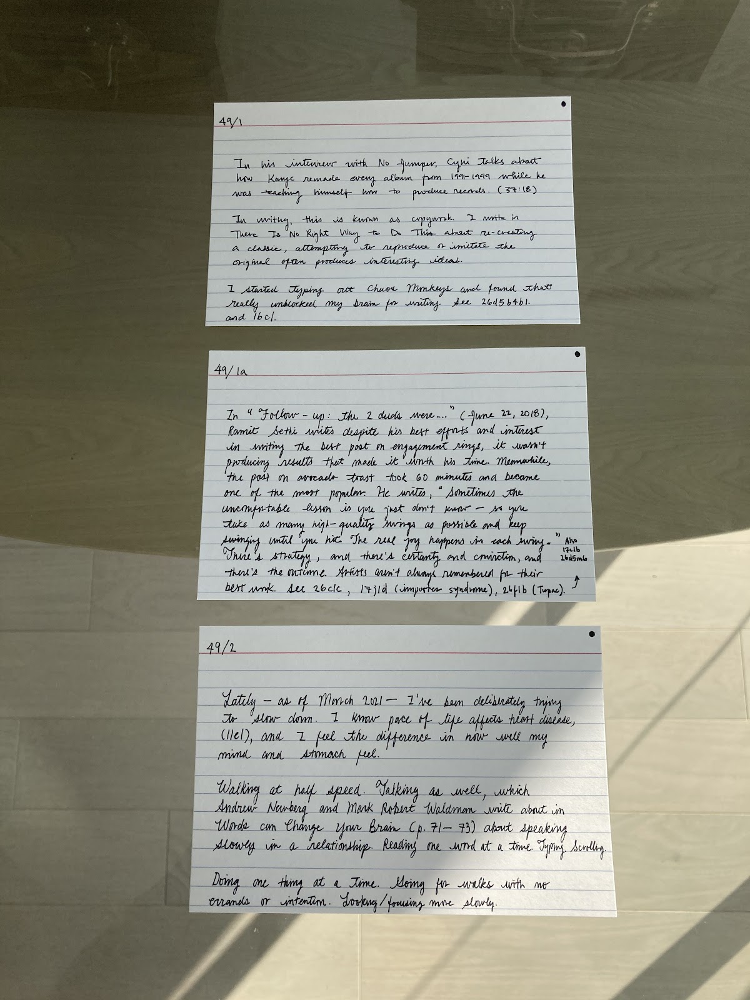
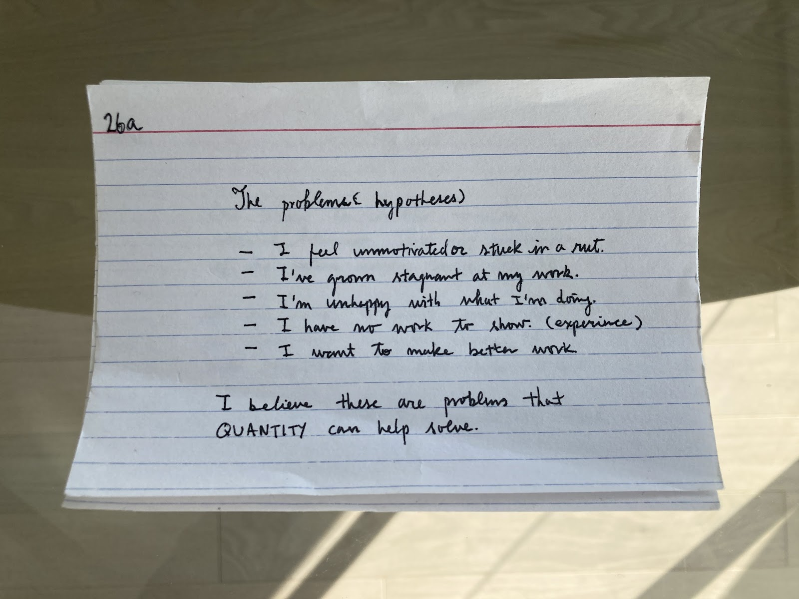
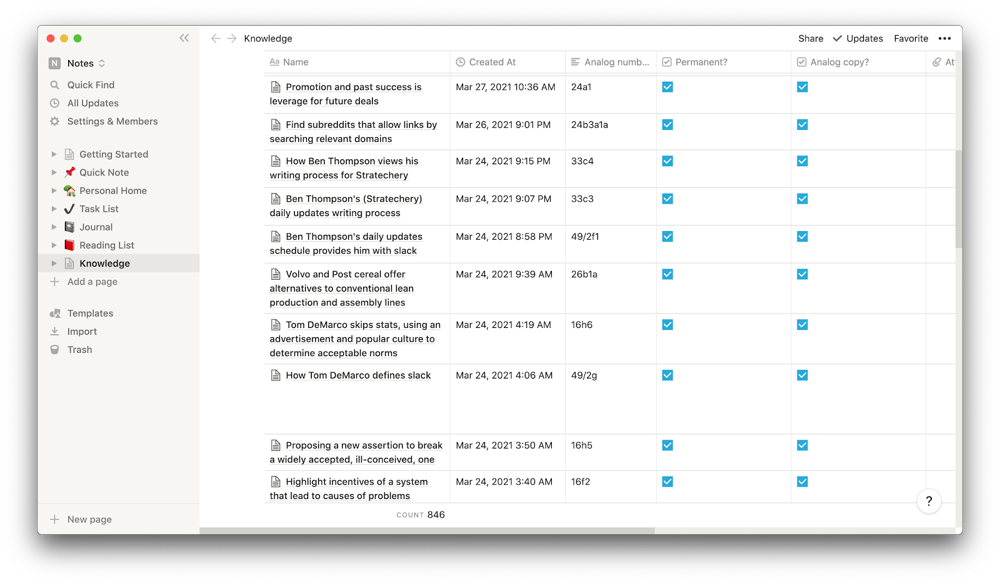
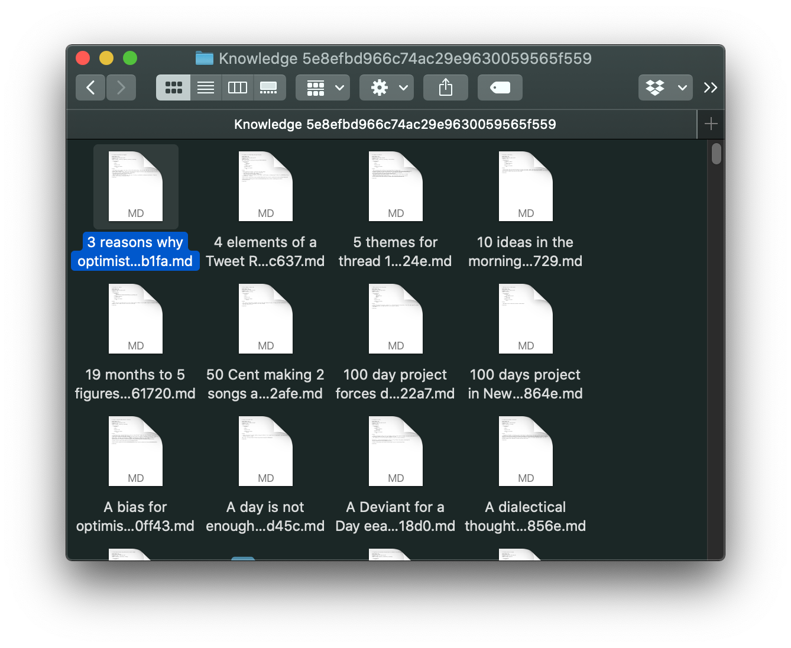
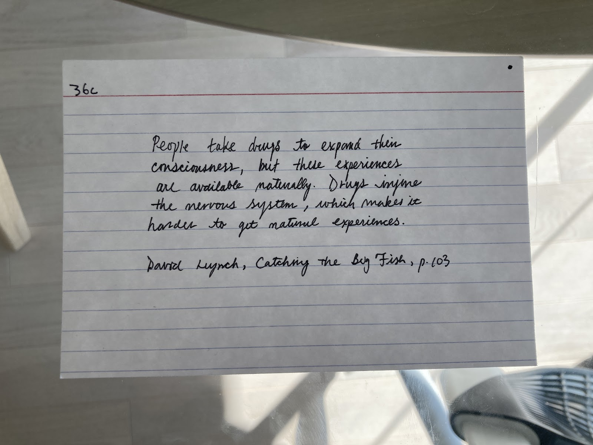

## Summary
[[HerbertLui]] reflects on one year and roughly 800 handwritten and digital cards, presenting [[ZettelkastenMethod]] as a regular review-and-linking practice rather than a magical or rigid doctrine. He argues that physical constraints can improve initial selection and brevity, while digitization becomes useful when retrieval friction grows; exportability then matters more than loyalty to [[Notion]] or another application. The retained images show his physical slip boxes, numbered card threads, paper constraints, Notion database fields and 846-card count, Markdown export, and lightweight source citation.

## Key Claims
- A sustainable Zettelkasten can begin with a low-pressure daily card habit in which clear thinking emerges from accumulated material rather than from demanding that every note be important.
- Handwriting on 4×6 cards adds selection effort, removes online distraction, and imposes a useful length constraint before digital tools make unlimited capture easy.
- Structure and repeated encounters let ideas develop gradually over months, making large writing projects easier to approach than one expanding document or unindexed notebook.
- Notes preserve ideas that memory may lose, while regular review makes older material available for later writing and unexpected reuse.
- Digitization becomes worthwhile when physical identifiers and locations no longer support fast retrieval; Lui scanned about 300 cards, then adopted a paper-first transcription workflow.
- [[NoteToolFit]] includes portability: Notion was sometimes sluggish, but its Markdown export worked well enough that the underlying notes were not trapped in one tool.
- Writing new cards regularly creates occasions to revisit the system and find meaningful placement; Lui calls this review process the most important part of the practice.
- The best method is one a person can sustain and adapt, so deviation from Niklas Luhmann's historical implementation is acceptable when the system supports real work.

## Key Quotes
> "Put everything in there—let the clear thinking emerge." - on favoring sustained capture over judging every card in advance.

> "Whenever you have trouble finding cards, that's the time to do it." - on letting retrieval friction trigger digitization.

> "The best method is the one that works for you." - on adapting the practice rather than reproducing an orthodoxy.

## Connections
- [[HerbertLui]] - author reporting the one-year, roughly 800-card practice.
- [[ZettelkastenMethod]] - central method, operationalized through handwriting, identifiers, linking, regular review, and later digitization.
- [[PersonalKnowledgeManagement]] - the cards form a reusable store for long-term writing and forgotten ideas.
- [[NoteToolFit]] - paper, scanning, Notion, Roam Research, and Markdown export are evaluated against focus, retrieval, and portability needs.
- [[Notion]] - digital database used for card titles, identifiers, paper-copy status, and export.
- [[NiklasLuhmann]] - historical benchmark whose exact workflow Lui explicitly does not attempt to reproduce.

## Contradictions
- No direct contradiction with existing wiki content. The source strengthens the output-oriented and tool-fit accounts of [[ZettelkastenMethod]], while its willingness to omit a separate literature-note box qualifies more prescriptive workflow taxonomies.
- The article is one practitioner's retrospective, not a comparison with other methods. Claims about handwriting, memory, creativity, idea emergence, and writing productivity are plausible mechanisms or linked assertions rather than effects established by this source.
- The portability claim is demonstrated only by a 2021 Notion-to-Markdown export attempt; export success does not by itself establish complete metadata preservation, durable interoperability, or easy migration at larger scale.
