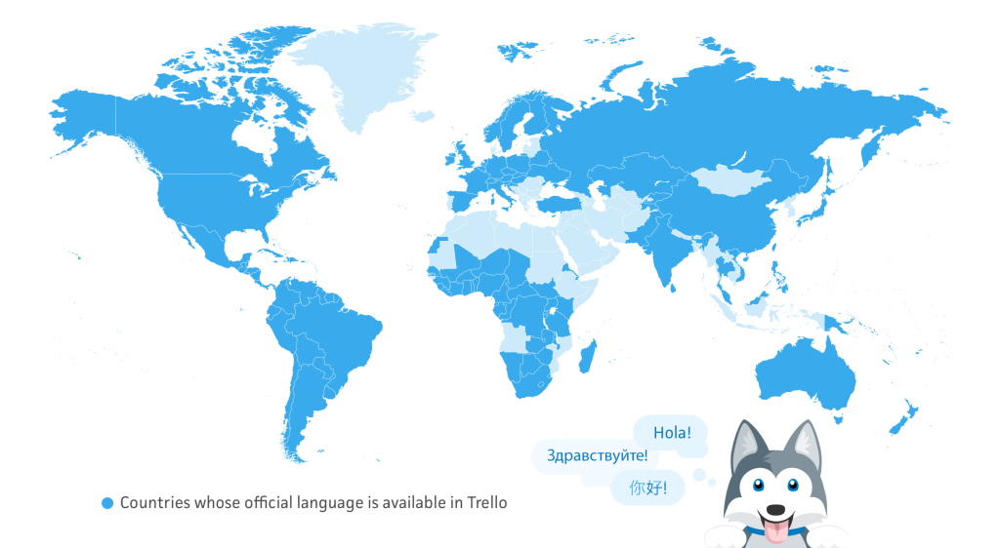
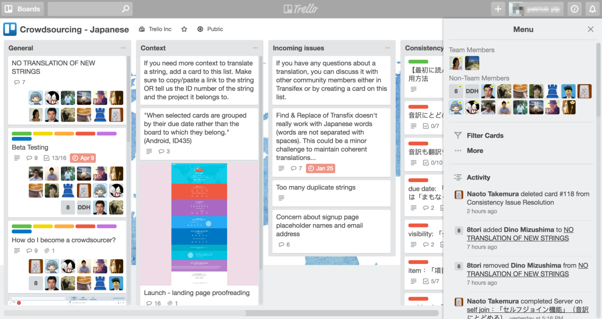
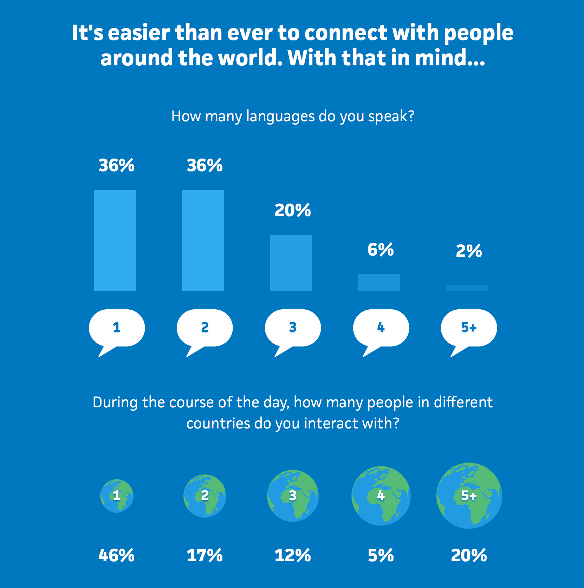

## Summary
[[PatrickYip]] reports how [[AlexiaOhannessian]] led [[Trello]] from country experiments to a 20-language product rollout, combining user-demand data, volunteer translation, professional fallback, internationalization work, and local marketing. The case supports [[InternationalExpansionStrategy]] as an experimental operating system and develops [[CrowdsourcedLocalization]] as a managed workflow rather than free, unstructured labor. Its signup and quality results are company-reported historical observations whose translation and marketing effects were not independently isolated.

## Key Claims
- Trello tested localization in Brazil, Spain, and Germany with different marketing treatments, then used France to test a volunteer translation model before a broader launch.
- France's volunteers reportedly translated about 47,000 words in one month; the wider effort involved 520 volunteers, 30–50 per language, and produced about 800,000 translated words over four months.
- A translation management system automated source-string import, translator notification, and reintegration, while one Trello board per language coordinated instructions, timelines, glossaries, context, questions, consistency issues, testing, and reviewers.
- Product familiarity helped volunteers preserve Trello's friendly voice, but quality still required curated terminology, contextual screenshots, three or four reviewers per language, peer review, and discussion.
- Crowdsourcing was not sufficient for every workload: Trello used professional services when some Asian-language launches faced deadline risk and for weekly user updates requiring predictable delivery.
- Internationalization required developers to extract strings and support language-specific plural forms; gender and right-to-left text remained incompletely handled and sometimes required translation workarounds.
- Translation alone did not produce reliable growth: Spain saw little signup change with translated content alone, while marketing-intensive Brazil reportedly doubled launch-period signups and France tripled them, with France remaining 25% above its prior level afterward.

## Key Quotes
> “Instead of looking for what [languages] you want to have, choose the languages that your users really want.” — Alexia Ohannessian on demand-led language selection

> “To make localization successful, you have to tell the local users that these languages are available.” — Alexia Ohannessian on pairing translation with marketing

## Connections
- [[Trello]] — product and company whose localization program supplies the case.
- [[AlexiaOhannessian]] — international marketing lead who describes the experiments, volunteer system, tools, and marketing work.
- [[PatrickYip]] — OneSky marketer who authored the article from the interview.
- [[InternationalExpansionStrategy]] — the case adds demand-led language selection, staged experiments, parallel translation rollout, and launch marketing.
- [[CrowdsourcedLocalization]] — volunteer translation required recruitment, tooling, terminology, context, review, motivation, and professional fallback.
- [[StartupHypothesisTesting]] — country launches were used to test both marketing intensity and translation production models.
- [[ContentLedAcquisition]] — local blogs, events, ambassadors, PR, and a global survey landing page made translated availability discoverable.

## Contradictions
- [[InternationalExpansionStrategy]] currently recommends sequential country launches to protect cross-functional capacity, while Trello reports launching 16 new languages in parallel. The tension is scope-dependent rather than a direct contradiction: Trello parallelized a bounded digital translation program for an already global user base, whereas the Dropbox source includes offices, legal entities, payments, support, and market operations.
- The article alternates among 20 localized languages, “over 20” languages, and 21 languages in its biography. Its enumerated rollout supports 20 non-English languages plus English; the headline totals should therefore be treated as inconsistent marketing counts.
