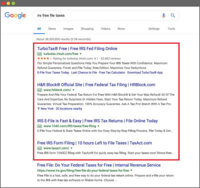
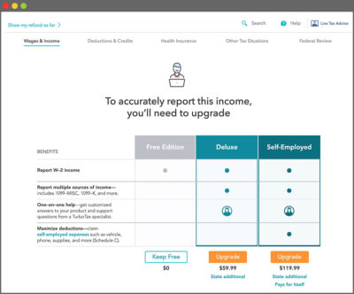
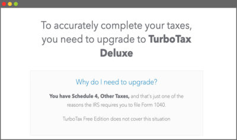
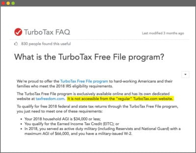
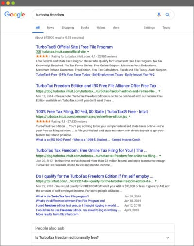
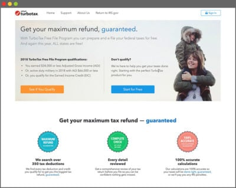
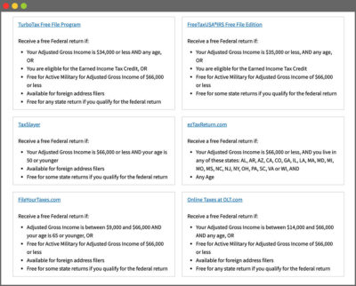
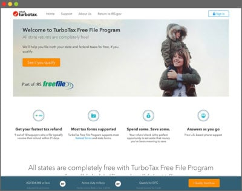

## Summary
[[ProPublica]] traces how [[Intuit]] routed taxpayers from heavily advertised “free” [[TurboTax]] pages into paid upgrades while keeping its separate IRS-backed product difficult to discover. The walkthrough shows [[DarkPatterns]] operating across search ads, product naming, delayed price disclosure, internal funnel classification, and competing calls to action, within a public-private [[IRSFreeFile]] program that the [[InternalRevenueService]] was criticized for weakly overseeing.

## Key Claims
- For the 2018 tax year, the IRS Free File agreement made at least one participating offer available to taxpayers with adjusted gross income below $66,000, but each provider imposed its own narrower age, income, location, or tax-situation rules.
- TurboTax’s commercial “Free Edition” and IRS-backed “Free File” or “Freedom Edition” were different products whose similar names obscured materially different eligibility and pricing.
- ProPublica’s test profiles—a $29,000 independent house cleaner and an uninsured Walgreens cashier—were shown paid upgrades only after extensive data entry; the displayed prices were $119.99 and $59.99 respectively.

- Page source labeled the commercial-path visitor “NONFFA,” or outside the Free File Alliance flow, even when the test taxpayer could qualify for an IRS-backed free option.
- A TurboTax FAQ said the IRS-backed product was not accessible from the regular TurboTax website and required the “right” URL, while one page paired an orange eligibility link with a more prominent-looking blue control returning users to the commercial funnel.

- Search advertising and an IRS directory added discovery layers between an eligible taxpayer and the free product, while Intuit and other tax-preparation companies lobbied against a government-run filing service.

- The National Taxpayer Advocate and an IRS advisory body criticized low participation and oversight; the article also reported a dispute over legislation that would codify the industry partnership.

## Key Quotes
> “It is not accessible from the ‘regular’ TurboTax.com website.” — TurboTax FAQ text highlighted in the article.

> “NONFFA” — the page-source classification ProPublica found on the commercial filing path.

## Connections
- [[ProPublica]] — publisher of the reported walkthrough and source-code inspection.
- [[Intuit]] — TurboTax maker, Free File participant, and subject of the lobbying and product-funnel reporting.
- [[TurboTax]] — commercial tax-preparation product whose similarly named free paths are compared.
- [[IRSFreeFile]] — public-private program that established the broader free-filing eligibility framework.
- [[InternalRevenueService]] — agency that administered the provider partnership and directory.
- [[DarkPatterns]] — interface and journey tactics that steered eligible users away from the genuinely free path.
- [[SearchPlatformDisintermediation]] — search ads and ranked results mediated access to the government-backed option.
- [[UserTrustCapital]] — the case shows how “free” claims, delayed prices, and opaque routing can consume trust.

## Contradictions
- The article documents the 2018 filing season and was updated in April 2019. Its $34,000 TurboTax threshold, $66,000 program threshold, provider list, URLs, prices, refund route, legislation, and product names are historical evidence, not current tax-filing guidance.
- The screenshots and test profiles directly establish the paths ProPublica observed, not the frequency with which all TurboTax users encountered them or how many paid unnecessarily.
- Intuit said its commercial Free Edition cost $0 for simple federal and state returns and said it donated 2.3 million returns through Free File programs; the source does not independently audit those figures.
- The article attributes deliberate concealment through funnel design, naming, search visibility, and lobbying evidence, but it does not reproduce internal decision records proving the intent behind every individual interface choice.
