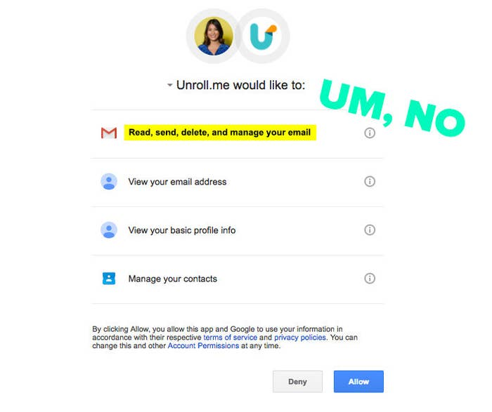
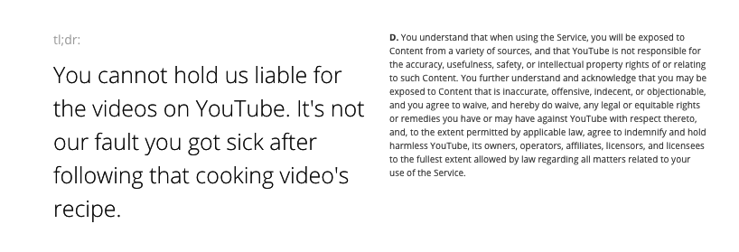

## Summary
[[NicoleNguyen]] uses the 2017 [[UnrollMe]] controversy to explain that a zero-price service can be funded by advertising, profiling, or sale of information rather than by the person using it. The article connects [[DataMonetization]] to practical [[AppPermissionGovernance]]: inspect whether requested access is proportionate, read privacy and contract summaries, investigate the provider's business model, and periodically revoke unused account and phone permissions. Its platform paths, company policies, and product examples are historical rather than current instructions.

## Key Claims
- A service can monetize personal information through targeted advertising, aggregated analysis, or transfer to another company, so “free” does not identify who pays or what is exchanged.
- [[UnrollMe]] reportedly analyzed users' email receipts and supplied anonymized Lyft receipt information to Slice Intelligence for sale to [[Uber]], illustrating a use beyond inbox cleanup.
- [[AppPermissionGovernance]] begins with necessity and proportionality: a user should ask whether the feature really requires every requested capability and whether the provider is trustworthy enough to receive it.
- Terms and privacy policies remain important but hard to use; services such as Terms of Service; Didn't Read and TLDRLegal can expose favorable and unfavorable clauses in shorter language without replacing the underlying contract.
- Reviewing connected-account access and mobile permissions can reduce stale or unnecessary exposure, while a paid service with explicit privacy commitments may offer better incentive alignment.
- Free VPN, public Wi-Fi, and ad-blocking labels do not by themselves prove a privacy-protective business model; users still need to inspect revenue sources and data practices.

## Key Quotes
> “there’s no such thing as a free lunch.” - Nguyen's framing for hidden non-price exchange.

> “Does the service really need all of these permissions?” - the article's proportionality test.

## Connections
- [[NicoleNguyen]] - BuzzFeed News reporter and author of the consumer privacy guide.
- [[UnrollMe]] - email-management service used as the central case of broad account access and secondary data monetization.
- [[AppPermissionGovernance]] - practice of matching requested capabilities to purpose, trust, continued need, and revocation.
- [[DataMonetization]] - explains how a no-price consumer service can create revenue from behavior, profiles, or transferred information.
- [[PrivacyPovertyDivide]] - qualifies the suggestion that paying for privacy is equally available to every user.
- [[Google]] - account provider whose authorization screen makes the requested Unroll.me capabilities visible.
- [[Facebook]] - advertising and connected-app platform used in the article's historical examples.
- [[Uber]] - reported buyer of anonymized Lyft receipt information derived from Unroll.me users' inboxes.
- [[Android]] - mobile platform whose then-current permissions menu is part of the article's review advice.

## Contradictions
- The recommendation to prefer paid privacy-oriented apps can improve incentive alignment but is not a general guarantee of privacy and conflicts with any assumption that all users can afford to substitute away from data-funded services; [[PrivacyPovertyDivide]] treats price and exit capacity as unequally distributed.
- The article sometimes compresses advertising, aggregate analytics, and transfer of individual records into one “you are the product” frame. [[DataMonetization]] distinguishes these mechanisms and the different governance risks they create.
- No direct contradiction was found in the central permission-review advice, but the named policies, settings paths, and provider practices describe 2017 and require current verification before use.
