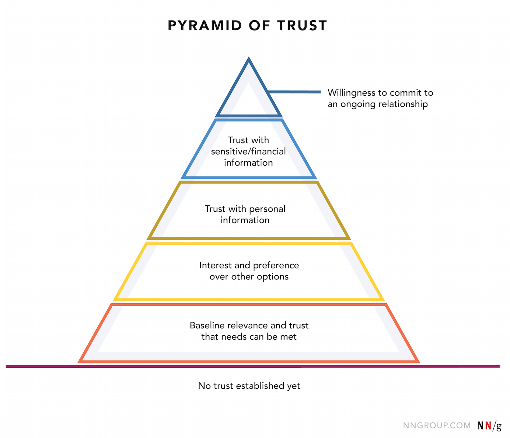
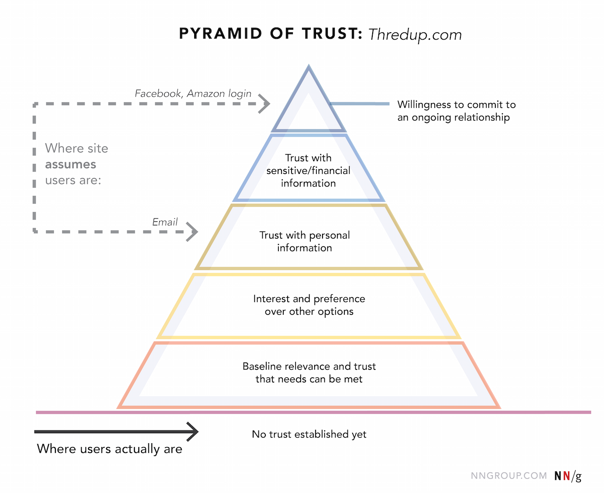
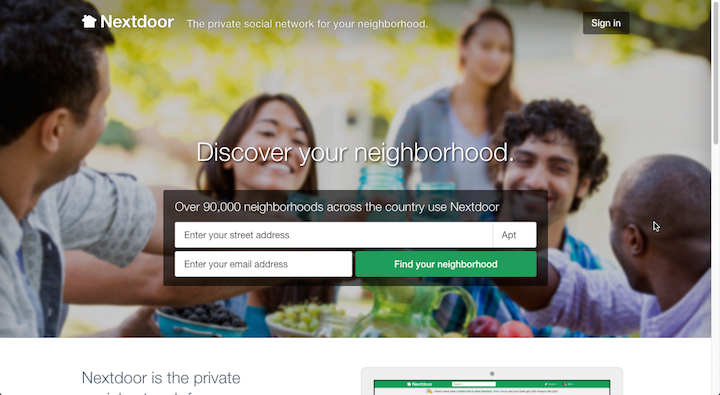
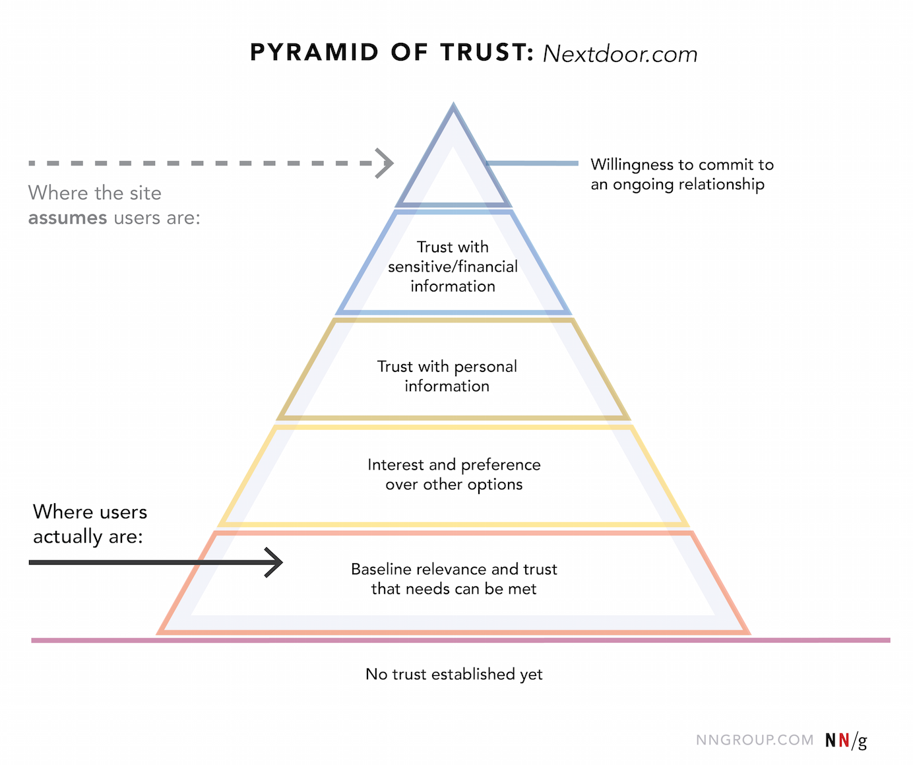

## Summary
The article presents a five-level [[HierarchyOfTrust]] for matching website requests to a visitor's demonstrated comfort: establish baseline relevance, earn preference, then ask for personal information, sensitive or financial information, and finally an ongoing relationship. Historical ThredUp and Nextdoor examples show how forced registration or address collection can skip the lower levels, while free exploration, clear positioning, representative imagery, and [[SocialProof]] can reduce uncertainty before a larger ask.

## Key Claims
- New visitors begin with no established trust, and skepticism should be treated as the default rather than an objection that appears only after a failure.
- The five proposed commitment levels are baseline relevance and confidence that needs can be met; interest and preference over alternatives; trust with personal information; trust with sensitive or financial information; and willingness to sustain an ongoing relationship.
- A site's request should not exceed the trust level supported by the experience so far; collecting more information or effort requires more confidence and comfort.
- Forced login walls can ask for level-three or level-five commitment before visitors can establish level-one relevance or level-two preference.

- Asking for a street address and email before showing neighborhood availability similarly assumes a higher commitment than a visitor has reached; a postal-code lookup would let the visitor test relevance first.

- Descriptive taglines, relevant product imagery, and credible social proof can help visitors evaluate lower-level needs before registration, while free browsing, reversible exploration, and easy backtracking strengthen agency and trust.
- Because visitors may not articulate their doubts directly, teams should observe behavior rather than relying only on stated feedback when evaluating trust barriers.

## Key Quotes
> "Don't make demands at higher levels of commitment until you've addressed all the trust needs at the inferior levels." - the article's equilibrium rule.

> "skepticism is strong by default." - the article's starting assumption for new visitors.

## Connections
- [[HierarchyOfTrust]] - the source's five-stage model for calibrating requests to earned confidence.
- [[UserTrustCapital]] - distinguishes trust needed within an early interaction from goodwill accumulated across repeated experiences.
- [[ProductFlowFriction]] - login walls and premature data requests add effort and uncertainty before value is visible.
- [[FirstMileProductExperience]] - early positioning and exploration determine whether a newcomer can establish baseline relevance.
- [[SocialProof]] - third-party evidence can help bridge early uncertainty when it is credible and relevant.
- [[PsychologicalReactance]] - blocking exploration and removing control can provoke resistance as well as abandonment.
- [[ConversionRateOptimization]] - near-term data capture should be evaluated against trust, agency, and downstream completion.

## Contradictions
- The hierarchy is a practitioner framework modeled by analogy to Maslow, not a validated universal sequence; the source reports no experiment, sample, completion rate, or longitudinal outcome that proves all users traverse the five levels in order.
- The ThredUp and Nextdoor screens are historical examples. They demonstrate the requests and visibility constraints shown at capture time, not current interfaces or measured abandonment caused by those designs.
- External recommendations, prior brand familiarity, urgency, regulation, risk, and user goals may let visitors tolerate or reject requests differently; the source acknowledges outside trust factors but does not model these variations.
- The source metadata records an update on 2026-04-12 but supplies no visible author or original publication date, so that date is retained without treating it as complete publication history.
