## Summary
[[BrettKlika]] and [[ChrisJordan]] present [[HighIntensityCircuitTraining]] (HICT) as a time-efficient way to combine aerobic and resistance work using body weight and minimal rest. Their practical example alternates total-body, lower-body, upper-body, and core exercises for 30 seconds each with 10-second transitions, producing a roughly seven-minute circuit that may be repeated two or three times. The article reports possible benefits for [[VO2Max]], insulin sensitivity, muscular fitness, and body composition, but also says that most people need repeated circuits, that high intensity is demanding and contraindicated for some populations, and that HICT may be inferior to specific training for maximal strength, power, or sport endurance.

## Key Claims
- HICT trades workout duration for effort by combining large-muscle resistance exercises, elevated heart rate, and incomplete recovery in one circuit.
- Effective sequencing alternates muscle groups and modulates cardiovascular demand so participants can maintain high effort without sacrificing form.
- The proposed general-purpose protocol uses 9–12 balanced exercises, about 30 seconds of work, and no more than 15 seconds of transition; the illustrated circuit uses 12 stations and 10-second transitions.
- Short HICT protocols may improve [[VO2Max]], insulin sensitivity, body composition, and muscular fitness with less exercise volume than conventional separated programs, although the paper largely summarizes prior studies rather than reporting a new trial of its exact routine.
- A single seven-minute pass is an example circuit, not a universal dose: the authors recommend multiple repetitions to approach at least 20 minutes when participants cannot sustain intensities above 100% of VO2 max.
- HICT requires appropriate screening, exercise technique, scalable movements, and avoidance or substitution of isometric exercises for some people with hypertension or heart disease.

## Key Quotes
> “trade total exercise time for total exercise effort” — the article's central time-efficiency proposition.

> “without compromising proper exercise form and technique” — the constraint on minimizing recovery.

## Sample Circuit
Each station is performed for 30 seconds with 10 seconds to transition. The images show the intended exercise positions; they do not by themselves establish safe technique for every participant.

### 1. Jumping jacks — total body
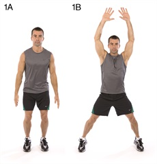

### 2. Wall sit — lower body
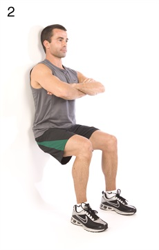

### 3. Push-up — upper body
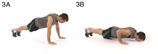

### 4. Abdominal crunch — core
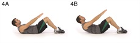

### 5. Step-up onto a chair — total body
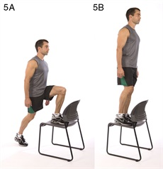

### 6. Squat — lower body
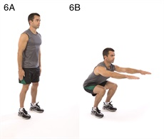

### 7. Triceps dip on a chair — upper body
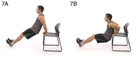

### 8. Plank — core
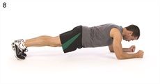

### 9. High knees or running in place — total body
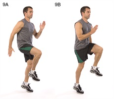

### 10. Lunge — lower body
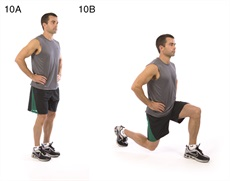

### 11. Push-up and rotation — upper body
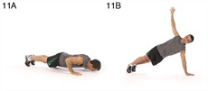

### 12. Side plank — core
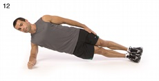

## Connections
- [[BrettKlika]] — coauthor presenting the program from work with time-constrained professionals.
- [[ChrisJordan]] — coauthor presenting the program from work with time-constrained professionals.
- [[HumanPerformanceInstitute]] — workplace context in which the authors say they developed and used the approach.
- [[HighIntensityCircuitTraining]] — programming method synthesized from the article's evidence, design rules, cautions, and example.
- [[VO2Max]] — cardiopulmonary outcome that the reviewed protocols reportedly improve.
- [[CardiorespiratoryFitness]] — broader aerobic capacity that HICT attempts to train alongside muscular fitness.
- [[AmericanCollegeOfSportsMedicine]] — organization whose aerobic, resistance, and high-intensity exercise guidance the authors use as comparison and dosing context.

## Contradictions
- No direct contradiction with the existing wiki's capacity-reserve account of VO2 max. This source adds a compact training option, while the older page did not prescribe a protocol.
- The popular “seven-minute workout” framing can overstate the paper: the authors explicitly recommend two or three circuits and cite at least 20 minutes of high-intensity exercise for most people unable to work above 100% of VO2 max.
- The health-benefit claims come from heterogeneous prior protocols and intensities, not a direct controlled test of the exact illustrated 12-station circuit; the paper therefore supports a plausible programming model more strongly than precise outcome guarantees.
- Reported post-exercise metabolic effects, hormonal explanations for fat loss, and extremely low weekly doses are source-scoped claims that require the cited primary studies for independent evaluation.
- The routine is not universally safe or optimal. The authors identify concerns for detrained, overweight or obese, injured, elderly, and comorbid participants; advise medical clearance; and distinguish general health efficiency from maximal strength, power, or sport-specific performance.
