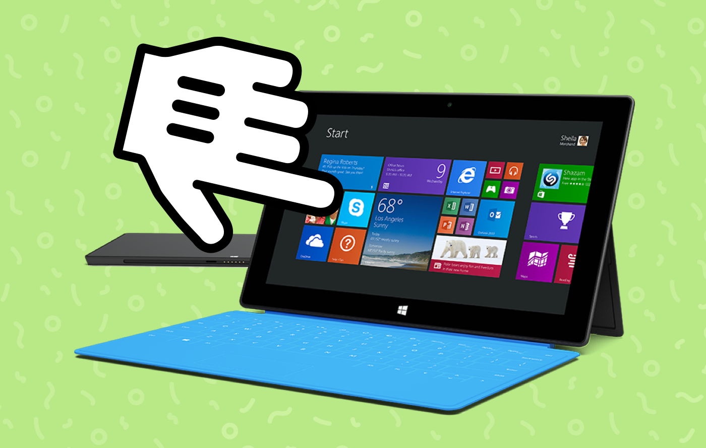
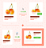

## Summary
[[JordanStaniscia]] argues that touch-enabled laptops make desktop-versus-mobile assumptions unreliable: a laptop-sized viewport no longer proves that a mouse pointer or hover state is available. A user-research session in which a Surface Pro user could not reveal paragraph-level commenting controls grounds the article's central rule of [[InputModalityIndependence]]: hover may provide feedback or optional shortcuts, but an essential action needs a visible, touch-operable primary path.

The illustration combines a touch gesture with a Surface Pro and attached keyboard, reinforcing the source's point that one device can cross conventional tablet and laptop input categories.

## Key Claims
- Touch-enabled laptops and 2-in-1 devices make hover availability unreliable even when an interface has a desktop-sized viewport.
- A commenting product that appeared only when a reader hovered over a paragraph became completely inaccessible to a Surface Pro user who scrolled by touch.
- Treating one failed session as an anomalous device problem delayed recognition of a broader input shift.
- Hover remains useful for mouse and trackpad feedback, such as indicating that an element is clickable or previewing an outcome.
- Hover-triggered shortcuts are acceptable only when they duplicate an action available through a touch-operable primary path.
- Essential actions should never depend on hover as their sole trigger.
- User reports that a primary laptop action is impossible should be investigated as possible capability mismatches rather than dismissed as isolated error.

The captured UI example is only 58 by 60 pixels. Several card states and one highlighted combined layout remain visible, but its labels cannot be recovered reliably, so it is retained as context rather than evidence for a more detailed interaction claim.

## Key Quotes
> "Don't use hover as the primary action to trigger anything essential." - the article's categorical design rule.

> "Always have a primary way to do the same actions with your fingers." - on treating hover actions as optional shortcuts.

## Connections
- [[JordanStaniscia]] - author who derives the design rule from a failed user-research session.
- [[InputModalityIndependence]] - captures the requirement that essential actions survive changes among touch, mouse, trackpad, and other inputs.
- [[CapabilityAccessibility]] - the commenting feature existed technically but was functionally absent when touch could not reveal it.
- [[Usability]] - realistic task observation exposed an interaction that intended users could not complete.
- [[UserTesting]] - direct observation revealed a failure that the product team's Mac-centered assumptions had missed.
- [[Microinteractions]] - hover can still provide useful optional feedback when it is not the sole route to an action.

## Contradictions
- No direct contradiction with the wiki was found. The article's categorical wording is best read as a rule for essential action availability, not as a rejection of hover feedback or optional pointer shortcuts.
- The market-growth discussion is a 2016 forecast rather than outcome evidence, and the source does not substantiate its claim that every major PC manufacturer, "including Apple," then sold a 2-in-1 device.
- The captured file contains conflicting dates: its metadata says 2017-06-27 while the article byline says 2016-07-28; this note uses the byline date.
