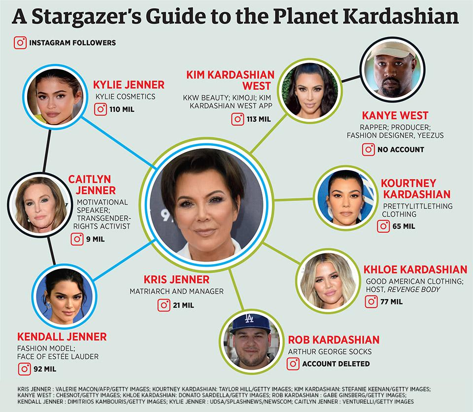

## Summary
[[Forbes]] profiles [[KylieJenner]] and [[KylieCosmetics]] as a 2018 example of [[CelebrityLedCommerce]]: a large pre-existing audience, direct social promotion, scarce launches, and outsourced commerce infrastructure turned personal fame into a high-margin cosmetics business. The article attributes the company's speed and low fixed overhead to [[KrisJenner]]'s management, Seed Beauty's manufacturing and fulfillment, and [[Shopify]]'s storefront, while noting that Kylie Jenner retained full ownership. Its valuation and growth claims are publication-date estimates, and the same dependence on one celebrity's relevance that lowered acquisition cost also created concentration, competition, and durability risk.

## Key Claims
- Forbes estimated that Kylie Cosmetics had sold more than $630 million of makeup since launch, including about $330 million in 2017, and valued Kylie Jenner's wholly owned company at nearly $800 million within an estimated $900 million personal fortune.
- The operating company reportedly had only seven full-time and five part-time employees because Seed Beauty handled manufacturing, packaging, and fulfillment, Shopify handled online commerce, and Kris Jenner handled finance, public relations, and major business decisions for a management fee.
- [[KylieJenner]] used direct access to more than 110 million Instagram followers, plus Snapchat, Twitter, the company account, and family amplification, as targeted launch media with little conventional marketing expense.
- The first 15,000 lip kits were financed with about $250,000 of Jenner's modeling earnings and sold out in under a minute after months of Instagram teasing and a one-day launch announcement.
- Shopify enabled a February 2016 relaunch with 500,000 lip kits and charged an estimated annual platform fee plus a small sales percentage, supporting high-volume direct commerce without a permanent retail footprint.
- Seed Beauty's private-label expertise shortened product introduction from a conventional months-long formula-development process to weeks, but made Kylie Cosmetics dependent on an external manufacturing and fulfillment partner.
- The inspected infographic maps Kris Jenner's managerial position across the Kardashian-Jenner family and pairs family members with follower counts and ventures, reinforcing that Kylie Jenner's distribution advantage came from an established family media system rather than an audience built solely by the cosmetics startup.

- The model carried material limits: 2017 revenue growth slowed to 7%, lip-kit revenue was estimated to fall 35%, celebrity brands received lower valuation multiples because one person's popularity was volatile, and several financial figures were disputed or unverifiable.

## Key Quotes
> "Social media is an amazing platform" - Jenner on direct access to fans and customers.

> "fame is just another word for free marketing" - the article's explanation of the distribution advantage.

## Connections
- [[KylieJenner]] - founder, owner, product face, and principal distribution channel for Kylie Cosmetics.
- [[KylieCosmetics]] - company whose launch, operating model, revenue, and valuation form the central case.
- [[KrisJenner]] - manager who helped convert the first sellout into an ongoing Shopify-based business.
- [[CelebrityLedCommerce]] - the article's fame-to-demand, scarce-launch, direct-commerce, and outsourced-operations model.
- [[Shopify]] - online commerce infrastructure used for the scaled relaunch and subsequent sales.
- [[Instagram]] - primary audience and launch channel connecting Jenner's public identity to targeted cosmetics demand.
- [[PersonalBranding]] - Jenner's public identity functioned as a low-cost, high-reach distribution asset.
- [[MicroBrandCommerce]] - related modular commerce model, here amplified by celebrity-scale demand.
- [[Forbes]] - publisher responsible for the estimates, comparisons, and self-made-billionaire framing.

## Contradictions
- The article's "self-made" framing is qualified by its own evidence that Jenner inherited exceptional family fame, television exposure, management, and cross-promotion before launching the company.
- Forbes estimated several private-company figures from incomplete disclosure: Kylie Cosmetics disputed the estimated Seed Beauty payment, Kris Jenner's 2018 growth statement was not verified, and a forecast that Jenner would soon become the youngest self-made billionaire was not evidence about long-term durability.
